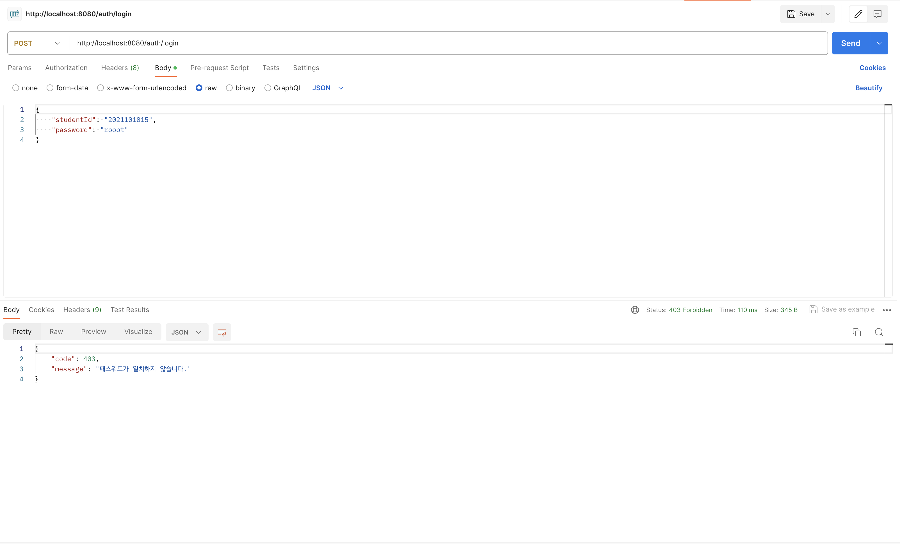

로그는 시스템에 있어서 중요한 역할을 하는데요.
로그를 통해 문제를 해결하거나 사용자의 행동을 분석하는 등의 많은 작업을 수행할 수 있습니다.
저 또한 로그를 활용하기 위해 서비스에서 발생하는 HTTP 요청 및 응답에 대한 로그를 출력하려고 했습니다.

# 프로퍼티 설정 기반 로깅

```yaml title="application.yml" showLineNumbers
logging:
  level:
    web: debug
```

사실 Spring Boot에서는 간단하게 프로퍼티만 설정해도 요청 및 응답을 로그로 출력할 수 있습니다.

```console
2024-04-02 14:34:25.657 DEBUG [reactor-http-epoll-4] o.s.w.r.f.s.s.RouterFunctionMapping: [2b5e844f-985] Mapped to org.springframework.web.reactive.function.server.HandlerFilterFunction$$Lambda$2224/0x00007f8cf4aa21b0@43585181
```

그러나 위와 같이 핸들러 매핑 등의 불필요한 정보도 로그로 출력되는데요.
이러한 이유로, 저는 자체적인 로그 시스템을 구축하기로 결정했습니다.

# Spring AOP 기반 로깅

일반적으로 Spring에서 로깅을 자체적으로 구현한다면 AOP(Aspect Oriented Programming)를 활용할 수 있습니다.
AOP란 핵심적인 기능으로부터 부가적인 기능을 분리해 모듈화하는 프로그래밍 기법 중 하나입니다.
제가 구현할 로깅은 부가적인 기능 중 하나이므로 횡단 관심사인 애스펙트(Aspect)가 되며, 로깅의 대상이 되는 지점이 포인트컷(Pointcut)이 됩니다.

<br /><br />

우선 AOP를 적용할 포인트컷을 찾아보기 위해 HTTP 요청 및 응답을 주로 처리하는 컨트롤러 계층을 주로 살펴보겠습니다.

```kotlin title="PostRouter.kt" showLineNumbers
@Router
class PostRouter {
    @Bean
    fun postRoutes(handler: PostHandler): RouterFunction<ServerResponse> =
        router {
            "/post".nest {
                GET("/{id}", handler::getPostById)
            }
        }
}
```
```kotlin title="PostHandler.kt" showLineNumbers
@Handler
class PostHandler(
    private val postService: PostService
) {
    fun getPostById(request: ServerRequest): Mono<ServerResponse> =
        ServerResponse.ok()
            .body(postService.getPostById(request.pathVariable("id")))
}
```

Spring WebFlux의 함수형 엔드포인트는 컨트롤러 계층의 구성요소로 라우터와 핸들러를 가지는데요.
이때, 엔드포인트를 매핑하는 방식은 `@GetMapping` 등의 어노테이션 방식이 아닌 라우터에 `HandlerFunction`을 등록하는 방식을 사용합니다.

```java title="HandlerFunction.java" showLineNumbers
@FunctionalInterface
public interface HandlerFunction<T extends ServerResponse> {
	Mono<T> handle(ServerRequest request);
}
```

실제 요청과 응답은 `HandlerFunction`의 인자인 `ServerRequest`와 리턴 값인 `Mono<ServerResponse>`가 됩니다.
그러므로 포인트컷은 핸들러의 메서드 실행 시점이라고 볼 수 있습니다.

```kotlin title="Handler.kt" showLineNumbers
@Target(AnnotationTarget.CLASS)
@Retention(AnnotationRetention.RUNTIME)
@Component
annotation class Handler
```

이제 포인트컷을 핸들러로 지정하기 위해 포인트컷 표현식에 사용할 `@Handler`를 구현합니다.
이렇게 되면 `@within` 지시자를 통해 핸들러에 AOP를 적용할 수 있습니다.

```kotlin title="LoggingAspect.kt" showLineNumbers
fun around(joinPoint: ProceedingJoinPoint): Mono<*> =
    with(joinPoint.args.first() as ServerRequest) {
        bodyToMono<String>()
            .defaultIfEmpty("")
            .doOnNext {
                logger.info {
                    "HTTP ${method()} ${uri().run { "$path${query?.let { "?$it" } ?: ""}" }} ${it.toPrettyJson()}"
                }
            }
            .flatMap {
                (joinPoint.proceed(arrayOf(this)) as Mono<*>)
                    .doOnNext { logger.info { "HTTP ${(it as ServerResponse).statusCode()}" } }
            }
    }
```

로깅을 수행하는 어드바이스(Advice)는 위와 같이 구현했습니다.
해당 어드바이스는 핸들러에 인자로 전달된 `ServerRequest`를 통해 요청에 대한 로깅을 수행합니다.
그 다음, 리턴 값인 `Mono<ServerResponse>`를 통해 응답에 대한 로깅을 수행하도록 했습니다.

```kotlin title="LoggingAspect.kt" showLineNumbers
@Aspect
@Component
class LoggingAspect {
    private val logger = getLogger()

    @Around("@within(com.quizit.quiz.global.annotation.Handler)")
    fun around(joinPoint: ProceedingJoinPoint): Mono<*> =
        with(joinPoint.args.first() as ServerRequest) {
            bodyToMono<String>()
                .defaultIfEmpty("")
                .doOnNext {
                    logger.info {
                        "HTTP ${method()} ${uri().run { "$path${query?.let { "?$it" } ?: ""}" }} ${it.toPrettyJson()}"
                    }
                }
                .flatMap {
                    (joinPoint.proceed(arrayOf(this)) as Mono<*>)
                        .doOnNext { logger.info { "HTTP ${(it as ServerResponse).statusCode()}" } }
                }
        }
}
```

이제 해당 어드바이스에 `@within` 지시자를 적용해 애스펙트를 완성합니다.

```console
2024-04-02 22:54:35.557 INFO [reactor-http-nio-3] c.d.c.a.LoggingAspect: HTTP POST /auth/login {"studentId":"2021101015", "password":"root"}
```

그렇게 출력된 로그를 확인하는데 API가 정상적으로 요청을 처리하지 못하는 문제가 발생했습니다.

## Reactor

문제의 원인은 어드바이스에서 `ServerRequest`로부터 Request Body를 가져오는 과정에 있었습니다.

```java title="ServerRequest.java" showLineNumbers
public interface ServerRequest {
    <T> Mono<T> bodyToMono(Class<? extends T> elementClass);
}
```

앞서 `ServerRequest`에서 Request Body는 `bodyToMono()`를 통해 가져왔었는데요.
이때, `bodyToMono()`는 단순히 Request Body를 반환하는 것이 아닌 Request Body를 발행하는 Reactor의 `Publisher` 구현체인 `Mono`를 반환합니다.
`Mono`는 단일 요소 스트림이므로 한번 구독을 통해 값을 발행받으면 그 이후에는 더 이상 값을 발행받을 수 없습니다.

```kotlin title="LoggingAspect.kt" showLineNumbers {9}
@Aspect
@Component
class LoggingAspect {
    private val logger = getLogger()

    @Around("@within(com.quizit.quiz.global.annotation.Handler)")
    fun around(joinPoint: ProceedingJoinPoint): Mono<*> =
        with(joinPoint.args.first() as ServerRequest) {
            bodyToMono<String>()
                .defaultIfEmpty("")
                .doOnNext {
                    logger.info {
                        "HTTP ${method()} ${uri().run { "$path${query?.let { "?$it" } ?: ""}" }} ${it.toPrettyJson()}"
                    }
                }
                .flatMap {
                    (joinPoint.proceed(arrayOf(this)) as Mono<*>)
                        .doOnNext { logger.info { "HTTP ${(it as ServerResponse).statusCode()}" } }
                }
        }
}
```
```kotlin title="AuthenticationHandler.kt" showLineNumbers {8-9}
@Handler
class AuthenticationHandler(
    private val authenticationService: AuthenticationService
) {
    fun login(request: ServerRequest): Mono<ServerResponse> =
        request.bodyToMono<LoginRequest>()
            .flatMap {
                ServerResponse.ok()
                    .body(authenticationService.login(it))
            }
}
```

`LoggingAspect`에서 `bodyToMono()`를 통해 얻은 `Mono`를 구독해 값을 발행받았으니, 이후 핸들러 계층에서 호출되는 `bodyToMono()`로 얻은 `Mono`는 더 이상 값을 발행하지 않습니다.
그렇게 핸들러 계층에서 Request Body를 제대로 읽지 못해 요청이 정상적으로 처리되지 못했던 것인데요.

<br /><br />

그래서 생각한 방법은 기존의 `ServerRequest`의 Request Body를 읽고 해당 Request Body를 가진 새로운 `ServerRequest`를 만들어서 핸들러에게 전달하는 방법이었습니다.
당연히 `bodyToMono()`가 반환하는 `Mono`도 새로운 `Mono`이므로 핸들러 계층에서 Request Body를 정상적으로 읽을 수 있게 됩니다.

```java title="ServerRequest.java" showLineNumbers
public interface ServerRequest {
	static Builder from(ServerRequest other) {
		return new DefaultServerRequestBuilder(other);
	}
}
```

기존의 `ServerRequest`를 통해 새로운 `ServerRequest`를 만드는 것은 `ServerRequest.Builder`를 통해 수행할 수 있습니다.

```java title="DefaultServerRequestBuilder.java" showLineNumbers
class DefaultServerRequestBuilder implements ServerRequest.Builder {
	@Override
	public ServerRequest.Builder body(String body) {
		Assert.notNull(body, "Body must not be null");
		releaseBody();
		this.body = Flux.just(body).
				map(s -> {
					byte[] bytes = body.getBytes(StandardCharsets.UTF_8);
					return DefaultDataBufferFactory.sharedInstance.wrap(bytes);
				});
		return this;
	}
}
```

`ServerRequest.Builder`의 구현체인 `DefaultServerRequestBuilder`에는 Request Body를 새로 생성하는 `body()`가 있습니다.
`body()`는 JSON(JavaScript Object Notation) 문자열을 통해 새로운 Request Body를 생성합니다.

```kotlin title="LoggingAspect.kt" showLineNumbers {17-19}
@Aspect
@Component
class LoggingAspect {
    private val logger = getLogger()

    @Around("@within(com.quizit.quiz.global.annotation.Handler)")
    fun around(joinPoint: ProceedingJoinPoint): Mono<*> =
        with(joinPoint.args.first() as ServerRequest) {
            bodyToMono<String>()
                .defaultIfEmpty("")
                .doOnNext {
                    logger.info {
                        "HTTP ${method()} ${uri().run { "$path${query?.let { "?$it" } ?: ""}" }} ${it.toPrettyJson()}"
                    }
                }
                .map {
                    ServerRequest.from(this)
                        .body(it)
                        .build()
                }
                .flatMap { joinPoint.proceed(arrayOf(it)) as Mono<*> }
                .doOnNext { logger.info { "HTTP ${(it as ServerResponse).statusCode()}" } }
        }
}
```

이제 `bodyToMono()`로부터 가져온 Request Body와 기존의 `ServerRequest`를 통해 새로운 `ServerRequest`를 생성하도록 했습니다.

```console
2024-04-04 15:44:24.594 INFO [reactor-http-nio-3] c.d.c.a.LoggingAspect: HTTP POST /auth/login {"studentId":"2021101015", "password":"root"}
2024-04-04 15:44:24.832 INFO [reactor-http-nio-3] c.d.c.a.LoggingAspect: HTTP 200 OK
```

정상적으로 요청이 처리되어 로그가 출력되는 것을 확인 할 수 있습니다.

```console
2024-04-04 15:46:29.444 INFO [reactor-http-nio-3] c.d.c.a.LoggingAspect: HTTP POST /auth/login {"studentId":"2021101015", "password":"rooot"}
2024-04-04 15:46:29.563 INFO [reactor-http-nio-3] c.d.c.a.LoggingAspect: HTTP 200 OK
2024-04-04 15:46:29.560 ERROR [nioEventLoopGroup-3-3] c.d.c.e.GlobalExceptionHandler: PasswordNotMatchedException at com.doyoumate.api.auth.service.AuthenticationService.login(AuthenticationService.kt:92)
```

그러나 예외가 발생하는 경우, 로그에 해당 예외에 대한 상태 코드가 반영되지 못하는 문제가 발생했었습니다.

## 예외 처리

```kotlin title="PostHandler.kt" showLineNumbers {6}
@Handler
class PostHandler(
    private val postService: PostService
) {
    fun getPostById(request: ServerRequest): Mono<ServerResponse> =
        ServerResponse.ok()
            .body(postService.getPostById(request.pathVariable("id")))
}
```

저는 모든 핸들러에서 `ServerResponse.ok()`를 통해 `ServerResponse`가 `200 OK`의 상태를 가지도록 구현했었는데요.



그렇다고 예외가 발생했을 때도 항상 `200 OK`를 반환하는 것은 아닙니다.
예외 처리를 핸들러 계층이 아닌 다른 계층에서 수행하도록 구현했기 때문입니다.

```kotlin title="GlobalExceptionHandler.kt" showLineNumbers
@Configuration
class GlobalExceptionHandler(
    private val objectMapper: ObjectMapper
) : ErrorWebExceptionHandler {
    private val logger = getLogger()

    override fun handle(exchange: ServerWebExchange, exception: Throwable): Mono<Void> =
        with(exchange.response) {
            val body = ErrorResponse(exception)

            logger.error { "${exception::class.simpleName}(\"${exception.message}\") at ${exception.stackTrace[0]}" }

            headers.contentType = MediaType.APPLICATION_JSON
            statusCode = HttpStatusCode.valueOf(body.code)

            writeBody(body)
        }

    private fun ServerHttpResponse.writeBody(body: Any): Mono<Void> =
        writeWith(
            Mono.just(
                bufferFactory()
                    .wrap(objectMapper.writeValueAsBytes(body))
            )
        )
}
```

실제로 발생한 예외는 `ErrorWebExceptionHandler`의 구현체인 `GlobalExceptionHandler`가 처리합니다.
그래서 `200 OK`의 상태 코드를 가진 `ServerResponse`는 예외가 발생하면 `GlobalExceptionHandler`를 통해 해당 예외에 맞는 상태 코드와 Response Body를 가진 응답으로 변환됩니다.

<br /><br />

문제는 이 예외 처리는 핸들러 계층 외부이므로 핸들러에 적용한 AOP가 적용되지 않는다는 점입니다.
그래서 로깅은 핸들러가 반환하는 `200 OK`의 상태 코드를 가진 `ServerResponse`에 대해서만 수행됩니다.
그러나 이를 해결하고자 핸들러 계층에서 예외 처리를 수행하도록 하는 것은 핸들러 계층의 책임이 너무 커지고 중복 코드가 발생하게 된다고 생각했습니다.

# WebFilter 기반 로깅

이를 해결하기 위해 로깅 구현 방식을 바꿔보기로 했습니다.
이번엔 추상화된 `ServerResponse`가 아닌 저수준의 `ServerHttpResponse`를 사용하기로 했습니다.
그 방법으로는 Spring WebFlux의 `WebFilter`를 활용할 수 있습니다.

```java title="WebFilter.java" showLineNumbers
public interface WebFilter {
	Mono<Void> filter(ServerWebExchange exchange, WebFilterChain chain);
}
```

`WebFilter`는 서블릿(Servlet)의 `Filter`와 비슷한 역할을 수행합니다.

```java title="DefaultWebFilterChain.java" showLineNumbers
public class DefaultWebFilterChain implements WebFilterChain {
	@Override
	public Mono<Void> filter(ServerWebExchange exchange) {
		return Mono.defer(() ->
				this.currentFilter != null && this.chain != null ?
						invokeFilter(this.currentFilter, this.chain, exchange) :
						this.handler.handle(exchange));
	}
}
```

Bean으로 등록된 `WebFilter`들은 `DefaultWebFilterChain`의 `filter()`에 의해 호출되는데요.
중요한 점은 이 과정들이 `DispatcherHandler`가 엔드포인트에 맞는 핸들러를 매핑하기 전에 수행된다는 점입니다.
그래서 `WebFilter`는 `ServerHttpRequest`나 `ServerHttpResponse` 등의 저수준의 요청 및 응답을 다루기 용이합니다.

```kotlin title="LoggingFilter.kt" showLineNumbers
class LoggingFilter : WebFilter {
    private val logger = getLogger()

    override fun filter(exchange: ServerWebExchange, chain: WebFilterChain): Mono<Void> =
        exchange.log()
            .flatMap { chain.filter(it) }

    private fun ServerWebExchange.log(): Mono<ServerWebExchange> =
        mutate()
            .let { builder ->
                Mono.just(request)
                    .flatMap {
                        request.body
                            .toByteArray()
                    }
                    .doOnNext {
                        builder.request(
                            object : ServerHttpRequestDecorator(request) {
                                override fun getBody(): Flux<DataBuffer> =
                                    Flux.just(
                                        response.bufferFactory()
                                            .wrap(it)
                                    )
                            }
                        )
                    }
                    .defaultIfEmpty(ByteArray(0))
                    .doOnNext { loggingRequest(request, String(it)) }
                    .map {
                        builder
                            .response(response.apply {
                                beforeCommit {
                                    loggingResponse(this)
                                    Mono.empty()
                                }
                            })
                            .build()
                    }
            }

    private fun loggingRequest(request: ServerHttpRequest, body: String) {
        request.apply {
            logger.info {
                "HTTP $method ${uri.run { "$path${query?.let { "?$it" } ?: ""}" }} ${body.toPrettyJson()}"
            }
        }
    }

    private fun loggingResponse(response: ServerHttpResponse) {
        logger.info { "HTTP ${response.statusCode}" }
    }
}
```

`WebFilter`에서 요청 로깅은 기존의 AOP 방식처럼 구현하고 문제의 응답 로깅을 저수준의 `ServerHttpResponse`를 통해 구현했습니다.

```kotlin showLineNumbers {2, 6}
fun Flux<DataBuffer>.toByteArray(): Mono<ByteArray> =
    DataBufferUtils.join(this)
        .map {
            ByteArray(it.readableByteCount())
                .also(it::read)
                .apply { DataBufferUtils.release(it) }
        }
```

`ServerHttpRequest`의 경우, `ServerResponse`와 달리 `DataBuffer`를 통해 Request Body를 다뤄야 합니다.
특히 Request Body가 비어있는 경우, `join()`이 `Mono<Void>`를 반환하므로 `Mono<Void>`로 인해 다운 스트림이 전부 수행되지 않는 문제가 발생할 수 있는데요.
그래서 `defaultIfEmpty()`를 사용해 크기가 0인 `ByteArray`를 Request Body의 기본 값으로 설정해 주었습니다.

<br /><br />

또한 `ByteBuffer`는 사용한 후에 남은 레퍼런스 카운트(Reference Count)에 의해 자동으로 가비지 컬렉션(Garbage Collection)의 대상이 되지 않는데요.
이는 메모리 누수로 이어질 수 있으므로 반드시 `release()`를 통해 버퍼를 해제해야 합니다.

```kotlin title="LoggingFilter.kt" showLineNumbers {10-18}
private fun ServerWebExchange.log(): Mono<ServerWebExchange> =
    mutate()
        .let { builder ->
            Mono.just(request)
                .flatMap {
                    request.body
                        .toByteArray()
                }
                .doOnNext {
                    builder.request(
                        object : ServerHttpRequestDecorator(request) {
                            override fun getBody(): Flux<DataBuffer> =
                                Flux.just(
                                    response.bufferFactory()
                                        .wrap(it)
                                )
                        }
                    )
                }
                .defaultIfEmpty(ByteArray(0))
                .doOnNext { loggingRequest(request, String(it)) }
                .map {
                    builder
                        .response(response.apply {
                            beforeCommit {
                                loggingResponse(this)
                                Mono.empty()
                            }
                        })
                        .build()
                }
        }
```

당연히 이전처럼 핸들러 계층에서 Request Body를 다시 읽을 수 있도록 `mutate()`를 통해 `ServerWebExchange`에 새로운 `ServerHttpRequest`를 설정해야 합니다.
이때, `ServerHttpRequestDecorator`를 통해 기존의 `ServerHttpRequest`의 `getBody()`를 새로 정의한 `ServerHttpRequest`를 생성할 수 있습니다.

```kotlin showLineNumbers {23-29}
private fun ServerWebExchange.log(): Mono<ServerWebExchange> =
    mutate()
        .let { builder ->
            Mono.just(request)
                .flatMap {
                    request.body
                        .toByteArray()
                }
                .doOnNext {
                    builder.request(
                        object : ServerHttpRequestDecorator(request) {
                            override fun getBody(): Flux<DataBuffer> =
                                Flux.just(
                                    response.bufferFactory()
                                        .wrap(it)
                                )
                        }
                    )
                }
                .defaultIfEmpty(ByteArray(0))
                .doOnNext { loggingRequest(request, String(it)) }
                .map {
                    builder.response(response.apply {
                            beforeCommit {
                                loggingResponse(this)
                                Mono.empty()
                            }
                        })
                        .build()
                }
        }
```
```java title="ReactiveHttpOutputMessage.java" showLineNumbers
public interface ReactiveHttpOutputMessage extends HttpMessage {
	void beforeCommit(Supplier<? extends Mono<Void>> action);
}
```

문제의 응답 로깅의 경우, `beforeCommit()`을 통해 `ServerHttpResponse`가 커밋되기 전에 로깅이 수행되도록 구현합니다.
커밋되는 시점은 예외 처리를 포함한 모든 작업이 수행된 후의 응답이 반환되는 시점이므로 최종적인 응답에 대해 로깅을 수행할 수 있게 됩니다.

```console
2024-04-04 17:32:31.313 INFO [reactor-http-nio-3] c.d.c.l.LoggingFilter: HTTP POST /auth/login {"studentId":"2021101015", "password":"rooot"}
2024-04-04 17:32:31.395 ERROR [nioEventLoopGroup-3-3] c.d.c.e.GlobalExceptionHandler: PasswordNotMatchedException at com.doyoumate.api.auth.service.AuthenticationService.login(AuthenticationService.kt:92)
2024-04-04 17:32:31.396 INFO [nioEventLoopGroup-3-3] c.d.c.l.LoggingFilter: HTTP 403 FORBIDDEN
```

이전과 달리 `GlobalExceptionHandler`에 의해 변형된 응답이 로그에 반영된 것을 확인할 수 있었습니다.

# 로그 추적

```console
2024-04-04 17:36:29.568 INFO [reactor-http-nio-3] c.d.c.l.LoggingFilter: HTTP POST /auth/login {"studentId":"2021101015", "password":"rooot"}
2024-04-04 17:36:29.676 ERROR [nioEventLoopGroup-3-3] c.d.c.e.GlobalExceptionHandler: PasswordNotMatchedException at com.doyoumate.api.auth.service.AuthenticationService.login(AuthenticationService.kt:92)
2024-04-04 17:36:29.677 INFO [nioEventLoopGroup-3-3] c.d.c.l.LoggingFilter: HTTP 403 FORBIDDEN
2024-04-04 17:36:33.086 INFO [reactor-http-nio-3] c.d.c.l.LoggingFilter: HTTP POST /auth/login {"studentId":"2021101015", "password":"root"}
2024-04-04 17:36:33.194 INFO [nioEventLoopGroup-3-3] c.d.c.l.LoggingFilter: HTTP 200 OK
```

제가 구축한 로그 시스템에서 아쉬운 점이 하나 있었습니다.
많은 로그가 뒤섞이면서 어떤 요청과 응답이 하나의 통신인지 알기 어렵다는 점인데요.
그래서 로그를 추적하기 쉽게 요청마다 임의의 식별자를 부여해주는 것을 생각했습니다.
일반적으로 식별자를 이용한 로그 추적에는 MDC(Mapped Diagnostic Context)가 사용됩니다.

# MDC

MDC는 스레드를 통해 특정 메타 정보를 저장하는 공간입니다.
Slf4j 구현체들은 기본적으로 MDC를 사용할 수 있도록 구현되어 있으므로 Slf4j 구현체를 사용하는 Spring에서도 별도의 설정 없이 MDC를 사용할 수 있습니다.

<br /><br />

이 MDC를 Spring WebFlux 환경에서 그냥 사용하기에는 어려움이 있습니다.
Spring WebFlux에서는 하나의 리액티브 시퀀스(Reactive Sequence)가 여러 스레드에서 수행될 수 있습니다.
이로 인해 스레드에 의존적인 `ThreadLocal`을 사용하는 MDC를 활용하기는 어렵습니다.
그래서 스레드가 아닌 리액티브 시퀀스에 종속되는 저장 공간인 Reactor Context를 활용하기로 했습니다.

# Reactor Context 기반 로그 추적

Reactor Context는 `Map`처럼 Key-Value 형태를 가지고 있습니다.
Slf4j 구현체가 MDC를 사용하므로 결국은 MDC에 요청 식별자를 저장해야 하는데요.
이때, Reactor Context는 MDC로 로그를 추적하기 어려운 부분인 컨텍스트 스위칭 부분에서 MDC 내의 요청 식별자를 스위칭되는 스레드로 복사해주는 역할을 수행하게 됩니다.

```kotlin title="MdcFilter.kt" showLineNumbers {4}
class MdcFilter : WebFilter {
    override fun filter(exchange: ServerWebExchange, chain: WebFilterChain): Mono<Void> =
        chain.filter(exchange)
            .contextWrite { it.put("traceId", UUID.randomUUID().toString().substring(0..7)) }
}
```

`WebFliter`를 통해 요청이 들어오면 `contextWrite()`로 Reactor Context에 식별자로 사용할 임의의 문자열을 저장합니다.

```kotlin title="MdcContextLifter.kt" showLineNumbers {21-24}
class MdcContextLifter<T>(private val coreSubscriber: CoreSubscriber<T>) : CoreSubscriber<T> {
    override fun onSubscribe(subscription: Subscription) {
        coreSubscriber.onSubscribe(subscription)
    }

    override fun onNext(t: T) {
        currentContext().synchronizeMdc()
        coreSubscriber.onNext(t)
    }

    override fun onError(throwable: Throwable) {
        coreSubscriber.onError(throwable)
    }

    override fun onComplete() {
        coreSubscriber.onComplete()
    }

    override fun currentContext(): Context = coreSubscriber.currentContext()

    private fun Context.synchronizeMdc() {
        getOrEmpty<String>("traceId")
            .ifPresent { MDC.put("traceId", it) }
    }
}
```

그 다음, 현재 Reactor Context 내의 식별자와 MDC 내의 식별자를 동기화하는 `MdcContextLifter`를 구현합니다.
Reactor Hook을 통해 `CoreSubscriber`의 구현체인 `MdcContextLifter`가 리액티브 시퀀스가 진행될 때마다 호출되어 Reactor Context 내의 `traceId`를 MDC로 복사하게 됩니다.

```kotlin title="MdcConfiguration.kt" showLineNumbers
@Configuration
class MdcConfiguration {
    private val mdcContextKey = MdcConfiguration::class.java.name

    @PostConstruct
    fun registerHook() {
        Hooks.onEachOperator(mdcContextKey, Operators.lift { _, subscriber -> MdcContextLifter(subscriber) })
    }

    @PreDestroy
    fun cleanHook() {
        Hooks.resetOnEachOperator(mdcContextKey)
    }

    @Order(Ordered.HIGHEST_PRECEDENCE)
    @Bean
    fun mdcFilter(): MdcFilter = MdcFilter()

    @Order(Ordered.HIGHEST_PRECEDENCE + 1)
    @Bean
    fun loggingFilter(): LoggingFilter = LoggingFilter()
}
```

마지막으로 지금까지 구현한 `WebFilter`들과 `MdcContextLifter`를 설정합니다.
`MdcFilter`의 경우, `@Order`를 통해 `DefaultWebFilterChain`에서 가장 먼저 호출되도록 했습니다.

```console
2024-04-04 17:58:03.514 INFO [reactor-http-nio-3] c.d.c.l.LoggingFilter: [d1375571] HTTP POST /auth/login {"studentId":"2021101015", "password":"rooot"}
2024-04-04 17:58:03.619 ERROR [nioEventLoopGroup-3-3] c.d.c.e.GlobalExceptionHandler: [d1375571] PasswordNotMatchedException at com.doyoumate.api.auth.service.AuthenticationService.login(AuthenticationService.kt:92)
2024-04-04 17:58:03.619 INFO [nioEventLoopGroup-3-3] c.d.c.l.LoggingFilter: [d1375571] HTTP 403 FORBIDDEN
2024-04-04 17:58:08.212 INFO [reactor-http-nio-3] c.d.c.l.LoggingFilter: [9b585b5a] HTTP POST /auth/login {"studentId":"2021101015", "password":"root"}
2024-04-04 17:58:08.322 INFO [nioEventLoopGroup-3-3] c.d.c.l.LoggingFilter: [9b585b5a] HTTP 200 OK
```

이전 로그들과 달리 식별자가 앞에 붙어 로그 추적이 되는 것을 볼 수 있습니다.
