이번에 서비스를 개발하면서 채팅 기능을 구현하게 되었습니다.
저는 채팅 기능 등의 실시간 통신을 구현한 경험이 많지 않아 어떻게 구현할지 고민에 빠지게 되었습니다.

# 실시간 통신

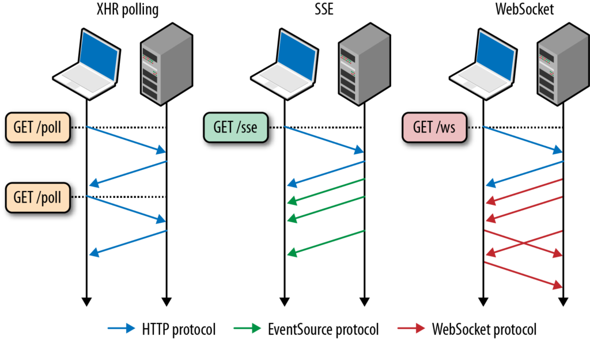

실시간 통신을 구현하는 방법으로는 폴링(Polling), SSE(Server Sent Event), 웹 소켓(Web Socket)이 있는데요.

## 폴링

폴링은 주기적으로 서버와 통신을 통해 실시간성을 구현하는 방식입니다.
해당 방식은 구현 방법이 쉽지만 특정 주기 동안은 실시간성이 보장되지 않는다는 단점을 가지고 있습니다.
제가 구현할 채팅 기능은 실시간성이 중요하므로 폴링 방식은 적절하지 않다고 생각했습니다.

## SSE

SSE는 실시간 단방향 통신에 사용되는 방식입니다.
웹 소켓과 달리 HTTP(Hypertext Transfer Protocol) 통신을 사용하므로 구현이 쉽지만 단방향 통신만 가능하다는 단점이 있습니다.
사실 메세지를 보내는 것은 단순히 API를 통해서, 메세지를 받는 것은 웹 소켓 방식처럼 받으면 SSE만으로도 채팅 기능을 구현할 수 있습니다.
그러나 양방향 통신을 SSE로 구현하는 것은 비효율적이라고 생각했습니다.

## 웹 소켓

웹 소켓은 실시간 양방향 통신에 사용되는 프로토콜입니다.
HTTP 통신과 달리 연결에 불필요한 비용을 최소화할 수 있습니다.
저는 실시간성을 보장하고 오버헤드가 적다는 점에서 채팅 기능에는 웹 소켓이 적절하다고 생각해 웹 소켓을 사용하기로 했습니다.

<br /><br />

일반적으로 채팅 기능을 웹 소켓으로 구현한다면 세션(Session)을 통해 사용자를 식별하게 됩니다.
특정 사용자에게 메시지를 보내면 해당 사용자의 세션으로 메시지를 전송하도록 구현하게 됩니다.

# 웹 소켓 통신

이제 웹 소켓 통신을 구현해 보겠습니다.
Spring WebFlux는 웹 소켓 통신을 쉽게 구현할 수 있는 STOMP(Simple Text Oriented Messaging Protocol)를 지원하지 않습니다.
비슷한 대체제로 Netflix의 RSocket도 있으나 관련 레퍼런스가 적어서 효율적인 선택이 아니라 생각했고요.

```java title="WebSocketHandler.java" showLineNumbers
public interface WebSocketHandler {
	default List<String> getSubProtocols() {
		return Collections.emptyList();
	}

	Mono<Void> handle(WebSocketSession session);
}
```

그래도 Spring WebFlux에서는 자체적으로 웹 소켓 통신을 적절하게 지원하고 있었습니다.
Spring WebFlux에서는 `WebSockerHandler`을 활용해 웹 소켓 통신을 구현할 수 있습니다.

```java title="WebSocketSession.java" showLineNumbers
public interface WebSocketSession {
    Flux<WebSocketMessage> receive();

    Mono<Void> send(Publisher<WebSocketMessage> messages);

    WebSocketMessage textMessage(String payload);

    Mono<Void> close(CloseStatus status);
    ...
}
```

`WebSockerHandler`의 `handle()`에 전달되는 `WebSockerSession`는 웹 소켓 세션으로, 주로 `receive()`나 `send()` 등의 통신 관련 메서드들을 가지고 있는데요.
`receive()`는 인바운드 스트림인 `Flux<WebSockerMessage>`로부터 받은 메시지를 발행하며, `send()`는 아웃바운드 스트림인 `Publisher<WebSockerMessage>`로부터 메시지를 발행받아 클라이언트에게 전송하도록 하는 메서드들입니다.
웹 소켓 통신은 인바운드 스트림 및 아웃바운드 스트림 중 하나라도 끊기거나 명시적으로 `close()`를 호출하면 종료됩니다.

```kotlin title="ExampleWebSockerHandler.kt" showLineNumbers
@Component
class ExampleWebSocketHandler: WebSocketHandler {
    override fun handle(session: WebSocketSession): Mono<Void> =
        session.receive()
            .map { session.textMessage("Hello, ${it.payloadAsText}!") }
            .let(session::send)
}
```

간단하게 웹 소켓을 통해 메시지를 주고 받는 예시를 작성해 보았는데요.
해당 예시는 인바운드 메시지를 받아 가공한 후 바로 아웃바운드 메시지로 전송하는 예시입니다.

```kotlin title="ExampleWebSockerHandler.kt" showLineNumbers
override fun handle(session: WebSocketSession): Mono<Void> =
    Mono.zip(
        session.receive()
            .then(),
        session.send(
            Flux.interval(Duration.ofSeconds(1))
                .map { session.textMessage("Hello World!") }
        )
    ).then()
```

만약 `receive()`와 `send()`가 서로 독립적으로 처리되는 경우에는 `zip()`을 사용하면 됩니다.
위 예시는 인바운드 스트림과 상관 없이 서버에서 1초마다 `"Hello World!"`를 메시지로 전송하는 코드입니다.

```kotlin title="WebSocketConfiguration.kt" showLineNumbers
@Configuration
class WebSocketConfiguration {
    @Bean
    fun handlerMapping(exampleWebSocketHandler: ExampleWebSocketHandler): HandlerMapping =
        SimpleUrlHandlerMapping(mapOf("/example" to exampleWebSocketHandler), -1)
}
```

이렇게 구현한 `WebSockerHandler`는 `SimpleUrlHandlerMapping`을 통해 엔드포인트를 매핑할 수 있습니다.
여기서 생성자로 전달되는 두번째 인자는 핸들러 매핑의 우선 순위인데요.
다른 핸들러 매핑보다 우선적으로 적용되도록 하기 위해 최상위 순위인 `-1`을 부여했습니다.

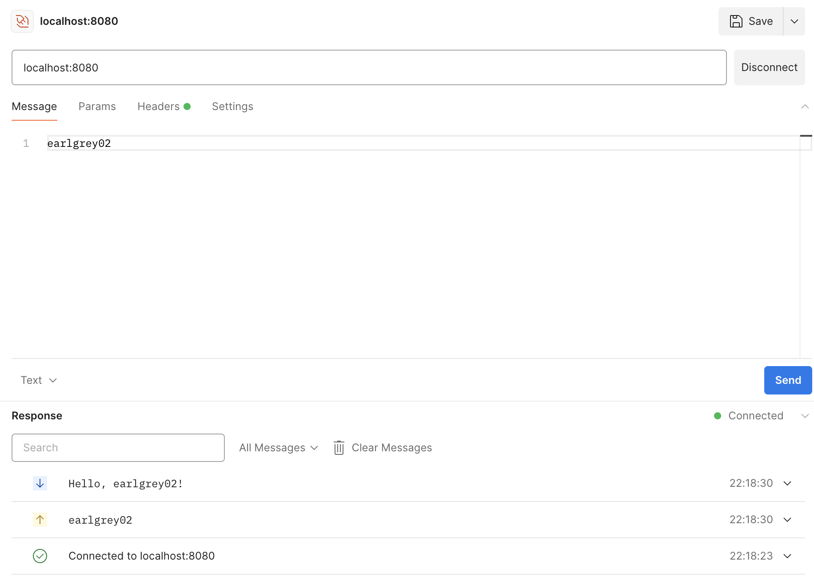

정상적으로 웹 소켓 통신이 이루어지는 것을 확인할 수 있습니다.

# 채팅 기능 구현

이제 웹 소켓 통신을 기반으로 채팅 기능을 구현해 보겠습니다.
앞서, 인증 및 인가는 Spring Security를 통해 수행되므로 `ReactiveSecurityContextHolder`로부터 가져온 `Authentication`을 사용자 식별에 사용하겠습니다.
제가 자체적으로 구현한 `DefaultJwtAuthentication`은 데이터베이스 내에 저장된 사용자의 식별자를 가지고 있습니다.

```kotlin title="MessageWebSocketHandler.kt" showLineNumbers {12, 15, 21-27, 30-34}
@Component
class MessageWebSocketHandler(
    private val messageRepository: MessageRepository,
    private val objectMapper: ObjectMapper,
) : WebSocketHandler {
    private val logger = getLogger()
    private val sessions = ConcurrentHashMap<String, WebSocketSession>()

    override fun handle(session: WebSocketSession): Mono<Void> =
        ReactiveSecurityContextHolder.getContext()
            .map { it.authentication as DefaultJwtAuthentication }
            .doOnNext { if (!sessions.contains(it.id)) sessions[it.id] = session }
            .doOnNext { logger.info { "WebSocket connected ${it.id}" } }
            .flatMap { authentication ->
                session.receive()
                    .doFinally { sessions.remove(authentication.id) }
                    .map { it.payloadAsText }
                    .doOnNext { logger.info { "WebSocket received: ${it.prettifyJson()}" } }
                    .map { objectMapper.readValue<SendMessageRequest>(it) }
                    .flatMap {
                        messageRepository.save(
                            Message(
                                senderId = authentication.id,
                                receiverId = it.receiverId,
                                content = it.content
                            )
                        )
                    }
                    .flatMap {
                        sessions[it.receiverId]?.send(
                            Mono.just(objectMapper.writeValueAsString(it))
                                .map(session::textMessage)
                                .doOnNext { logger.info { "WebSocket sent: ${it.payloadAsText.prettifyJson()}" } }
                        ) ?: Mono.empty()
                    }
                    .then()
            }
}
```

Reactor 특성상 코드가 복잡해보이지만 핵심 비즈니스 로직은 다음과 같습니다.
사용자가 처음 웹 소켓에 연결하면 `ConcurrentHashMap<String, WebSocketSession>`에 세션이 저장됩니다.
이후, 해당 세션은 웹 소켓 통신이 끊길때 호출되는 `doFinally()`에 의해 삭제됩니다.
사용자가 메시지를 보내는 경우에는 해당 메시지를 데이터베이스에 저장한 후, 해당 메시지의 `receiverId`에 해당하는 세션으로 메시지를 전송하게 됩니다.

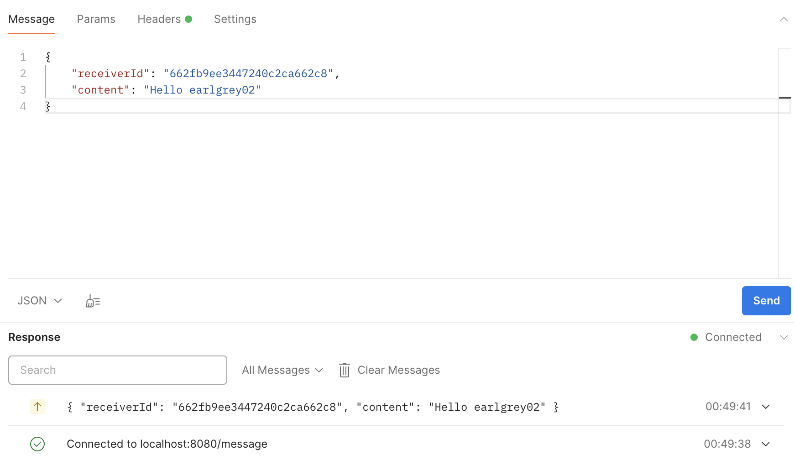
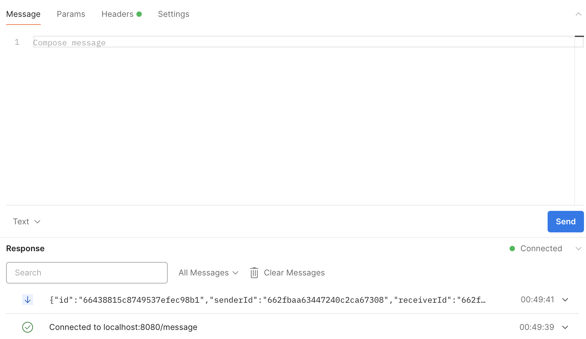

```console
2024-05-15 00:49:38.396 INFO [reactor-http-nio-2] c.d.c.l.LoggingFilter: [44f9fa6d] HTTP GET /message
2024-05-15 00:49:38.427 INFO [reactor-http-nio-2] c.d.c.l.LoggingFilter: [44f9fa6d] HTTP 200 OK
2024-05-15 00:49:38.438 INFO [reactor-http-nio-2] c.d.c.h.MessageWebSocketHandler: [44f9fa6d] WebSocket connected 662fbaa63447240c2ca67308
2024-05-15 00:49:39.719 INFO [reactor-http-nio-3] c.d.c.l.LoggingFilter: [b19459ae] HTTP GET /message
2024-05-15 00:49:39.726 INFO [reactor-http-nio-3] c.d.c.l.LoggingFilter: [b19459ae] HTTP 200 OK
2024-05-15 00:49:39.729 INFO [reactor-http-nio-3] c.d.c.h.MessageWebSocketHandler: [b19459ae] WebSocket connected 662fb9ee3447240c2ca662c8
2024-05-15 00:49:41.303 INFO [reactor-http-nio-2] c.d.c.h.MessageWebSocketHandler: [44f9fa6d] WebSocket received: {"receiverId":"662fb9ee3447240c2ca662c8", "content":"Hello earlgrey02"}
```

실제로 웹 소켓 통신을 통해 메시지를 잘 주고 받는 것을 확인할 수 있습니다.

## 분산 시스템

웹 소켓은 서버에 종속적이라 서버 인스턴스가 분산되어 있는 분산 시스템에서는 메세지를 받을 사용자가 다른 서버의 세션으로 존재할 수 있습니다.
이 경우, 메세지가 정상적으로 수신되지 않는 문제가 발생하는데요.
이 문제는 Kubernetes 클러스터에 서버가 분산되어 있는 제 서비스에도 적용되는 문제였습니다.

```console
NAME                             READY   UP-TO-DATE   AVAILABLE   AGE
deployment.apps/doyoumate-chat   2/2     2            2           28m
```
```console
NAME                                          READY   STATUS      RESTARTS   AGE
pod/doyoumate-chat-56bb7596d6-85pk4           1/1     Running     0          2m24s
pod/doyoumate-chat-56bb7596d6-shbm6           1/1     Running     0          2m53s
```

현재 채팅 서버를 배포하는 Deploayment의 Replica 개수는 2이므로 서버 인스턴스가 두 개로 존재하는 것을 확인할 수 있습니다.
이 상태에서 앞서 구현한 채팅 기능을 사용해 보겠습니다.

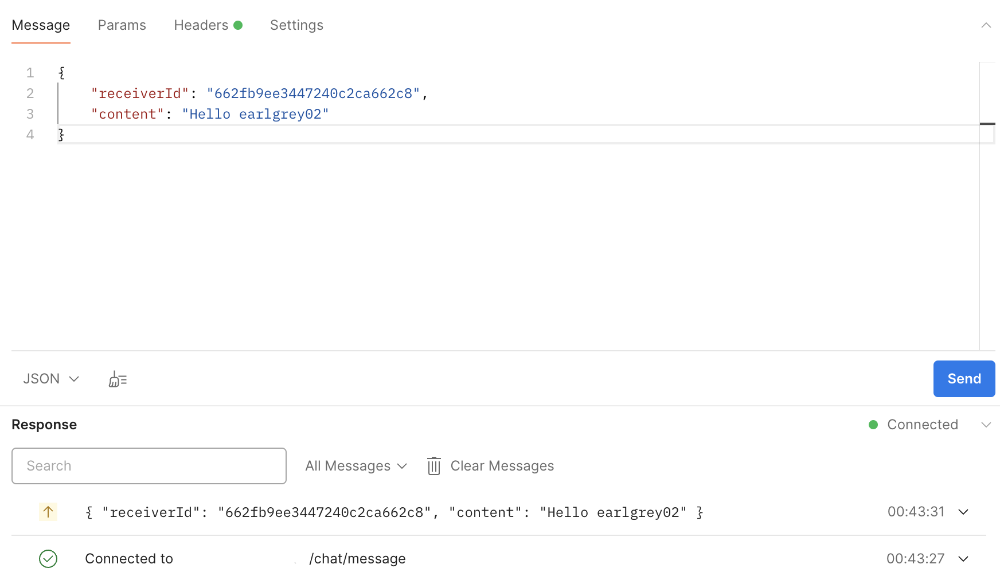
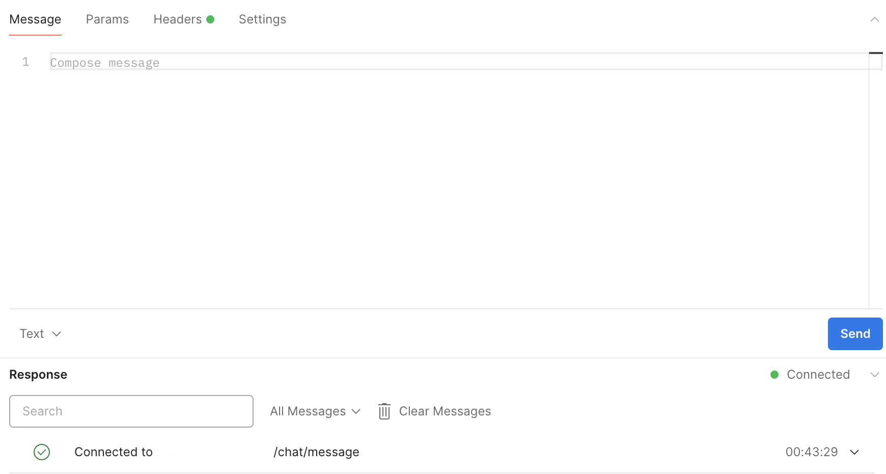

이전처럼 메시지가 성공적으로 전송되는 반면, 메시지가 전달되지는 않았습니다.

```console
2024-05-15 00:43:26.396 INFO [reactor-http-epoll-2] c.d.c.l.LoggingFilter: [07bbd55c] HTTP GET /message
2024-05-14 00:43:26.566 INFO [reactor-http-epoll-2] c.d.c.l.LoggingFilter: [07bbd55c] HTTP 200 OK
2024-05-14 00:43:26.136 INFO [reactor-http-epoll-2] c.d.c.h.MessageWebSocketHandler: [07bbd55c] WebSocket connected 662fbaa63447240c2ca67308
2024-05-14 00:43:31.306 INFO [reactor-http-epoll-2] c.d.c.h.MessageWebSocketHandler: [07bbd55c] WebSocket received: {"receiverId":"662fb9ee3447240c2ca662c8", "content":"Helloearlgrey02"}
```
```console
2024-05-15 00:43:28.355 INFO [reactor-http-epoll-2] c.d.c.l.LoggingFilter: [82a65341] HTTP GET /message
2024-05-15 00:42:28.512 INFO [reactor-http-epoll-2] c.d.c.l.LoggingFilter: [82a65341] HTTP 200 OK
2024-05-15 00:42:29.022 INFO [reactor-http-epoll-2] c.d.c.h.MessageWebSocketHandler: [82a65341] WebSocket connected 662fb9ee3447240c2ca662c8
```

각 Pod에서 로그를 확인해보니 서로 다른 Pod로 웹 소켓이 연결된 것을 확인했는데요.
이렇게 서버가 분산된 환경에서는 사용자들의 세션이 서로 공유되지 않아 문제가 발생할 수 있습니다.
저는 해당 문제를 해결하기 위해서 메시지 브로커(Message Broker)를 도입하기로 했습니다.

# 메시지 브로커

메시지 브로커는 메시지 큐(Message Queue)를 통해 애플리케이션들이 서로 메시지를 통해 통신할 수 있도록 도와주는 미들웨어(Middleware)입니다.
메시지 브로커에는 Redis Pub / Sub, RabbitMQ, Apache Kafka 등이 있습니다.

<br /><br />

제가 구현한 채팅 기능은 Redis Pub / Sub과 달리 메시지의 순서 보장이 필요하며 RabbitMQ와 달리 높은 데이터 처리 성능을 가져야 했는데요.
이러한 이유로 저는 Apache Kafka를 선택했습니다.

[//]  # (채팅 기능에서 프로듀서는 메시지를 DB에 저장하고, 컨슈머는 현재 서버에 메시지를 받을 사용자에게 메시지를 웹 소켓으로 전송하도록 합니다.)

## Kafka 설정

우선 프로듀서와 컨슈머에 대한 설정을 해야 하는데요.
아직까진 개발 단계이므로 간단하게 설정하겠습니다.

```yaml title="application.yaml" showLineNumbers
spring:
  kafka:
    bootstrap-servers: localhost:9092
```

우선 프로퍼티에서 `bootstrap-servers`를 통해 Kafka의 브로커(Broker) 호스트를 설정해야 합니다.
해당 값은 클라이언트가 파티션(Partition)에 대한 메타 데이터를 가져오는데 사용됩니다.
그러므로 모든 브로커 호스트를 작성할 필요는 없지만 가용성을 고려한다면 여러 브로커 호스트를 등록할 수 있습니다.

```kotlin title="ProducerConfiguration.kt" showLineNumbers
@Configuration
class ProducerConfiguration(
    private val properties: KafkaProperties
) {
    @Bean
    fun reactiveKafkaProducerTemplate(): ReactiveKafkaProducerTemplate<String, Any> =
        mapOf<String, Any>(
            ProducerConfig.BOOTSTRAP_SERVERS_CONFIG to properties.bootstrapServers.first(),
        ).let {
            ReactiveKafkaProducerTemplate(
                SenderOptions.create<String, Any>(it)
                    .withKeySerializer(StringSerializer())
                    .withValueSerializer(JsonSerializer())
            )
        }
}
```

이번엔 `ReactiveKafkaProducerTemplate`을 Bean으로 등록하는 `ProducerConfiguration`을 구현했습니다.
`ReactiveKafkaProducerTemplate`을 통해 메시지를 발행하는 과정을 추상화해서 사용할 수 있습니다.

```java title="ReactiveKafkaProducerTemplate.java" showLineNumbers {9}
public class ReactiveKafkaProducerTemplate<K, V> implements AutoCloseable, DisposableBean {
    private final KafkaSender<K, V> sender;

    public Mono<SenderResult<Void>> send(String topic, V value) {
        return this.send(new ProducerRecord(topic, value));
    }

    public Mono<SenderResult<Void>> send(String topic, K key, V value) {
        return this.send(new ProducerRecord(topic, key, value));
    }

    public <T> Flux<SenderResult<T>> send(Publisher<? extends SenderRecord<K, V, T>> records) {
        return this.sender.send(records);
    }
    ...
}
```

`ReactiveKafkaProducerTemplate`는 내부적으로 Reactor Kafka의 `KafkaSender`를 통해 메시지를 발행합니다.

```kotlin title="ConsumerConfiguration.kt" showLineNumbers
@Configuration
class ConsumerConfiguration(
    private val properties: KafkaProperties
) {
    @Bean("messageConsumer")
    fun messageConsumer(): ReactiveKafkaConsumerTemplate<String, Message> =
        ReactiveKafkaConsumerTemplate(createReceiverOptions("message-group", setOf("message")))

    private inline fun <reified T> createReceiverOptions(
        groupId: String,
        topics: Set<String>,
    ): ReceiverOptions<String, T> =
        mapOf<String, Any>(
            ConsumerConfig.BOOTSTRAP_SERVERS_CONFIG to properties.bootstrapServers.first(),
            ConsumerConfig.GROUP_ID_CONFIG to groupId,
        ).let {
            ReceiverOptions.create<String, T>(it)
                .subscription(topics)
                .withKeyDeserializer(StringDeserializer())
                .withValueDeserializer(JsonDeserializer<T>(T::class.java, false))
        }
}
```

이번엔 `ReactiveKafkaConsumerTemplate`을 Bean으로 등록하는 `ConsumerConfiguration`을 구현했는데요.
채팅 기능과 관련된 토픽과 컨슈머 그룹을 가지는 `ReactiveKafkaConsumerTemplate`을 Bean으로 등록했습니다.

## Sinks

컨슈머에서는 메시지를 받으면 해당 메시지를 웹 소켓 통신으로 전달해야 하는데요.
`ReactiveKafkaConsumerTemplate`은 무한 스트림을 제공하지 않아서 따로 `send()`에 전달할 스트림이 필요합니다.
해당 방법으로는 Reactor의 `Sinks`를 사용하기로 했습니다.

<br /><br />

`Sinks`는 일종의 신호를 리액티브 프로그래밍 방식으로 Thread-safe하게 보낼 수 있는 방법 중 하나입니다.
`tryEmitNext()`를 통해 값을 전달하면 해당 `Sinks`의 구독자가 값을 받을 수 있습니다.
또한 `Sinks`의 `MulticastSpec`을 사용하면 무한 스트림을 여러 구독자에게 제공할 수 있습니다.

```java title="Sinks.java" showLineNumbers
public interface MulticastSpec {
    <T> Sinks.Many<T> onBackpressureBuffer(int bufferSize);

    <T> Sinks.Many<T> directAllOrNothing();
    ...
}
```

`MuticastSpec`이 값을 발행하는 방식은 일반적으로 `onBackpressureBuffer()` 또는 `directAllOrNothing()`으로 나뉘는데요.

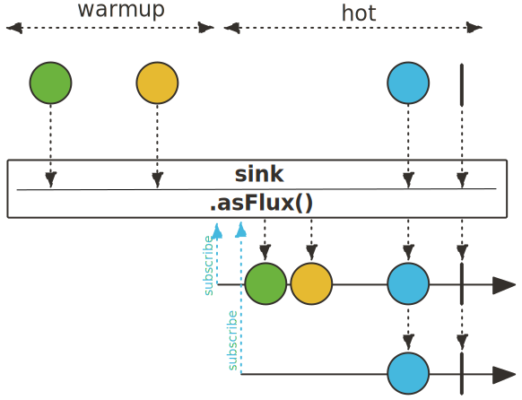

`onBackpressureBuffer()`는 구독자가 없는 경우, `tryEmitNext()`에 의해 받은 값들을 `bufferSize`만큼 저장해놓습니다.
해당 값들은 최초 구독자에게 발행됩니다.

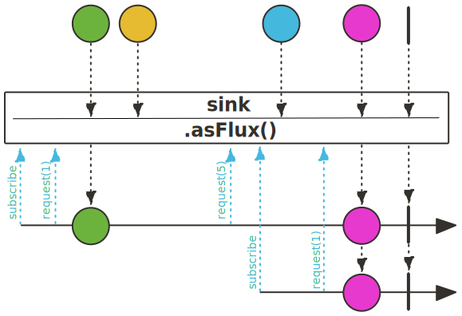

반면, `directAllOrNothing()`은 구독자가 없는 경우, `tryEmitNext()`이 실패하게 됩니다.

<br /><br />

채팅 기능에서는 `tryEmitNext()`을 호출하는 컨슈머가 메시지를 소비하기 전에 채팅이 데이터베이스에 저장됩니다.
그러므로 구독자가 없을 때 컨슈머가 받은 메시지들을 고려할 필요가 없기 때문에 `directAllOrNothing()`을 사용하기로 했습니다.

# Kafka 기반 웹 소켓 통신

이제 기존의 웹 소켓 통신에 `Sinks`와 함께 Kafka를 적용해 보겠습니다.

```kotlin title="MessageWebSocketHandler.kt" showLineNumbers {9-11, 32, 35-39, 46-50}
@Component
class MessageWebSocketHandler(
    private val messageRepository: MessageRepository,
    private val objectMapper: ObjectMapper,
    private val messageProducer: ReactiveKafkaProducerTemplate<String, Any>,
    private val messageConsumer: ReactiveKafkaConsumerTemplate<String, Message>
) : WebSocketHandler {
    private val logger = getLogger()
    private val sink = Sinks.many()
        .multicast()
        .onBackpressureBuffer<Message>()

    override fun handle(session: WebSocketSession): Mono<Void> =
        ReactiveSecurityContextHolder.getContext()
            .map { it.authentication as DefaultJwtAuthentication }
            .doOnNext { logger.info { "WebSocket connected ${it.id}" } }
            .flatMap { authentication ->
                Mono.zip(
                    session.receive()
                        .map { it.payloadAsText }
                        .doOnNext { logger.info { "WebSocket received: ${it.prettifyJson()}" } }
                        .map { objectMapper.readValue<SendMessageRequest>(it) }
                        .flatMap {
                            messageRepository.save(
                                Message(
                                    senderId = authentication.id,
                                    receiverId = it.receiverId,
                                    content = it.content
                                )
                            )
                        }
                        .flatMap { messageProducer.send("message", authentication.id, it) }
                        .then(),
                    session.send(
                        sink.asFlux()
                            .filter { it.receiverId == authentication.id || it.senderId == authentication.id }
                            .map { objectMapper.writeValueAsString(it) }
                            .map(session::textMessage)
                            .doOnNext { logger.info { "WebSocket sent: ${it.payloadAsText.prettifyJson()}" } }
                    )
                )
            }
            .then()

    @EventListener(ApplicationStartedEvent::class)
    fun receiveMessage() {
        messageConsumer.receiveAutoAck()
            .doOnNext { sink.tryEmitNext(it.value()) }
            .subscribe()
    }
}
```

Kafka를 사용하는 경우, `receiver()`와 `send()`가 독립적으로 수행되므로 `zip()`을 사용했습니다.
클라이언트로부터 메시지를 받으면 메시지가 데이터베이스에 저장된 후, 프로듀서를 통해 `message` 토픽에 메시지를 발행합니다.
해당 토픽을 구독하는 컨슈머들은 메시지를 가져와서 해당 메시지와 함께 `tryEmitNext()`을 호출하는데요.
이렇게 되면 `send()`의 `Publisher<WebSockerMessage>`에서 컨슈머로부터 가져온 메시지가 발행되며, 해당 메시지가 웹 소켓을 통해 클라이언트에게 전송됩니다.

<br /><br />

참고로 컨슈머의 경우, `@EventListener`을 통해 애플리케이션 구동 시에 활성화 되도록 했습니다.
또한 `receiveAutoAck()`를 통해 컨슈머가 자동으로 오프셋(Offset)을 처리했음을 알리도록 했습니다.

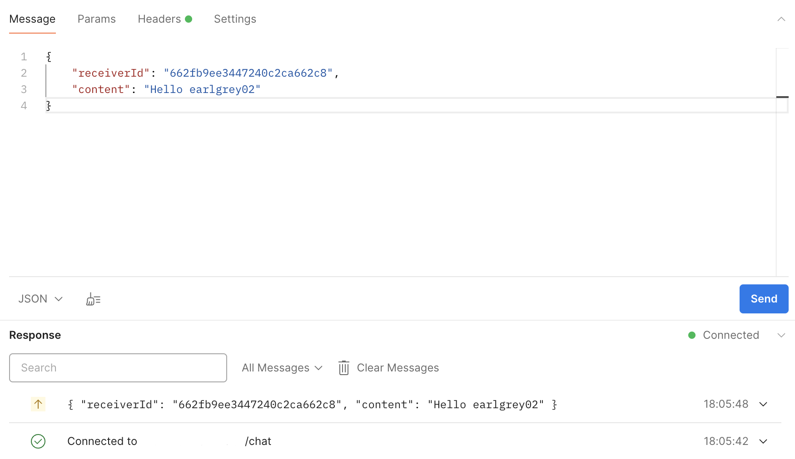
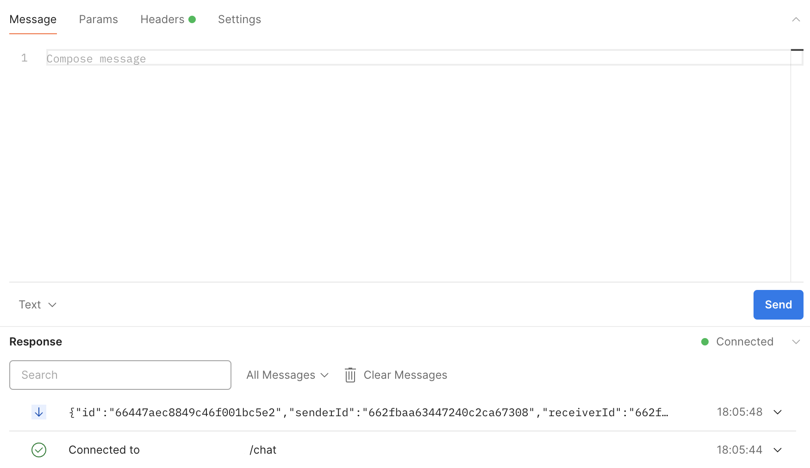

```console
2024-05-15 09:05:42.700 INFO [reactor-http-epoll-2] c.d.c.l.LoggingFilter: [028d10c8] HTTP GET /
2024-05-15 09:05:42.858 INFO [reactor-http-epoll-2] c.d.c.l.LoggingFilter: [028d10c8] HTTP 200 OK
2024-05-15 09:05:42.905 INFO [reactor-http-epoll-2] c.d.c.h.MessageWebSocketHandler: [028d10c8] WebSocket connected 662fbaa63447240c2ca67308
2024-05-15 09:05:48.171 INFO [reactor-http-epoll-2] c.d.c.h.MessageWebSocketHandler: [028d10c8] WebSocket received: {"receiverId":"662fb9ee3447240c2ca662c8", "content":"Hello earlgrey02"}
```
```console
2024-05-15 09:05:44.584 INFO [reactor-http-epoll-2] c.d.c.l.LoggingFilter: [7d1ca0ab] HTTP GET /
2024-05-15 09:05:44.701 INFO [reactor-http-epoll-2] c.d.c.l.LoggingFilter: [7d1ca0ab] HTTP 200 OK
2024-05-15 09:05:44.729 INFO [reactor-http-epoll-2] c.d.c.h.MessageWebSocketHandler: [7d1ca0ab] WebSocket connected 662fb9ee3447240c2ca662c8
2024-05-15 09:05:48.741 INFO [reactive-kafka-message-group-1] c.d.c.h.MessageWebSocketHandler: [7d1ca0ab] WebSocket sent: {"id":"66447aec8849c46f001bc5e2", "senderId":"662fbaa63447240c2ca67308", "receiverId":"662fb9ee3447240c2ca662c8", "content":"Hello earlgrey02", "createdDate":"2024-05-15T09:05:48.257943199"}
```

정상적으로 메시지가 처리되는 것처럼 보이나, 문제가 있었습니다.
앞서 구현한 로직에서 프론트엔드에서의 메시지 동기화를 위해 자신이 보낸 메시지도 받도록 했었는데요.
해당 케이스에서는 상대방에게 메시지는 전송됐으나 이상하게 본인이 보낸 메시지를 다시 받지 못했습니다.

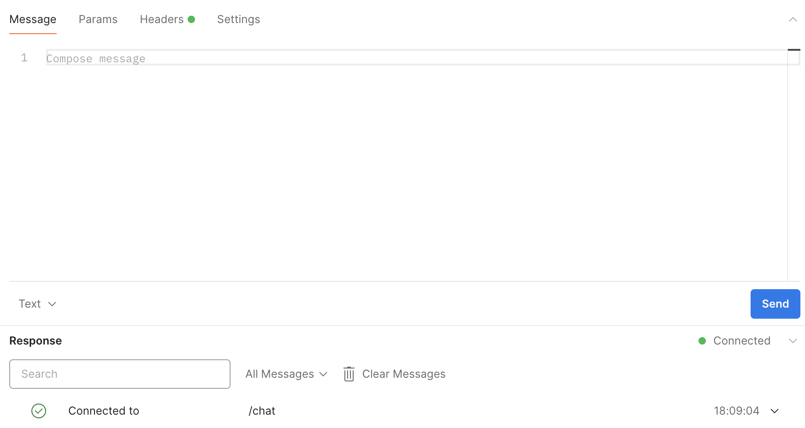

또한 다른 케이스에서는 아예 상대방에게 메시지가 전달이 안되는 문제를 확인했는데요.

```console
> kafka-console-consumer.sh --bootstrap-server kafka.default.svc.cluster.local:9092 --topic message --from-beginning
{"id": "66447dc28849c46f001bc5f6", "senderId": "662fbaa63447240c2ca67308", "receiverId": "662fb9ee3447240c2ca662c8", "content":"Hello earlgrey02", "createdDate": [2024,5,15,9,17,54,267708709]}
```

심지어 프로듀서에 의해 메시지가 정상적으로 발행되는 것도 확인했습니다.
그렇게 해당 문제의 해결 방법을 찾던 중, 제가 컨슈머 그룹을 고려하지 못했다는 것을 알았습니다.

# 컨슈머 그룹

컨슈머 그룹은 컨슈머들을 하나로 묶는 논리적인 단위입니다.


하나의 컨슈머 그룹은 어떤 방식으로든 모든 파티션을 읽게 되는데요.
만약 컨슈머가 n개이고 파티션이 n개이면 각각의 컨슈머가 하나의 파티션을, 컨슈머가 (n / 2)개이고 파티션이 n개라면 각각의 컨슈머가 (n / 2)개의 파티션을 읽게 됩니다.
모든 메시지는 토픽의 파티션에 분할되어 배치되는데, 만약 컨슈머 그룹에 컨슈머가 2개 이상이라면 하나의 컨슈머가 읽지 못하는 메시지가 존재할 수 있습니다.
물론 해당 메시지는 다른 컨슈머가 읽게 되겠지요.

<br /><br />

문제는 어떤 서버에 메시지를 받을 사용자가 세션으로 존재하는 지 모르기 때문에, 모든 서버의 컨슈머에게 메시지를 보내야 하는데요.
그러므로 각 서버의 컨슈머들이 서로 다른 컨슈머 그룹을 가지도록 하는 방법을 사용해야 합니다.
그렇게 되면 하나의 컨슈머 그룹에 하나의 컨슈머만 존재하는 구조를 가지게 되는데요.
이는 컨슈머의 분산 처리가 사실상 불가능해 Kafka의 성능적인 이점을 챙기지 못하게 됩니다.
그러나 순서 보장을 위해서 이미 파티션을 하나로 유지하고 있는 점에서 성능보단 기능을 중시하기로 했습니다.

## 컨슈머 그룹 분리

```kotlin title="ConsumerConfiguration.kt" showLineNumbers {3}
@Bean("messageConsumer")
fun messageConsumer(): ReactiveKafkaConsumerTemplate<String, Message> =
    ReactiveKafkaConsumerTemplate(createReceiverOptions(UUID.randomUUID().toString(), setOf("message")))
```

컨슈머마다 `UUID`를 통해 랜덤한 고유 식별자를 그룹 식별자로 가지도록 했습니다.

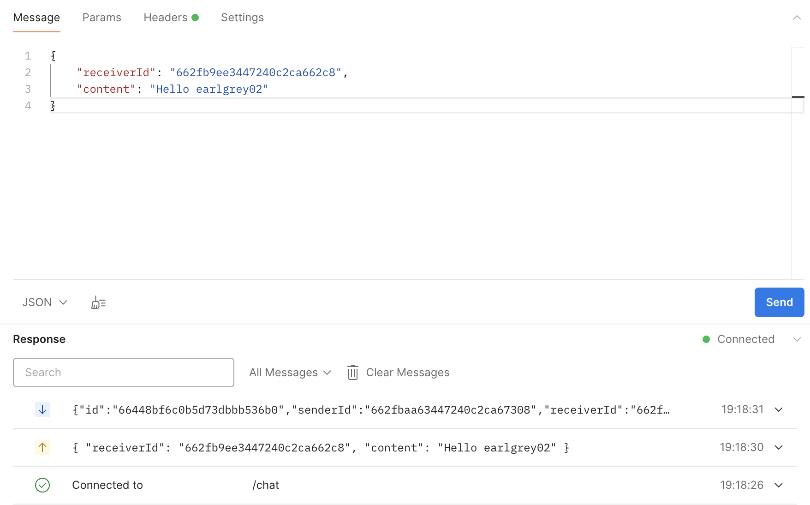
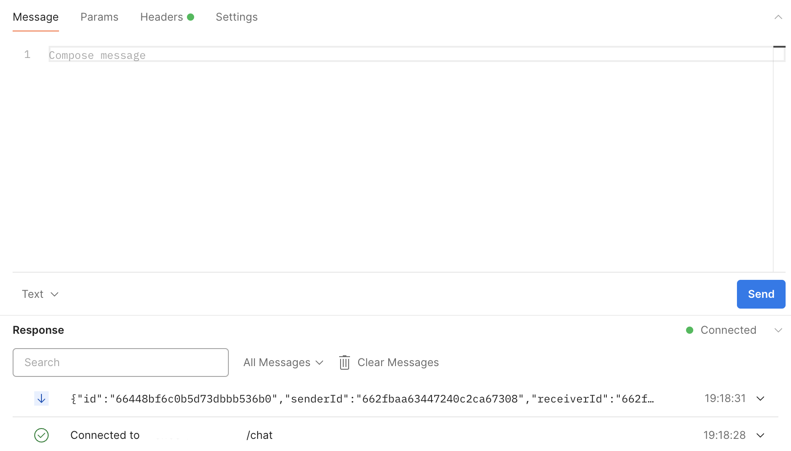

```console
2024-05-15 10:18:26.413 INFO [reactor-http-epoll-2] c.d.c.l.LoggingFilter: [4ac56887] HTTP GET /
2024-05-15 10:18:26.508 INFO [reactor-http-epoll-2] c.d.c.l.LoggingFilter: [4ac56887] HTTP 200 OK
2024-05-15 10:18:26.555 INFO [reactor-http-epoll-2] c.d.c.h.MessageWebSocketHandler: [4ac56887] WebSocket connected 662fbaa63447240c2ca67308
2024-05-15 10:18:30.657 INFO [reactor-http-epoll-2] c.d.c.h.MessageWebSocketHandler: [4ac56887] WebSocket received: {"receiverId":"662fb9ee3447240c2ca662c8", "content":"Helloearlgrey02"}
2024-05-15 10:18:31.225 INFO [reactive-kafka-7a69ed8f-aff0-4fbe-ba65-290d40909787-1] c.d.c.h.MessageWebSocketHandler: [4ac56887] WebSocket sent: {"id":"66448bf6c0b5d73dbbb536b0", "senderId":"662fbaa63447240c2ca67308", "receiverId":"662fb9ee3447240c2ca662c8", "content":"Hello earlgrey02", "createdDate":"2024-05-15T10:18:30.766371323"}
```
```console
2024-05-15 10:18:28.370 INFO [reactor-http-epoll-3] c.d.c.l.LoggingFilter: [12d56b69] HTTP GET /
2024-05-15 10:18:28.408 INFO [reactor-http-epoll-3] c.d.c.l.LoggingFilter: [12d56b69] HTTP 200 OK
2024-05-15 10:18:28.437 INFO [reactor-http-epoll-3] c.d.c.h.MessageWebSocketHandler: [12d56b69] WebSocket connected 662fb9ee3447240c2ca662c8
2024-05-15 10:18:31.276 INFO [reactive-kafka-9d3a9032-330c-49d8-b813-216778886ef5-1] c.d.c.h.MessageWebSocketHandler: [12d56b69] WebSocket sent: {"id":"66448bf6c0b5d73dbbb536b0", "senderId":"662fbaa63447240c2ca67308", "receiverId":"662fb9ee3447240c2ca662c8", "content":"Hello earlgrey02", "createdDate":"2024-05-15T10:18:30.766371323"}
```

이번엔 정상적으로 상대방과 자기 자신에게 전부 메시지가 전송되는 것을 확인할 수 있습니다.
