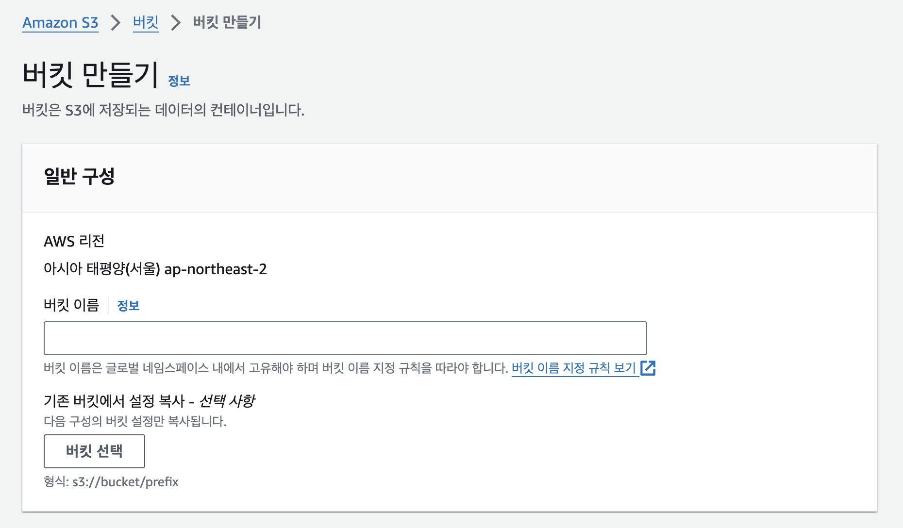
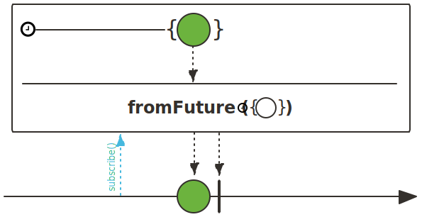

이번에 서비스를 개발하면서 게시글에 이미지를 업로드하는 기능을 구현하게 되었습니다.
일반적으로 이미지 등의 파일은 일반적인 문자열 등의 데이터와 달리 용량이 커서 데이터베이스가 아닌 외부 저장소에 저장되는데요.
저는 외부 저장소로 비용이 저렴한 클라우드 스토리지인 AWS S3(Simple Storage Service)를 사용하기로 했습니다.

# AWS S3

AWS S3란 비용도 저렴하고 저장할 수 있는 데이터의 양도 제한이 없는 수준의 클라우드 스토리지 서비스입니다.
S3에서 객체 하나는 최대 5TB의 제한을 가지고 있는데, 사실상 이미지는 500KB 정도의 용량을 가지기 때문에 용량 측면에서 문제는 없습니다.

## 버킷 생성

우선 S3에서 객체를 저장할 버킷(Bucket)을 생성해야 합니다.



버킷은 리전(Region)에 종속적이므로 서울이 속해있는 `ap-northeast-2`에 버킷을 생성하겠습니다.


일반적으로 버킷 내 객체에 대한 권한은 ACL(Access Control List) 또는 버킷 정책으로 설정할 수 있습니다.
저는 개별적인 이미지에 대한 권한보다는 모든 이미지들에 대한 권한 설정이 필요한데요.
그러므로 전체적인 객체 권한 설정에 용이한 버킷 정책을 사용할 예정입니다.
앞서, 버킷 정책을 통해 권한을 설정하기 위해서는 버킷 정책이 적용하는 퍼블릭 액세스 차단을 해제해야 합니다.


정상적으로 해당 리전에 버킷이 생성된 것을 확인할 수 있습니다.

```json showLineNumbers
{
    "Version": "2012-10-17",
    "Statement": [
        {
            "Sid": "AllowAllPrincipalReadOnly",
            "Effect": "Allow",
            "Principal": "*",
            "Action": "s3:GetObject",
            "Resource": "<S3 ARN>/*"
        }
    ]
}
```

그 다음, 외부에서 버킷 내의 모든 객체(이미지)에 대해 접근할 수 있도록 버킷 정책을 설정했습니다.

## IAM 설정

이제 AWS SDK(Software Development Kit)를 통해 애플리케이션에서 S3에 접근해야 하는데요.
그 전에 S3에 대해 전체 권한을 가진 IAM(Identity and Access Management) 사용자가 필요합니다.


`AmazonS3FullAccess`는 S3에 대한 모든 권한을 포함하고 있는 정책입니다.
해당 정책을 SDK에서 사용할 사용자에게 적용했습니다.

## AWS SDK 설정

이제 애플리케이션에 AWS SDK를 설정해 보겠습니다.

```kotlin title="gradle.build.kts" showLineNumbers {4}
dependencies {
    implementation(platform("software.amazon.awssdk:bom:2.15.0"))
    implementation("software.amazon.awssdk:s3")
    implementation("software.amazon.awssdk:netty-nio-client")
}
```

저는 현재 Spring WebFlux를 사용하고 있으므로 비동기 방식의 업로드를 지원하는 SDK를 사용하였습니다.

```kotlin title="AwsConfiguration.kt" showLineNumbers
@Configuration
class AwsConfiguration(
    @Value("\${aws.credentials.accessKey}")
    private val accessKey: String,
    @Value("\${aws.credentials.secretKey}")
    private val secretKey: String
) {
    @Bean
    fun awsCredentialsProvider(): AwsCredentialsProvider =
        AwsCredentialsProvider { AwsBasicCredentials.create(accessKey, secretKey) }
}
```

IAM으로 생성한 사용자의 액세스 키와 시크릿 액세스 키를 통해 `AwsCredentialsProvider`를 Bean으로 등록합니다.

```kotlin title="S3Configuration.kt" showLineNumbers
@Configuration
class S3Configuration(
    private val credentialsProvider: AwsCredentialsProvider,
    @Value("\${aws.s3.region}")
    private val region: String
) {
    @Bean
    fun amazonS3Client(): S3AsyncClient =
        S3AsyncClient.builder()
            .region(Region.of(region))
            .credentialsProvider(credentialsProvider)
            .serviceConfiguration(
                S3Configuration.builder()
                    .checksumValidationEnabled(false)
                    .chunkedEncodingEnabled(true)
                    .build()
            )
            .build()
}
```

그 다음, 업로드에 사용할 `S3AsyncClient`를 Bean으로 등록했는데요.
성능 오버헤드 및 비용 문제를 생각해 객체의 무결성을 검사하는 체크섬(Checksum) 유효성 검사는 해제했습니다.

```java title="S3AsyncClient.java" showLineNumbers
public interface S3AsyncClient extends SdkClient {
    default CompletableFuture<PutObjectResponse> putObject(PutObjectRequest putObjectRequest, AsyncRequestBody requestBody) {
        throw new UnsupportedOperationException();
    }
    ...
}
```

`S3AsyncClient`는 기존의 `S3Client`와 달리 `putObject()`가 비동기적으로 작동하므로 `CompletableFuture`를 반환한다는 차이점이 있습니다.



Spring WebFlux에서는 `CompletableFuture`를 `fromFuture()`를 통해 `Mono`로 변환해서 사용하면 됩니다.

# 이미지 업로드 기능 구현

이제 이미지 업로드 기능을 구현해 보겠습니다.

<br /><br />

구현하기에 앞서, 저는 이미지를 `multipart/form-data`를 통해 받을 예정인데요.
Spring WebFlux에서는 `multipart/form-data`로 받은 Request Body는 `MultiValueMap<String, Part>`의 타입을 가지고 있습니다.

```java title="Part.java" showLineNumbers
public interface Part {
	String name();

	HttpHeaders headers();

	Flux<DataBuffer> content();
  ...
}
```

`Part`는 기본적으로 위와 같은 명세를 가지고 있는데요.

```java title="FormFieldPart.java" showLineNumbers
public interface FormFieldPart extends Part {
	String value();
}
```
```java title="FilePart.java" showLineNumbers
public interface FilePart extends Part {
	String filename();
  ...
}
```

여기서 `Part`는 받은 데이터의 종류에 따라 `FilePart` 또는 `FormFieldPart`로 구현됩니다.

<br /><br />

문제는 `AsyncS3Client`가 `content()`의 반환 값인 `Flux<DataBuffer>`에 대한 지원을 하지 않는다는 점입니다.
그러므로 `Flux<DataBuffer>`를 `AsyncS3Client`가 받을 수 있는 `ByteArray` 또는 `String` 등의 형태로 변환해야 합니다.

```kotlin title="WebUtil.kt" showLineNumbers {2, 6}
fun Flux<DataBuffer>.toByteArray(): Mono<ByteArray> =
    DataBufferUtils.join(this)
        .map {
            ByteArray(it.readableByteCount())
                .also(it::read)
                .apply { DataBufferUtils.release(it) }
        }
```

저는 `Flux<DataBuffer>`를 `ByteArray`로 변환하는 방법을 사용해 보겠습니다.
`DataBufferUtils`를 사용하면 `Flux<DataBuffer>`를 `Mono<DataBuffer>`로 변환하고 안전하게 메모리 해제까지 수행할 수 있습니다.

```kotlin title="S3Provider.kt" showLineNumbers {13-15}
@Component
class S3Provider(
    private val s3Client: S3AsyncClient,
    @Value("\${aws.s3.bucket}")
    private val bucket: String,
    @Value("\${aws.s3.region}")
    private val region: String
) {
    fun upload(key: String, filePart: FilePart): Mono<String> =
        getPutObjectRequest(key, filePart)
            .zipWith(filePart.content().toByteArray())
            .flatMap { (request, bytes) ->
                Mono.fromFuture(
                    s3Client.putObject(request, AsyncRequestBody.fromBytes(bytes))
                )
            }
            .map { createUri(key) }

    private fun getPutObjectRequest(key: String, filePart: FilePart): Mono<PutObjectRequest> =
        DataBufferUtils
            .join(filePart.content())
            .map {
                PutObjectRequest.builder()
                    .contentType(filePart.headers().contentType!!.toString())
                    .contentLength(it.readableByteCount().toLong())
                    .key(key)
                    .bucket(bucket)
                    .build()
            }

    private fun createUri(key: String) =
        "https://${bucket}.s3.${region}.amazonaws.com/${key}"
}
```

앞서 구현한 `toByteArray()`와 함께 `FilePart` 형태의 이미지를 업로드하는 `S3Provider`를 구현했습니다.
`FilePart`는 따로 파일의 크기를 제공하지 않아서 `DataBuffer`의 `readableByteCount()`를 통해 크기를 구하였습니다.
또한 해당 이미지가 저장된 후의 URI(Uniform Resource Identifier)를 데이터베이스에 저장하기 위해 `upload()`가 객체 URI를 반환하도록 했습니다.

<br /><br />

마지막으로 구현한 이미지 업로드를 포함한 비즈니스 로직은 다음과 같습니다.

```kotlin title="PostHandler.kt" showLineNumbers {7}
@Handler
class PostHandler(
    private val postService: PostService
) {
    fun createPost(request: ServerRequest): Mono<ServerResponse> =
        with(request) {
            body(BodyExtractors.toMultipartData())
                .map { CreatePostRequest(it) }
                .zipWith(getAuthentication())
                .flatMap { (createPostRequest, authentication) ->
                    ServerResponse.ok()
                        .body(postService.createPost(createPostRequest, authentication))
                }
        }
    ...
}
```
```kotlin title="PostService.kt" showLineNumbers {17}
@Service
class PostService(
    private val postRepository: PostRepository,
    private val studentRepository: StudentRepository,
    private val boardRepository: BoardRepository,
    private val s3Provider: S3Provider
) {
    fun createPost(request: CreatePostRequest, authentication: DefaultJwtAuthentication): Mono<PostResponse> =
        with(request) {
            boardRepository.findById(boardId)
                .switchIfEmpty(Mono.error(BoardNotFoundException()))
                .zipWhen {
                    studentRepository.findById(authentication.id)
                        .switchIfEmpty(Mono.error(StudentNotFoundException()))
                }
                .flatMap { (board, student) ->
                    Flux.mergeSequential(images.map { s3Provider.upload(it.filename(), it) })
                        .collectList()
                        .defaultIfEmpty(emptyList())
                        .flatMap {
                            postRepository.save(
                                Post(
                                    board = board,
                                    writer = Writer(student),
                                    title = title,
                                    content = content,
                                    images = it
                                )
                            )
                        }
                }
                .map { PostResponse(it) }
        }
    ...
}
```

## E2E 테스트

실제로 프론트엔드를 통해 이미지를 업로드해 보겠습니다.

```ts title="formData.ts" showLineNumbers
const getFormData = (object: { [key: string]: any }) =>
  Object.keys(object).reduce((formData, key) => {
    if (object[key] instanceof Array) {
      object[key].forEach((value: any) => {
        formData.append(key, value)
      })
    } else {
      formData.append(key, object[key])
    }
    return formData
  }, new FormData())
```

AJAX(Asynchronous JavaScript And XML) 통신에서 `multipart/fomr-data` 형식의 요청은 JSON(JavaScript Object Notation)이 아닌 `FormData`를 Request Body로 전송해야 하는데요.
그렇기에 객체를 `FormData`로 변환하는 로직도 함께 구현했습니다.

```ts title="api.ts" showLineNumbers
const createPost = (request: CreatePostRequest) => {
  const formData = getFormData(request)

  return POST<PostResponse[]>(`/post`, formData, {
    headers: {
      'Content-Type': 'multipart/form-data'
    }
  })
}
...
```

API 연동 로직은 위와 같이 구현했습니다.


업로드할 이미지로는 제가 개인적으로 좋아하는 뉴진스 민지님의 사진을 사용했습니다.

```mongodb-json showLineNumbers {13-16}
{
  _id: ObjectId('665afc2ecbdeb92950f8f452'),
  board: { _id: ObjectId('662f548bc333f951251ea702'), name: '자유' },
  writer: {
    _id: ObjectId('664c0480a158f8347d17ecd9'),
    major: '컴퓨터공학부',
    grade: 3
  },
  title: '뉴진스 민지',
  content: 'ㅎㅎ',
  likedStudentIds: [],
  commentIds: [],
  images: [
    'https://<Bucket name>.s3.ap-northeast-2.amazonaws.com/8508B4F8-6264-4777-A5AE-74C4FF7F0519.jpg',
    'https://<Bucket name>.s3.ap-northeast-2.amazonaws.com/5A397677-898D-4BCA-AEB3-39A3F18588CB.jpg'
  ],
  createdDate: ISODate('2024-06-01T10:47:10.912Z'),
}
```

데이터베이스에 정상적으로 업로드한 이미지들의 URI가 저장되었습니다.


실제로 이미지들이 버킷에 정상적으로 저장되는 것을 확인할 수 있었고요.


또한 버킷 정책에 의해 외부에서 객체에 접근하는 것도 가능한 것을 확인할 수 있었습니다.

# CDN 적용

제가 구현한 이미지 업로드는 URI에 버킷의 정보가 노출된다는 단점이 존재하는데요.
해당 단점은 CDN(Content Delivery Network)을 적용해서 해결할 수 있습니다.

<br /><br />

CDN이란 사용자의 위치와 인접한 곳에서 정적 파일를 캐싱(Caching)해 제공하는 방식인데요.
일반적으로 정적 파일이 저장된 리전과 다른 리전에서도 정적 파일을 빠르게 로드하기 위해 사용그러나, AWS S3에 CDN을 적용하면 URI로부터 버킷 정보를 숨기고 비용을 절감할 수 있다는 장점도 챙길 수 있습니다.
AWS에서는 엣지 로케이션(Edge Location)에 파일을 캐싱해 제공하는 CloudFront라는 CDN 서비스를 사용하면 됩니다.

## CloudFront 배포


우선 원본을 가진 오리진(Origin) 서버가 S3 도메인을 가지도록 설정합니다.
이렇게 되면 CloudFront에서 특정 파일이 없는 경우, 오리진 서버인 S3로부터 해당 파일을 가져와 캐싱하게 됩니다.
또한 보안을 위해 OAC(Origin Access Control)를 설정했습니다.


정상적으로 S3 버킷이 CloudFront의 오리진 서버로 추가된 것을 확인할 수 있습니다.

## 버킷 정책 수정

이제부터는 외부에서 기존의 S3가 아닌 CloudFront로 접근할 것이므로 버킷 정책을 수정해야 합니다.

```json showLineNumbers
{
    "Version": "2012-10-17",
    "Statement": [
        {
            "Sid": "AllowCloudFrontServicePrincipalReadOnly",
            "Effect": "Allow",
            "Principal": {
                "Service": "cloudfront.amazonaws.com"
            },
            "Action": "s3:GetObject",
            "Resource": "<S3 ARN>/*",
            "Condition": {
                "StringEquals": {
                    "AWS:SourceArn": "<CloudFront ARN>"
                }
            }
        }
    ]
}
```

제가 생성한 CloudFront에서만 버킷 내의 객체에 접근할 수 있도록 버킷 정책을 수정했습니다.

## URI 수정

```kotlin showLineNumbers
private fun createUri(key: String) = "https://${domain}/${key}"
```

기존의 URI를 생성하는 코드에서 CloudFront의 도메인을 사용하도록 수정하면 됩니다.

# 이미지 업로드

이제 다시 이미지를 업로드해 보겠습니다.

```mongodb-json showLineNumbers {13-16}
{
  _id: ObjectId('665c28d52f9bc94363e65d33'),
  board: { _id: ObjectId('662f548bc333f951251ea702'), name: '자유' },
  writer: {
    _id: ObjectId('664c0480a158f8347d17ecd9'),
    major: '컴퓨터공학부',
    grade: 2
  },
  title: '뉴진스 민지',
  content: 'ㅎㅎ',
  likedStudentIds: [],
  commentIds: [],
  images: [
    'https://d39rop1r97qhnh.cloudfront.net/24DEBCD4-4573-49A0-AD6E-FFE167E8D36A.jpg',
    'https://d39rop1r97qhnh.cloudfront.net/14C9675D-CABF-477D-B804-0478F8E1D5DF.jpg'
  ],
  createdDate: ISODate('2024-06-02T08:09:57.586Z')
}
```

이번엔 S3의 URI가 아닌 CloudFront의 URI가 데이터베이스에 저장되었습니다.


해당 URI에 접근해보면 실제로 이미지가 조회되는 것을 확인할 수 있습니다.


또한 기존의 S3 URI로 접근하면 버킷 정책에 의해 요청이 거부되는 것도 확인할 수 있습니다.
