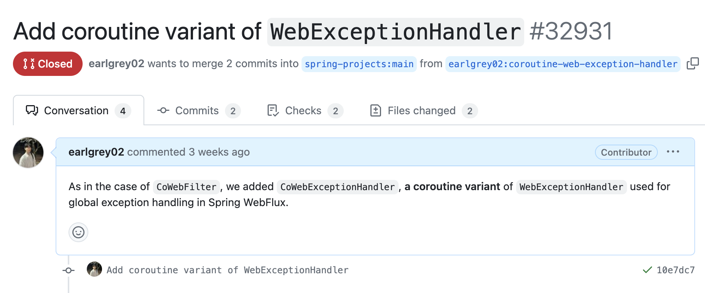
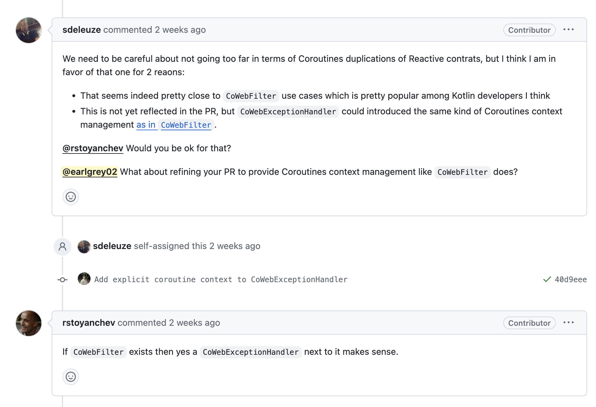
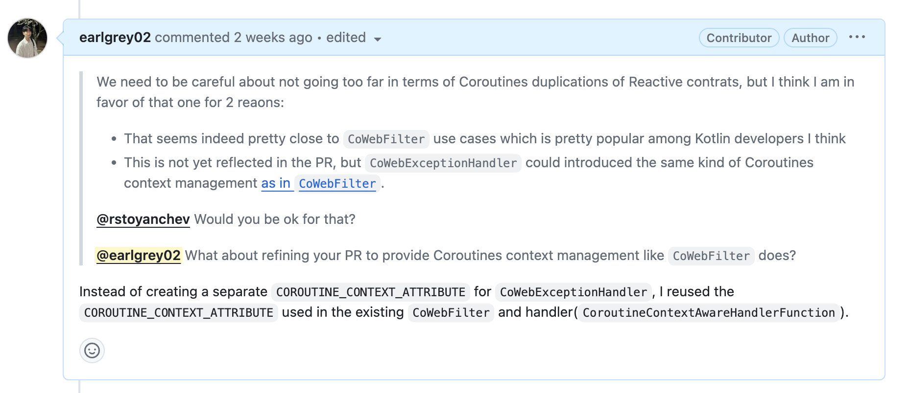
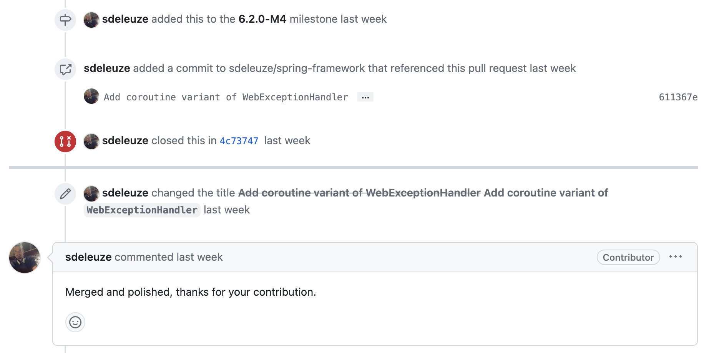

이번에 Spring WebFlux와 Kotlin을 함께 사용하면서 코루틴(Coroutine) 도입에 대한 고민을 했었는데요.
해당 고민을 하면서 Spring WebFlux에서는 코루틴을 얼마나 지원하고 있는지 살펴보고 있었습니다.

# CoWebFilter

```kotlin title="CoWebFilter.kt" showLineNumbers
abstract class CoWebFilter : WebFilter {
	final override fun filter(exchange: ServerWebExchange, chain: WebFilterChain): Mono<Void> {
		val context = exchange.attributes[COROUTINE_CONTEXT_ATTRIBUTE] as CoroutineContext?
		return mono(context ?: Dispatchers.Unconfined) {
			filter(exchange, object : CoWebFilterChain {
				override suspend fun filter(exchange: ServerWebExchange) {
					exchange.attributes[COROUTINE_CONTEXT_ATTRIBUTE] = currentCoroutineContext().minusKey(Job.Key)
					chain.filter(exchange).awaitSingleOrNull()
				}
			})}.then()
	}

	protected abstract suspend fun filter(exchange: ServerWebExchange, chain: CoWebFilterChain)

	companion object {
		@JvmField
		val COROUTINE_CONTEXT_ATTRIBUTE = CoWebFilter::class.java.getName() + ".context"
	}
}
```

여러 기능을 살펴보던 중 `CoWebFilter`라는 `WebFilter`의 코루틴 확장 클래스를 보게 되었는데요.
당연히 `CoWebFilter`가 있으니 예외 처리에 사용되는 `WebExceptionHandler`의 코루틴 확장도 있겠다는 생각을 했습니다.
그러나 따로 `CoWebExceptionHandler` 등의 클래스는 없었습니다.

<br /><br />

너무나 당연한 것이 없다고 생각해, 제가 직접 코드를 작성해 Spring framework에 컨트리뷰션을 하기로 했습니다.

# CoWebExceptionHandler

```kotlin title="CoWebExceptionHandler.kt" showLineNumbers
abstract class CoWebExceptionHandler : WebExceptionHandler {
	final override fun handle(exchange: ServerWebExchange, ex: Throwable): Mono<Void> =
		mono(Dispatchers.Unconfined) { coHandle(exchange, ex) }.then()

	protected abstract suspend fun coHandle(exchange: ServerWebExchange, ex: Throwable)
}
```

우선 제가 생각한대로 `WebExceptionHandler`의 코루틴 확장 클래스인 `CoWebExceptionHandler`를 구현했습니다.
`CoWebFilter`와 달리 `CoWebExceptionHandler`에서는 기존의 메서드와 코루틴 확장 메서드가 모두 시그니처(Signature)가 동일해지는 문제로 `co` 접두사를 통해 새로운 이름으로 메서드를 만들었습니다.

<br /><br />

또한 해당 코루틴이 특정 스레드에 국한되지 않도록 `Dispatchers.Unconfined`를 사용했습니다.
`Dispatchers.Unconfined`는 해당 일시 중지 함수를 재개하는 스레드에서 작업이 수행되도록 하는 코루틴 컨텍스트입니다.

```kotlin title="CoWebExceptionHandlerTest.kt" showLineNumbers
class CoWebExceptionHandlerTest {
	@Test
	fun handle() {
		val exchange = MockServerWebExchange.from(MockServerHttpRequest.get("https://example.com"))
		val ex = RuntimeException()

		val handler = MyCoWebExceptionHandler()
		val result = handler.handle(exchange, ex)

		StepVerifier.create(result).verifyComplete()

		assertThat(exchange.attributes["foo"]).isEqualTo("bar")
	}
}

private class MyCoWebExceptionHandler : CoWebExceptionHandler() {
	override suspend fun coHandle(exchange: ServerWebExchange, ex: Throwable) {
		exchange.attributes["foo"] = "bar"
	}
}
```

그리고 `CoWebExceptionHandler`에 대한 간단한 테스트 코드도 함께 작성하였습니다.

## Pull Request 작성

일반적으로 GitHub에 레포지토리가 존재하는 Spring framework 등의 오픈 소스들은 PR(Pull Request)을 통해 코드에 기여할 수 있습니다.
당연히 해당 오픈 소스의 관리자들에게 허가를 받아야 PR이 실제 코드에 반영됩니다.



저 또한 해당 코드를 커밋하고 PR을 작성하였습니다.



얼마 후, Spring framework의 커밋터(Committer)의 답장을 받았는데요.
해당 커밋터 분은 다른 커밋터 분과 함께 `CoWebExceptionHandler`에 대해 어느 정도 긍정적인 의견을 가지고 계셨습니다.
그와 동시에 `CoWebExceptionHandler`에 `CoWebFilter`와 비슷한 방식의 코루틴 컨텍스트 관리를 도입하자는 제안을 주셨습니다.

## 피드백 반영

```kotlin title="CoWebExceptionHandler.kt" showLineNumbers {3}
abstract class CoWebExceptionHandler : WebExceptionHandler {
	final override fun handle(exchange: ServerWebExchange, ex: Throwable): Mono<Void> =
		mono(Dispatchers.Unconfined) { coHandle(exchange, ex) }.then()

	protected abstract suspend fun coHandle(exchange: ServerWebExchange, ex: Throwable)
}
```

기존의 `CoWebExceptionHandler`는 `Dispatcher.Unconfined`에 의해 코루틴 컨텍스트를 배정받고 있었는데요.
이로 인해 `CoWebExceptionHandler`를 사용하는 개발자는 코루틴 컨텍스트를 자체적으로 관리할 수 없게 됩니다.

```kotlin title="CoWebFilter.kt" showLineNumbers {3-4, 7}
abstract class CoWebFilter : WebFilter {
	final override fun filter(exchange: ServerWebExchange, chain: WebFilterChain): Mono<Void> {
		val context = exchange.attributes[COROUTINE_CONTEXT_ATTRIBUTE] as CoroutineContext?
		return mono(context ?: Dispatchers.Unconfined) {
			filter(exchange, object : CoWebFilterChain {
				override suspend fun filter(exchange: ServerWebExchange) {
					exchange.attributes[COROUTINE_CONTEXT_ATTRIBUTE] = currentCoroutineContext().minusKey(Job.Key)
					chain.filter(exchange).awaitSingleOrNull()
				}
			})}.then()
	}

	protected abstract suspend fun filter(exchange: ServerWebExchange, chain: CoWebFilterChain)

	companion object {
		@JvmField
		val COROUTINE_CONTEXT_ATTRIBUTE = CoWebFilter::class.java.getName() + ".context"
	}
}
```

그래서 `CoWebFilter`에서는 이러한 문제를 자체적인 코루틴 컨텍스트를 가지도록 하는 방식을 통해 해결한 것을 볼 수 있었는데요.
자체적인 코루틴 컨텍스트는 `ServerWebExchange`의 `attributes`에서 참조하며, 연쇄적으로 호출되는 `chain.filter()`에서는 부모 코루틴과 독립적인 코루틴 컨텍스트를 가질 수 있도록 `minusKey(Job.Key)`를 사용한 것을 코드에서 볼 수 있습니다.
저도 이러한 방식을 통해 `CoWebExceptionHandler`에서도 코루틴 컨텍스트 관리를 제공하기로 했습니다.

```kotlin title="CoWebExceptionHandler.kt" showLineNumbers {3-4}
abstract class CoWebExceptionHandler : WebExceptionHandler {
	final override fun handle(exchange: ServerWebExchange, ex: Throwable): Mono<Void> {
		val context = exchange.attributes[CoWebFilter.COROUTINE_CONTEXT_ATTRIBUTE] as CoroutineContext?
		return mono(context ?: Dispatchers.Unconfined) { coHandle(exchange, ex) }.then()
	}

	protected abstract suspend fun coHandle(exchange: ServerWebExchange, ex: Throwable)
}
```

`COROUTINE_CONTEXT_ATTRIBUTE`를 통해 `ServerWebExchange`의 `attributes`에 저장된 코루틴 컨텍스트를 참조하도록 했는데요.
이렇게 되면 개발자는 `ServerWebExchange`를 통해 `CoWebExceptionHandler`가 실행될 코루틴 컨텍스트를 설정하는 등의 작업을 할 수 있습니다.

<br /><br />

이때, `CoWebFilter`에서 사용하던 `COROUTINE_CONTEXT_ATTRIBUTE`를 사용한 이유는 `CoWebFilter`를 제외한 다른 클래스에서도 `COROUTINE_CONTEXT_ATTRIBUTE`를 사용해 코루틴 컨텍스트에 접근하는 것을 확인했기 때문입니다.

```kotlin title="CoRouterFunctionDsl.kt" showLineNumbers {7}
class CoRouterFunctionDsl internal constructor (private val init: (CoRouterFunctionDsl.() -> Unit)) {
  private inner class CoroutineContextAwareHandlerFunction<T : ServerResponse>(
		private val handler: suspend (ServerRequest) -> T
	) : HandlerFunction<T> {
		override fun handle(request: ServerRequest): Mono<T> {
			val context = request.attributes()[CoWebFilter.COROUTINE_CONTEXT_ATTRIBUTE] as CoroutineContext?
			return handle(context ?: Dispatchers.Unconfined, request)
		}

		fun handle(context: CoroutineContext, request: ServerRequest) = asMono(request, context) {
			handler(request)
		}
	}
  ...
}
```

실제로 Spring WebFlux의 함수형 엔드포인트에서 사용되는 `CoroutineContextAwareHandlerFunction`에서도 `CoWebFilter`의 `COROUTINE_CONTEXT_ATTRIBUTE`를 사용하는 것을 볼 수 있습니다.
이렇게 되면 굳이 `CoWebExceptionHandler`만의 Key를 따로 추가해서 복잡도를 늘리는 것보다는 기존에 존재하는 Key인 `COROUTINE_CONTEXT_ATTRIBUTE`를 통해 코루틴 컨텍스트를 관리하도록 하는 것이 유지보수 측면에서 좋다고 생각했습니다.
그래서 제 `CoWebExceptionHandler`에서도 `CoWebFilter`의 `COROUTINE_CONTEXT_ATTRIBUTE`를 사용하도록 구현한 것입니다.



이렇게 피드백을 반영한 제 코드를 추가로 커밋하고 댓글을 남겼습니다.



마침내 PR이 마일스톤(Milestone)에 배정된 후, 작업이 수행되었는데요.

```kotlin title="CoWebExceptionHandler.kt" showLineNumbers
/**
 * Kotlin-specific implementation of the [WebExceptionHandler] interface that allows for
 * using coroutines, including [kotlin.coroutines.CoroutineContext] propagation.
 *
 * @author Sangyoon Jeong
 * @since 6.2
 */
abstract class CoWebExceptionHandler : WebExceptionHandler {
	final override fun handle(exchange: ServerWebExchange, ex: Throwable): Mono<Void> {
		val context = exchange.attributes[CoWebFilter.COROUTINE_CONTEXT_ATTRIBUTE] as CoroutineContext?
		return mono(context ?: Dispatchers.Unconfined) { coHandle(exchange, ex) }.then()
	}

	protected abstract suspend fun coHandle(exchange: ServerWebExchange, ex: Throwable)
}
```

이후, 추가적인 주석과 함께 실제로 제 코드가 반영된 것을 확인할 수 있었습니다.

<br /><br />

이렇게 오픈 소스에 제 코드와 함께 컨트리뷰션을 해보았는데요.
그동안 저에게는 Spring framework 및 Spring Security에서 수정 작업으로 컨트리뷰션한 경험들만 있었습니다.
그러나 이번에는 새로운 기능을 만들어서 제 실명과 함께 코드가 반영된 것을 보니 뿌듯함이 2배로 느껴진 경험이었던 것 같습니다.
