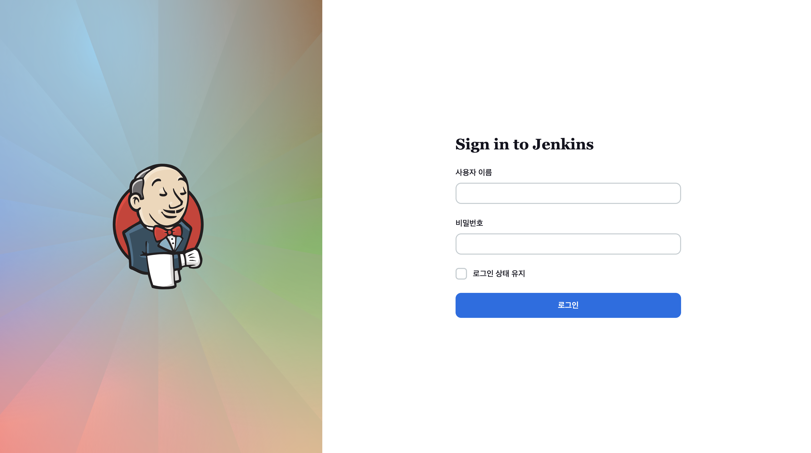
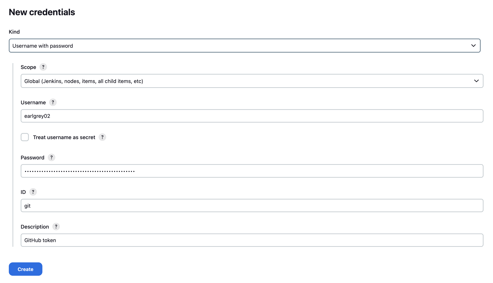
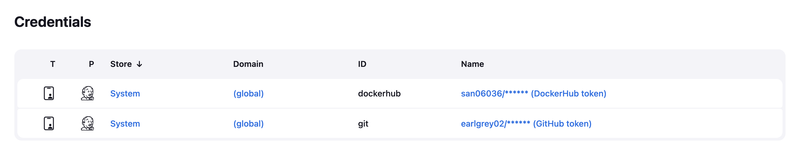
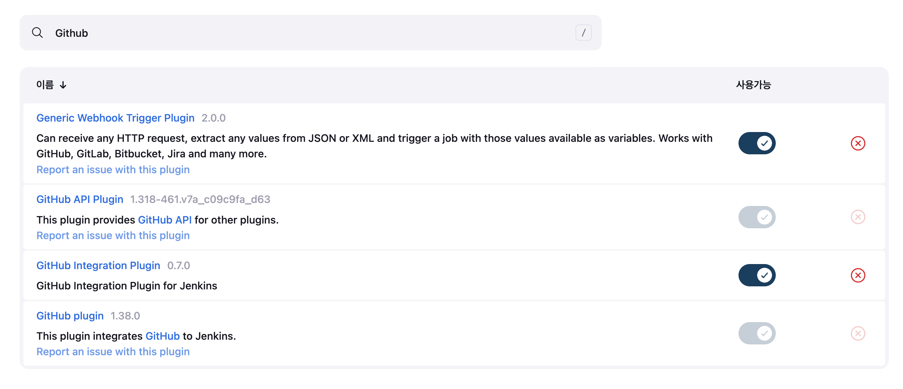
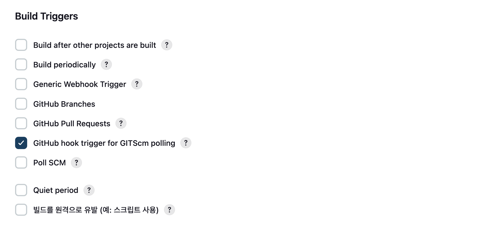
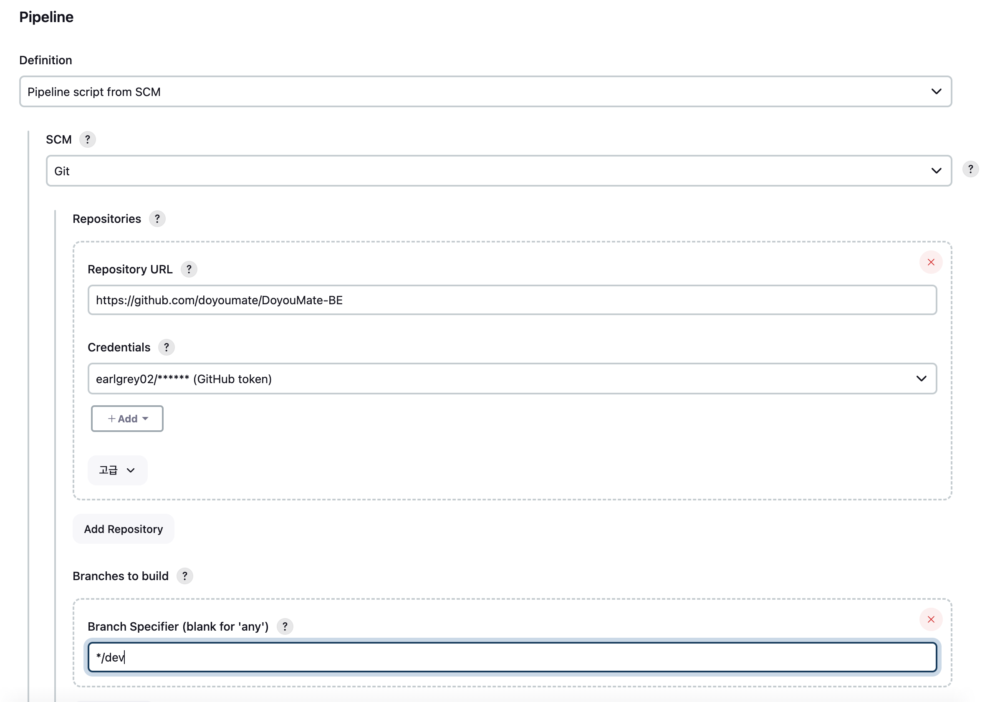
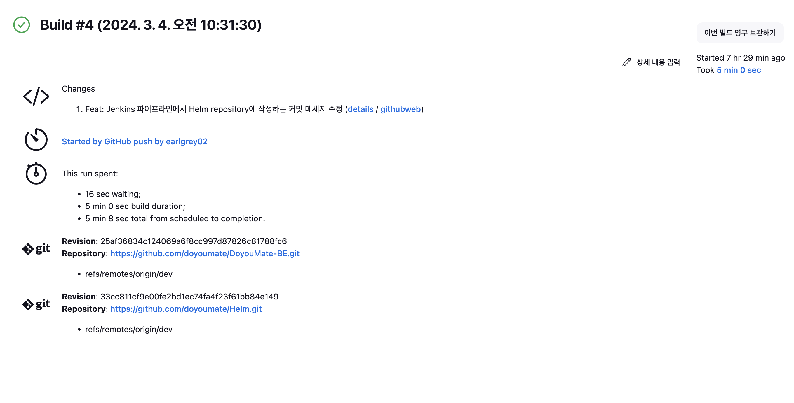
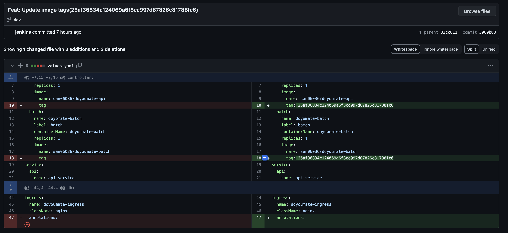

이번에 Kubernetes를 다루면서 코드형 인프라(Infrastructure as Code, IaC)의 장점을 더 살리기 위해 GitOps를 채택했는데요.
GitOps는 DevOps의 확장 개념으로, 배포와 운영에 관련된 코드들을 Git에서 관리하는 것을 의미합니다.
이 GitOps의 CI / CD 파이프라인에서 CI 파이프라인은 Jenkins를 통해 구축해 보기로 했습니다.

# Jenkins 배포

우선 Jenkins를 클러스터 내에 구동해야 합니다.
그러나 Jenkins와 관련된 Pod, Service, Ingress 등을 수동으로 배포하고 관리하기는 힘들다고 생각했습니다.
그래서 Helm을 사용하기로 했는데요.
각 벤더(Vendor)에서 만들어준 Helm 차트를 기반으로 `values.yaml`만 잘 수정해서 배포하기만 하면 됩니다.

```console
> helm repo add jenkins https://charts.jenkins.io
"jenkins" has been added to your repositories
> helm repo update
Hang tight while we grab the latest from your chart repositories...
...Successfully got an update from the "jenkinsci" chart repository
...Successfully got an update from the "jenkins" chart repository
Update Complete. ⎈Happy Helming!⎈
```

Jenkins 차트를 가져오기 위해 차트 레포지토리를 추가합니다.

```console
> helm show values jenkins/jenkins > jenkins-values.yaml
```

그 다음, Jenkins 차트에 설정할 `jenkins-values.yaml`을 가져옵니다.

```yaml title="jenkins-values.yaml" showLineNumbers
contoller:
  runAsUser: 0
  containerSecurityContext:
    runAsUser: 0
    runAsGroup: 1000
    readOnlyRootFilesystem: false
  jenkinsUriPrefix: /jenkins
  ingress:
    enabled: true
    ingressClassName: nginx
    path: "/jenkins"
    pathType: Prefix
  persistence:
    enable: true
    accessMode: ReadWriteOnce
    size: 8Gi
```

그리고 `jenkins-values.yaml`에서 권한이나 볼륨 등 설정하고자 하는 부분을 수정했는데요.
추가로 `/jenkins`를 Prefix로 가지는 Ingress를 생성할 것이므로, 이에 맞게 `jenkinsUriPrefix`도 수정했습니다.
이렇게 설정된 Ingress는 제가 사전에 배포한 `NodePort` 타입의 Nginx Ingress Controller를 통해 구현됩니다.

```yaml title="persistent-volume.yaml" showLineNumbers
apiVersion: v1
kind: PersistentVolume
metadata:
  name: jenkins-pv
spec:
  capacity:
    storage: 8Gi
  accessModes:
  - ReadWriteOnce
  persistentVolumeReclaimPolicy: Retain
  hostPath:
    path: /var/jenkins
```

제가 사용하는 Kubernetes는 AWS EKS(Elastic Kubernetes Service) 등의 Managed Kubernetes가 아니므로 AWS EBS(Elastic Block Storage) 등의 스토리지(Storage)를 프로비저닝할 Storage Class를 사용하기는 어렵습니다.
그래서 우선은 임시적으로 `hostPath` 타입의 Persistence Volume을 생성했습니다.
이후에 워커 노드가 많아진다면 NFS(Network File System) 등의 대안을 선택해야 합니다.

```console
> helm install jenkins jenkins/jenkins -f jenkins-values.yaml -n jenkins
NAME: jenkins
LAST DEPLOYED: Tue Mar  5 01:52:04 2024
NAMESPACE: jenkins
STATUS: deployed
REVISION: 1
NOTES:
1. Get your 'admin' user password by running:
  kubectl exec --namespace jenkins -it svc/jenkins -c jenkins -- /bin/cat /run/secrets/additional/chart-admin-password && echo
2. Get the Jenkins URL to visit by running these commands in the same shell:
  echo http://127.0.0.1:8080/jenkins
  kubectl --namespace jenkins port-forward svc/jenkins 8080:8080

3. Login with the password from step 1 and the username: admin
4. Configure security realm and authorization strategy
5. Use Jenkins Configuration as Code by specifying configScripts in your values.yaml file, see documentation: http://127.0.0.1:8080/jenkins/configuration-as-code and examples: https://github.com/jenkinsci/configuration-as-code-plugin/tree/master/demos

For more information on running Jenkins on Kubernetes, visit:
https://cloud.google.com/solutions/jenkins-on-container-engine

For more information about Jenkins Configuration as Code, visit:
https://jenkins.io/projects/jcasc/


NOTE: Consider using a custom image with pre-installed plugins
```

이제 `jenkins-values.yaml`와 함께 Jenkins 차트를 배포합니다.

```console
> kubectl get all -n jenkins
NAME            READY   STATUS    RESTARTS   AGE
pod/jenkins-0   2/2     Running   0          12h

NAME                    TYPE        CLUSTER-IP      EXTERNAL-IP   PORT(S)     AGE
service/jenkins         ClusterIP   10.101.229.50   <none>        8080/TCP    12h
service/jenkins-agent   ClusterIP   10.106.246.55   <none>        50000/TCP   12h

NAME                       READY   AGE
statefulset.apps/jenkins   1/1     12h
```
```console
> kubectl get ingresses -n jenkins
NAME      CLASS   HOSTS   ADDRESS        PORTS   AGE
jenkins   nginx   *       172.16.1.101   80      12h
```

위와 같이 Jenkins와 관련된 리소스들이 자동으로 생성된 것을 볼 수 있습니다.

## Jenkins 접속

사전에 배포된 Ingress Controller는 `NodePort` 타입이므로 `<NodeIP>:<NodePort>/jenkins`를 통해 Jenkins에 접속할 수 있습니다.



위와 같이 접속이 잘되면 성공입니다.

```console
kubectl exec --namespace default -it svc/jenkins -c jenkins -- /bin/cat /run/secrets/additional/chart-admin-password && echo
```

사용자 이름은 기본적으로 `admin`이고 패스워드는 위 커맨드를 통해 확인할 수 있습니다.

# Jenkins 설정

이제 Jenkins를 사용하기 이전에 기본적인 설정을 하겠습니다.

## 자격 증명

Jenkins에서는 GitHub나 DockerHub 등의 원격 저장소에 접근해야하는 경우가 있는데, 이때 사용하는 자격 증명이 필요하므로 따로 설정을 해줘야 합니다.



위와 같이 `username`에는 계정 이름을, `password`에는 발급 받은 토큰을 입력한 후 Credential을 생성합니다.



같은 방식으로 GitHub와 DockerHub 모두 Credential을 생성해줍니다.

## 플러그인



또한 CI 파이프라인은 GitHub 레포지토리에 커밋이 발생한 이후에 수행되도록 할 것이므로 WebHook이 필요합니다.
그래서 사용할 GitHub Webhook과 괸련된 플러그인들을 설치합니다.

## Job

CI 파이프라인을 수행할 Job을 구성해야 하는데요.



GitHub 레포지토리의 변경 사항을 감지하고 Job을 수행하도록 하기 위해 Build Trigger로 GitHub Hook Trigger를 선택합니다.



그 다음 레포지토리 URL, GitHub Credential, 브랜치를 설정합니다.
이렇게 되면 Pipeline Script로 레포지토리 내부에 있는 `Jenkinsfile`을 사용하게 됩니다.
Job에서 수행되는 파이프라인은 레포지토리 내의 `Jenkinsfile`에 정의하면 됩니다.

# 애플리케이션 설정

이전에 SW 마에스트로에서 GitOps를 구축할 때는 이미지 빌드 및 배포를 루트 권한 없이 할 수 있는 Kaniko를 사용했었습니다.
그러나 이번에는 좀 더 간단하게 Jib를 통해서 Docker나 Kaniko 등의 도구 없이 이미지를 빌드해서 컨테이너 레지스트리에 배포하는 방식을 사용해보겠습니다.

## Jib

```kotlin title="build.gradle.kts" showLineNumbers
plugins {
    id("com.google.cloud.tools.jib") version "3.3.1"
    ...
}

subprojects {
    apply {
        plugin("com.google.cloud.tools.jib")
        ...
    }
}
```

위와 같이 Jib 플러그인을 배포할 모든 하위 모듈들에 적용했습니다.

```kotlin title="build.gradle.kts" showLineNumbers
tasks {
    jib {
        from {
            image = "openjdk:17-oracle"
        }
        to {
            image = "san06036/doyoumate-api"
        }
    }
}
```

그 다음, 각각의 모듈 내부에서 Jib 설정을 추가했습니다.

```console
./gradlew :api:jib -Djib.to.tags=<Tag> -Djib.to.auth.username=<Docker Username> -Djib.to.auth.password=<Docker Token>
```

Jib는 위 커맨드 한 줄로 이미지 빌드부터 배포까지 쉽게 수행할 수 있습니다.

# Helm 차트

Jenkins가 새로운 이미지를 배포한 후에 클러스터에 변경 사항을 반영해야 합니다.
해당 프로젝트에서는 CD 도구로 ArgoCD를 사용할 것이므로 Jenkins가 이미지 태그를 수정할 Helm 차트가 있어야 합니다.
참고로 GitOps에서 Helm 차트는 Git을 통해 관리하게 됩니다.

```console
helm create doyoumate
```
```console
/doyoumate > ls
Chart.yaml  charts  templates  values.yaml
```

Helm을 통해 차트를 생성하면 위와 같은 디렉토리가 생기게 됩니다.

```yaml title="deployment.yaml" showLineNumbers
apiVersion: apps/v1
kind: Deployment
metadata:
  name: {{ .Values.controller.api.name }}
spec:
  selector:
    matchLabels:
      app: {{ .Values.controller.api.label }}
  replicas: {{ .Values.controller.api.replicas }}
  template:
    metadata:
      labels:
        app: {{ .Values.controller.api.label }}
    spec:
      containers:
      - name: {{ .Values.controller.api.containerName }}
        image: {{ .Values.controller.api.image.name }}:{{ .Values.controller.api.image.tag }}
        imagePullPolicy: Always
        ports:
        - containerPort: 8080
        env:
        - name: SPRING_PROFILES_ACTIVE
          value: {{ .Values.env }}
        envFrom:
        - secretRef:
            name: doyoumate-{{ .Values.env }}
      imagePullSecrets:
      - name: docker-secret
```

`templates`에 Deployment, Service, Ingress 등에 대한 매니페스트(Manifest)를 작성합니다.
위와 같이 `values.yaml`에 있는 값은 매니페스트에서 `{{ .Values.<Key> }}` 형태로 참조할 수 있습니다.

```yaml title="values.yaml" showLineNumbers
env: dev
controller:
  api:
    name: doyoumate-api
    label: api
    containerName: doyoumate-api
    replicas: 1
    image:
      name: san06036/doyoumate-api
      tag: 25af36834c124069a6f8cc997d87826c81788fc6
  batch:
    name: doyomate-batch
    label: batch
    containerName: doyoumate-batch
    replicas: 1
    image:
      name: san06036/doyoumate-batch
      tag: 25af36834c124069a6f8cc997d87826c81788fc6
service:
  api:
    name: api-service
  batch:
    name: batch-service
  mongodb:
    name: mongodb-service
  redis:
    name: redis-service
db:
  mongodb:
    name: doyoumate-mongodb
    replicas: 1
    label: mongodb
    storage:
      name: mongodb-storage
      accessMode: ReadWriteOnce
      request: 1Gi
  redis:
    name: doyoumate-redis
    replicas: 1
    label: redis
    cpuLimit: 0.1
    configMap:
      name: redis-config
ingress:
  name: doyoumate-ingress
  className: nginx
```

`values.yaml`에는 `templates` 내의 매니페스트들에 설정될 값들을 정의하면 됩니다.
이렇게 되면 Jenkins가 이미지를 업데이트한 후 `values.yaml`에 있는 이미지 태그들만 변경해주면 됩니다.
이후, 차트를 기반으로 애플리케이션을 배포하는 것은 Jenkins가 아닌 ArgoCD의 역할입니다.

# CI 파이프라인

이제 모든 준비가 끝났으니 `Jenkinsfile`에 지금까지의 CI 파이프라인을 작성할 차례입니다.

```groovy showLineNumbers
pipeline {
    agent {
        kubernetes {
            yaml(
                '''
                apiVersion: v1
                kind: Pod
                spec:
                  serviceAccountName: jenkins
                  containers:
                  - name: yq
                    image: mikefarah/yq
                    tty: true
                    command: ['sleep']
                    args: ['infinity']
                '''
            )
        }
    }
}
```

우선 차트 레포지토리 내의 이미지 태그를 변경하기 위해 YAML 형식의 파일에서 값을 조작할 수 있는 `yq`를 사용합니다.
`yq` 컨테이너는 Jenkins Agent Pod에 포함되어 배포됩니다.

```groovy showLineNumbers
stage('Git clone') {
    steps {
        git(
            url: 'https://github.com/doyoumate/DoyouMate-BE.git',
            branch: 'dev',
            credentialsId: 'git'
        )
        script {
            env.tag = sh(script: 'git rev-parse HEAD', returnStdout: true).trim()
        }
    }
}
```

첫 번째 스테이지는 서비스 레포지토리를 가져와 이미지 태그를 커밋 Id로 정의하는 스테이지입니다.

```groovy showLineNumbers
stage('Build and deploy image') {
    steps {
        script {
            withCredentials([usernamePassword(credentialsId: 'dockerhub', usernameVariable: 'username', passwordVariable: 'password')]) {
                sh('./gradlew :api:jib -Djib.to.tags=$tag -Djib.to.auth.username=$username -Djib.to.auth.password=$password')
                sh('./gradlew :batch:jib -Djib.to.tags=$tag -Djib.to.auth.username=$username -Djib.to.auth.password=$password')
            }
        }
    }
}
```

두 번째 스테이지는 Jib를 통해 이미지를 빌드하고 컨테이너 레지스트리인 DockerHub에 배포하는 스테이지입니다.
여기서 사용할 이미지 태그는 첫 번째 스테이지에서 정의한 커밋 ID입니다.

```groovy showLineNumbers
stage('Edit manifests') {
    steps {
        container('yq') {
            script {
                dir('helm') {
                    git(
                        url: 'https://github.com/doyoumate/Helm.git',
                        branch: 'dev',
                        credentialsId: 'git'
                    )
                    sh("yq e -i -P '.controller.api.image.tag = \"$tag\"' values.yaml")
                    sh("yq e -i -P '.controller.batch.image.tag = \"$tag\"' values.yaml")
                }
            }
        }

        script {
            dir('helm') {
                withCredentials([gitUsernamePassword(credentialsId: 'git')]) {
                    sh('git config --global user.email "<>"')
                    sh('git config --global user.name "jenkins"')
                    sh('git add .')
                    sh('git commit -m "Feat: Update image tags($tag)"')
                    sh('git push origin dev')
                }
            }
        }
    }
}
```

마지막 스테이지는 차트 레포지토리의 이미지 태그를 수정하는 스테이지입니다.
이 스테이지가 GitOps에서만 볼 수 있는 특별한 스테이지라 생각합니다.

<br /><br />

이렇게 구성한 전체 파이프라인은 다음과 같습니다.

```groovy title="Jenkinsfile" showLineNumbers
pipeline {
    agent {
        kubernetes {
            yaml(
                '''
                apiVersion: v1
                kind: Pod
                spec:
                  serviceAccountName: jenkins
                  containers:
                  - name: yq
                    image: mikefarah/yq
                    tty: true
                    command: ['sleep']
                    args: ['infinity']
                '''
            )
        }
    }

    stages {
        stage('Git clone') {
            steps {
                git(
                    url: 'https://github.com/doyoumate/doyoumate-BE.git',
                    branch: 'dev',
                    credentialsId: 'git'
                )
                script {
                    env.tag = sh(script: 'git rev-parse HEAD', returnStdout: true).trim()
                }
            }
        }

//         stage('Test and create document') {
//             steps {
//                 sh 'mkdir ./api/src/main/resources/static'
//                 sh 'mkdir ./api/src/main/resources/static/docs'
//
//                 sh './gradlew test'
//             }
//         }

        stage('Build and deploy image') {
            steps {
                script {
                    withCredentials([usernamePassword(credentialsId: 'dockerhub', usernameVariable: 'username', passwordVariable: 'password')]) {
                        sh('./gradlew :api:jib -Djib.to.tags=$tag -Djib.to.auth.username=$username -Djib.to.auth.password=$password')
                        sh('./gradlew :batch:jib -Djib.to.tags=$tag -Djib.to.auth.username=$username -Djib.to.auth.password=$password')
                    }
                }
            }
        }

        stage('Edit manifests') {
            steps {
                container('yq') {
                    script {
                        dir('helm') {
                            git(
                                url: 'https://github.com/doyoumate/doyoumate-chart.git',
                                branch: 'dev',
                                credentialsId: 'git'
                            )
                            sh("yq e -i -P '.controller.api.image.tag = \"$tag\"' values.yaml")
                            sh("yq e -i -P '.controller.batch.image.tag = \"$tag\"' values.yaml")
                        }
                    }
                }

                script {
                    dir('helm') {
                        withCredentials([gitUsernamePassword(credentialsId: 'git')]) {
                            sh('git config --global user.email "<>"')
                            sh('git config --global user.name "jenkins"')
                            sh('git add .')
                            sh('git commit -m "Feat: Update image tags($tag)"')
                            sh('git push origin dev')
                        }
                    }
                }
            }
        }
    }
}
```

Jenkins가 테스트를 돌리면 VM(Virtual Machine)의 메모리를 초과해 워커 노드가 계속해서 중단되는 문제를 겪었는데요.
그래서 임시적으로 테스트 스테이지를 주석 처리 해놓았습니다.

# 테스트



실제로 서비스 레포지토리의 `dev` 브랜치에 커밋을 올리면 위와 같이 Job이 수행됩니다.



Jenkins가 차트 레포지토리에서 이미지 태그를 변경하는 것까지도 확인 할 수 있습니다.
