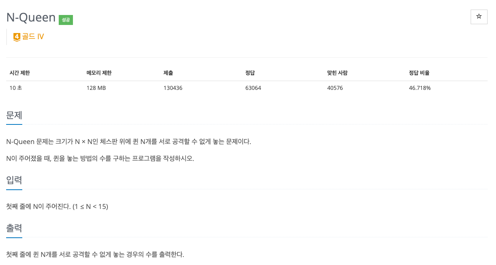

이번에 PS(Problem Solving)를 하면서 Python으로는 계속해서 시간 초과가 발생하는 문제를 발견했습니다.



해당 문제는 잘 알려진 N-Queen 문제로, 크기가 N × N인 체스판 위에 퀸 N개를 서로 공격할 수 없게 배치할 수 있는 모든 경우를 세는 문제입니다.

```python showLineNumbers
import sys

input = sys.stdin.readline

def backtracking(depth: int):
    global count

    if depth == n:
        count += 1
    else:
        for i in range(n):
            positions[depth] = i

            if is_possible_position(depth):
                backtracking(depth + 1)

def is_possible_position(depth: int):
    for i in range(depth):
        if positions[i] == positions[depth] or abs(positions[i] - positions[depth]) == abs(i - depth):
            return False

    return True

n = int(input())
positions = [0 for _ in range(n)]
count = 0

backtracking(0)

print(count)
```

해당 문제는 백트래킹(Backtracking)을 통해 1번째 행부터 마지막 행까지 퀸을 배치하며, 퀸을 N개 배치한 모든 경우를 세는 방식으로 풀 수 있는데요.
위 코드는 PyPy에서는 통과했지만 Python에서는 시간 초과로 인해 통과하지 못했습니다.
저는 이 시간 초과의 원인을 백트래킹의 프로미싱(Promising)이라고 생각했습니다.

# 백트래킹의 프로미싱

백트래킹은 기존의 깊이 우선 탐색(Depth First Search)에 가지치기(Pruning) 기법을 활용해 효율적인 브루트포스(Bruteforce) 탐색을 수행하는 알고리즘입니다.
가지치기는 더 이상 탐색할 필요가 없는 하위 트리를 잘라내는 기법인데, 이 가지치기 여부를 판단하는 행위를 프로미싱(Promising)이라고 합니다.

```python showLineNumbers {14, 17-22}
import sys

input = sys.stdin.readline

def backtracking(depth: int):
    global count

    if depth == n:
        count += 1
    else:
        for i in range(n):
            positions[depth] = i

            if is_possible_position(depth):
                backtracking(depth + 1)

def is_possible_position(depth: int):
    for i in range(depth):
        if positions[i] == positions[depth] or abs(positions[i] - positions[depth]) == abs(i - depth):
            return False

    return True

n = int(input())
positions = [0 for _ in range(n)]
count = 0

backtracking(0)

print(count)
```

앞선 코드에서는 `is_possible_position()`에서 프로미싱을 수행하게 됩니다.
문제는 프로미싱은 모든 노드를 탐색할 때마다 수행되므로 프로미싱의 시간 복잡도가 실행 시간에 큰 영향을 준다는 것인데요.
위 코드에서도 `is_possible_position()`의 시간 복잡도가 선형 시간을 가지므로 영향이 꽤 크다고 볼 수 있습니다.

<br /><br />

그렇다면 결국 프로미싱을 최적화해야 시간 초과를 피할 수 있는데요.
이 최적화 방법으로는 비트 마스킹(Bit Masking)을 생각했습니다.

# 비트 마스킹

비트 마스킹이란 집합 등의 자료 구조를 비트(Bit)로 표현하는 최적화 기법입니다.
비트 연산은 시간 복잡도가 상수 시간이기 때문에 굉장히 빠른데요.
그래서 기존의 자료 구조를 비트로 대체하면 비트 연산을 활용할 수 있어 시간 복잡도를 크게 줄일 수 있습니다.

## 프로미싱 최적화

```python showLineNumbers {18, 25}
import sys

input = sys.stdin.readline

def backtracking(depth: int):
    global count

    if depth == n:
        count += 1
    else:
        for i in range(n):
            positions[depth] = i

            if is_possible_position(depth):
                backtracking(depth + 1)

def is_possible_position(depth: int):
    for i in range(depth):
        if positions[i] == positions[depth] or abs(positions[i] - positions[depth]) == abs(i - depth):
            return False

    return True

n = int(input())
positions = [0 for _ in range(n)]
count = 0

backtracking(0)

print(count)
```

앞선 코드에서는 각 행에 있는 퀸들의 위치를 `positions`라는 배열에 저장했었는데요.
비트 마스킹을 활용해 현재 퀸의 위치를 비트로 표현하면 이후 프로미싱에서도 반복문을 사용하지 않고 비트 연산을 통해 가능한 퀸의 위치를 빠르게 판별할 수 있습니다.

```python showLineNumbers {11, 13-16}
import sys

input = sys.stdin.readline

def backtracking(depth: int, columns: int, left_diag: int, right_diag: int):
    global count

    if depth == n:
        count += 1
    else:
        possible_positions = ~ (columns | left_diag | right_diag) & ((1 << n) - 1)

        while possible_positions:
            position = possible_positions & -possible_positions
            possible_positions -= position
            backtracking(depth + 1, columns | position, (left_diag | position) << 1, (right_diag | position) >> 1)

n = int(input())
count = 0

backtracking(0, 0, 0, 0)

print(count)
```

`columns`와 `left_diag`, `right_diag`는 각각 위치할 수 없는 열과 좌우 대각선들을 나타낸 비트입니다.
또한 `possible_positions`는 현재 가능한 퀸의 위치, `position`은 현재 퀸의 위치입니다.
이렇게 되면 기존의 프로미싱이 `possible_positions`를 비트 연산으로 구하는 과정으로 대체되어 시간 복잡도를 크게 줄일 수 있습니다.

<br /><br />

우선 n이 4인 경우를 예시로 생각해 보겠습니다.
처음에는 어떤 퀸도 배치되지 않았으므로 `columns`, `left_diag`, `right_diag`는 모두 `0000`입니다.
그러므로 `possible_position`는 `1111`이 되는데요.
처음에는 1행 1열에 퀸이 배치되므로 `position`은 `possible_positions & -possible_positions`에 의해 `0001`이 됩니다.
그렇다면 `columns`은 `0001`이 되며, 좌우 대각선들을 나타낸 `left_diag`와 `right_diag`는 시프트 연산자에 의해 각각 `0010`과 `0000`이 되는데요.
이렇게 되면 다음 깊이에서의 `possible_positions`는 `1100`이 됩니다.
실제로 1행 1열에 퀸을 둔 후 다음 행에서는 3, 4열에 퀸을 배치할 수 있습니다.
