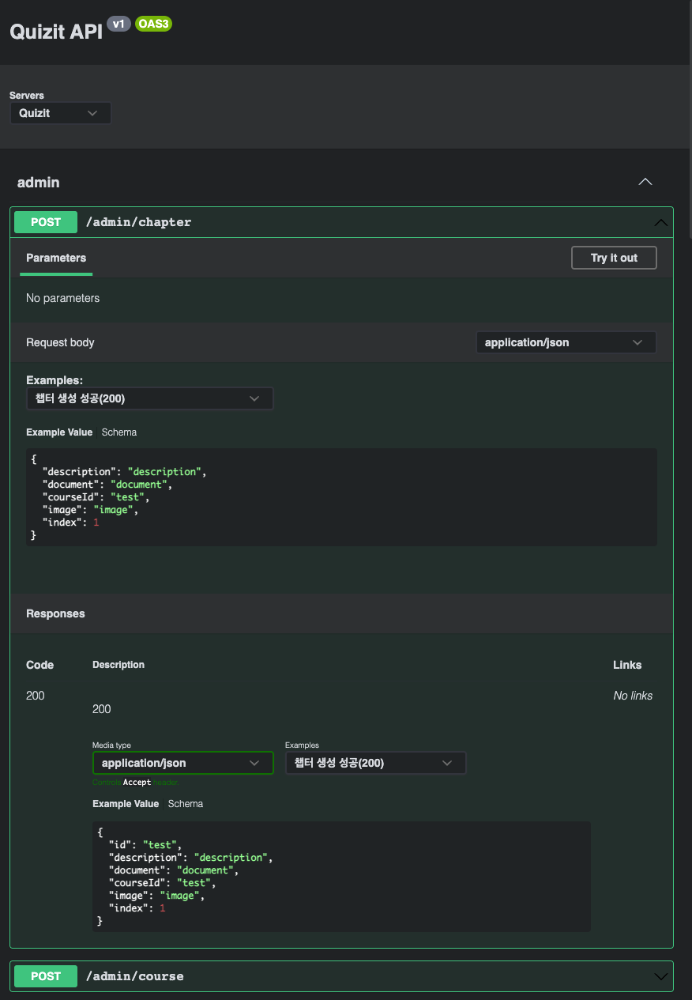

협업을 하면서 빠질 수 없는 요소 중 하나는 문서화입니다.
그 중 API 문서화는 개발자 간의 소통을 원활하게 하고, API의 변경 사항을 쉽게 전달할 수 있도록 하는데요.
저는 API 문서화를 편리하게 할 수 있는 방법을 모색하고 있었습니다.

# Spring REST Docs

일반적으로 Spring 생태계에서는 문서화 도구로 Swagger와 Spring REST Docs라는 선택지가 있습니다.
그 중 Spring REST Docs는 컨트롤러 계층의 테스트를 기반으로 API 명세서를 생성해주는 도구입니다.

<br /><br />

저는 코드 커버리지까지 적용해 테스트 코드를 작성하고 있었던 상황이라 Spring REST Docs를 함께 적용해왔습니다.
그래서 Spring REST Docs를 적용하기 용이한 테스트 환경을 구성했었는데요.

```kotlin title="ControllerTest.kt" showLineNumbers {12}
@AutoConfigureRestDocs
abstract class ControllerTest : DescribeSpec() {
    @Autowired
    private lateinit var applicationContext: ApplicationContext

    @Autowired
    private lateinit var restDocumentation: RestDocumentationContextProvider

    protected val webClient: WebTestClient by lazy {
        WebTestClient.bindToApplicationContext(applicationContext)
            .configureClient()
            .filter(WebTestClientRestDocumentation.documentationConfiguration(restDocumentation))
            .build()
    }
}
```

우선 Spring REST Docs가 설정된 환경을 모든 컨트롤러 계층 테스트에 쉽게 적용하기 위해 `ControllerTest`라는 추상 클래스를 구현했습니다.
`ControllerTest`에서는 Spring REST Docs가 설정된 `WebTestClient`를 가지고 있습니다.
해당 `WebTestClient`를 사용하는 테스트에서는 Spring REST Docs에 의해 스니펫이 생성됩니다.

```kotlin title="RestDocsUtil.kt" showLineNumbers
infix fun String.desc(description: String): FieldDescriptor =
    PayloadDocumentation.fieldWithPath(this)
        .description(description)

infix fun String.paramDesc(description: String): ParameterDescriptor =
    RequestDocumentation.parameterWithName(this)
        .description(description)

fun <T> BodySpec<T, *>.document(
    identifier: String,
    vararg snippets: Snippet
): BodySpec<T, *> =
    consumeWith(
        WebTestClientRestDocumentationWrapper.document<T>(
            identifier,
            Preprocessors.preprocessRequest(Preprocessors.prettyPrint()),
            Preprocessors.preprocessResponse(Preprocessors.prettyPrint()),
            *snippets
        )
    )
```

또한 Kotlin DSL을 통해 문서화 코드를 어느 정도 간소화하였습니다.

```kotlin title="QuizControllerTest.kt" showLineNumbers {20-24}
@WebFluxTest(QuizRouter::class, QuizHandler::class)
class QuizControllerTest : ControllerTest() {
    @MockkBean
    private lateinit var quizService: QuizService

    init {
        describe("getQuizById()는") {
            context("퀴즈가 존재하는 경우") {
                every { quizService.getQuizById(any()) } returns createQuizResponse()
                withMockUser()

                it("상태 코드 200과 quizResponse를 반환한다.") {
                    webClient
                        .get()
                        .uri("/quiz/{id}", ID)
                        .exchange()
                        .expectStatus()
                        .isOk
                        .expectBody<QuizResponse>()
                        .document(
                            "식별자를 통한 퀴즈 단일 조회 성공(200)",
                            pathParameters("id" paramDesc "식별자"),
                            responseFields(quizResponseFields)
                        )
                }
            }
        }
    }
}
```

기존의 컨트롤러 계층 테스트 코드에 `ControllerTest`에 포함된 `WebTestClient`와 함께 해당 API 명세에 대한 정보만 추가해주면 자동으로 `/build/generated-snippets` 경로에 스니펫이 생성됩니다.


이렇게 생성된 스니펫들은 AsciiDoc 형태로 저장되는데, 이 스니펫만으로는 API 명세를 표현하기 힘듭니다.
그래서 스니펫들을 이용해서 API 명세서를 직접 작성해야 합니다.
물론 문법이 어렵진 않지만 개발자의 개입이 필요하다는 점에서 만족스럽지 못했습니다.
저는 이 점을 Swagger를 도입해 극복하려고 했습니다.

# Swagger

Swagger는 Spring REST Docs처럼 API 문서화를 위한 도구 중 하나입니다.



Swagger는 Spring REST Docs와는 다르게 전용 UI를 제공하며, API 테스트 기능까지 가지고 있습니다.
Swagger는 프로덕션 코드에 작성된 `@Tag` 등의 어노테이션들을 기반으로 API 명세서를 생성하는데요.
테스트 코드를 기반으로 스니펫을 생성하는 Spring REST Docs와 달리, 프로덕션 코드에 문서화 관련 코드가 포함되는 것이 Swagger의 단점입니다.

# Spring REST Docs with Swagger

결국 저는 각각 장단점을 가진 Spring REST Docs와 Swagger를 함께 사용해 보기로 했습니다.
Spring REST Docs가 생성한 스니펫들을 Swagger가 읽을 수 있도록 OpenAPI 명세에 맞춘 문서로 변환하고, 해당 문서를 Swagger로 읽는 방법을 생각했는데요.
이러면 테스트 코드 기반으로 생성된 스니펫들을 자동으로 UI(User Interface)가 갖춰진 API 명세서로 만들 수 있습니다.

```kotlin title="build.gradle.kts" showLineNumbers
plugins {
    id("com.epages.restdocs-api-spec") version "0.17.1"
    ...
}

dependencies {
    testImplementation("com.epages:restdocs-api-spec-webtestclient:0.17.1")
    testImplementation("com.epages:restdocs-api-spec:0.17.1")
    ...
}
```

우선 스니펫들을 OpenAPI 문서로 변환하는데 필요한 의존성들을 추가합니다.

```kotlin title="build.gradle.kts" showLineNumbers {4, 9-16}
tasks {
    test {
        useJUnitPlatform()
        finalizedBy(jacocoTestReport, withType<OpenApi3Task>())
    }
    ...
}

openapi3 {
    setServer("Quizit")
    title = "Quizit API"
    version = "v1"
    format = "yaml"
    outputFileNamePrefix = "api"
    outputDirectory = "src/main/resources/static/docs"
}
```

그 다음, 스니펫을 OpenAPI 문서로 변환하는 작업인 `openapi3`를 설정한 후 테스트 작업 과정에 추가했습니다.
이렇게 되면 테스트 코드를 실행한 후 Spring REST Docs에 의해 스니펫들이 생성되고 `openapi3` 작업을 거쳐 스니펫들을 기반으로 한 OpenAPI 문서가 `/src/main/resources/static/docs` 경로에 생성됩니다.

```yaml title="api.yaml" showLineNumbers
openapi: 3.0.1
info:
  title: Quizit API
  version: v1
servers:
- url: Quizit
tags: []
paths:
  /admin/chapter:
    post:
      tags:
      - admin
      operationId: 챕터 생성 성공(200)
      requestBody:
        content:
          application/json:
            schema:
              $ref: '#/components/schemas/admin-chapter-650774478'
            examples:
              챕터 생성 성공(200):
                value: |-
                  {
                    "description" : "description",
                    "document" : "document",
                    "courseId" : "test",
                    "image" : "image",
                    "index" : 1
                  }
      responses:
        "200":
          description: "200"
          content:
            application/json:
              schema:
                $ref: '#/components/schemas/admin-chapter-id-715247309'
              examples:
                챕터 생성 성공(200):
                  value: |-
                    {
                      "id" : "test",
                      "description" : "description",
                      "document" : "document",
                      "courseId" : "test",
                      "image" : "image",
                      "index" : 1
                    }
  ...
```

테스트가 성공적으로 완료되면 위처럼 OpenAPI 문서인 `api.yaml`이 생성됩니다.
이 문서와 Swagger만 있다면 언제든지 API 명세서를 볼 수 있습니다.

# CI / CD

이제 API 명세서를 생성하는 것까지 자동화가 되었습니다.

<br /><br />

그러나 프론트엔드 팀원이 API 명세서를 보기 위해서는 로컬에서 테스트 코드를 돌리고 Swagger를 따로 구해야 한다는 불편함이 있었습니다.
이러한 불편함을 없애기 위해 Kubernetes 클러스터에 프론트엔드 팀원이 접속할 수 있는 Swagger를 미리 구동시켰습니다.
그리고 CI / CD 파이프라인을 활용해 백엔드가 업데이트될 때마다 변경 사항이 바로 API 명세서에 반영되도록 하면 됩니다.

```groovy title="Jenkinsfile" showLineNumbers {10, 17-23}
pipeline{
    agent {
        ...
    }

    stages {
        stage('Build') {
            steps {
                container('gradle') {
                    sh('mkdir -p ./src/main/resources/static/docs')
                    sh('gradle build')
                    sh('mv ./build/libs/quiz-service.jar ./')
                }
            }
        }

        stage('Update API Specification') {
            steps {
                container('aws') {
                    sh('aws s3 cp src/main/resources/static/docs/api.yml s3://quizit-swagger/quiz.yml')
                }
            }
        }
        ...
    }
}
```

이미 구성된 CI 파이프라인에 생성된 OpenAPI 문서를 객체 스토리지인 AWS S3에 저장하도록 했습니다.
이후 Swagger가 OpenAPI 문서의 객체 URL(Uniform Resource Locator)을 참조하도록 설정합니다.
이렇게 문서화하는 과정을 완전히 자동화하는데 성공했습니다.
