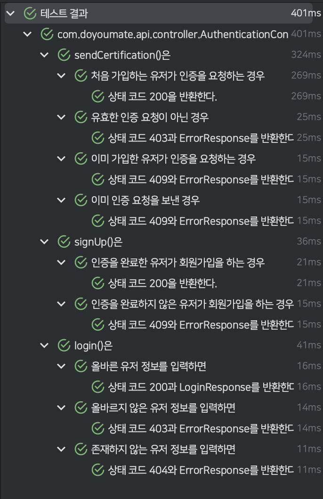

저는 항상 Java에서의 테스트 코드를 보고 복잡하다고 생각해왔습니다.
특히 여러 테스트를 계층화할 때 `@Nested`와 함께 많은 내부 클래스를 사용하다 보니 코드가 복잡해지기 쉬웠는데요.
그래서 저는 이러한 문제를 Kotlin DSL을 통해 개선하고자 했습니다.

# Kotlin DSL

DSL(Domain Specific Languages)은 특정 도메인에 국한된 프로그래밍 언어입니다.
DSL을 사용하면 코드의 내부 구현을 숨겨 가독성을 좋게 만들 수 있습니다.

```kotlin showLineNumbers
Given("챕터와 각각의 챕터에 속하는 퀴즈들이 존재하는 경우") {
    ...

    When("유저가 특정 퀴즈를 조회하면") {
        ...

        Then("해당 퀴즈가 조회된다.") {
            ...
        }
    }
}
```

그 중 Kotlin DSL은 Kotlin의 기능을 활용하여 위 코드처럼 특정 도메인에 대해 직관적인 코드를 작성할 수 있도록 해주는 언어인데요.
일반적으로 확장 함수나 후행 람다(Trailing Lambda) 등의 Kotlin의 기능을 활용해서 DSL을 구현하게 됩니다.

# Kotlin DSL 기반 테스트 코드

이 Kotlin DSL을 활용하면 기존의 테스트 코드도 직관적으로 작성할 수 있게 됩니다.
그 도구로는 주로 Kotlin 기반 테스트 프레임워크인 Kotest를 활용합니다.
Kotest를 통해서 단순히 `@Test`나 `@Nested`를 사용해서 테스트 코드를 작성하는 것 외에도 Given-When-Then 구조의 BDD(Behavior Driven Design) 또는 DCI(Describe-Context-It) 패턴을 Kotlin DSL로 구현할 수 있습니다.
또한 Kotest와 함께 자주 사용되는 모킹(Mocking) 프레임워크인 Mockk도 함께 사용합니다.

```kotlin title="build.gradle.kts" showLineNumbers
dependencies {
    testImplementation("io.kotest:kotest-runner-junit5:5.6.2")
    testImplementation("io.kotest:kotest-assertions-core:5.6.2")
    testImplementation("io.kotest.extensions:kotest-extensions-spring:1.1.2")
    testImplementation("io.mockk:mockk:1.13.5")
    testImplementation("com.ninja-squad:springmockk:3.0.1")
}
```

Kotest는 JUnit 기반으로 작동하므로 JUnit이 필요한데요.
그러나 Spring은 기본적으로 JUnit을 사용하므로 따로 필요한 설정은 없습니다.

```kotlin title="ProjectConfiguration.kt" showLineNumbers
@TestConfiguration
class ProjectConfiguration : AbstractProjectConfig() {
    override fun extensions(): List<Extension> = listOf(SpringExtension)
}
```

참고로 Kotest에서 `@Autowired`를 사용하기 위해서는 `AbstractProjectConfig`을 통해 `SpringExtentsion`을 등록해야 합니다.

## Controller 테스트

```kotlin title="ControllerTest.kt" showLineNumbers
@AutoConfigureRestDocs
abstract class ControllerTest : DescribeSpec() {
    @Autowired
    private lateinit var applicationContext: ApplicationContext

    @Autowired
    private lateinit var restDocumentation: RestDocumentationContextProvider

    protected val webClient: WebTestClient by lazy {
        WebTestClient.bindToApplicationContext(applicationContext)
            .configureClient()
            .filter(WebTestClientRestDocumentation.documentationConfiguration(restDocumentation))
            .build()
    }
}
```

저희는 Spring WebFlux와 Spring REST Docs를 사용하고 있으므로 Spring REST Docs가 설정된 `WebTestClient`를 포함한 `ControllerTest`를 구현했습니다.
컨트롤러 계층 테스트는 DCI 패턴을 사용할 예정이므로 Kotest의 `DescribeSpec`을 상속받았습니다.
이후 모든 컨트롤러 테스트 클래스들은 `ControllerTest`를 상속받습니다.

```kotlin title="QuizControllerTest.kt" showLineNumbers
@WebFluxTest(QuizRouter::class, QuizHandler::class)
class QuizControllerTest : ControllerTest() {
    @MockkBean
    private lateinit var quizService: QuizService

    init {
        describe("getQuizById()는") {
            context("퀴즈가 존재하는 경우") {
                every { quizService.getQuizById(any()) } returns Mono.just(createQuizResponse())

                it("상태 코드 200과 quizResponse를 반환한다.") {
                    webClient
                        .get()
                        .uri("/quiz/{id}", ID)
                        .exchange()
                        .expectStatus()
                        .isOk
                        .expectBody<QuizResponse>()
                }
            }

            context("퀴즈가 존재하지 않는 경우") {
                every { quizService.getQuizById(any()) } returns Mono.error(QuizNotFoundException())

                it("상태 코드 404를 반환한다.") {
                    webClient
                        .get()
                        .uri("/quiz/{id}", ID)
                        .exchange()
                        .expectStatus()
                        .isNotFound
                        .expectBody<ErrorResponse>()
                }
            }
        }
    }
}
```

앞서 구현한 `ControllerTest`에서 `DescribeSpec`을 상속받았기 때문에 DCI 패턴을 사용할 수 있는데요.
테스트 코드는 `DescribeSpec`의 생성자 내부나 `init` 블록 내부에 작성하게 됩니다.

```kotlin showLineNumbers
@MockkBean
private lateinit var quizService: QuizService
```

`@MockkBean`은 Mockito의 `@MockBean`처럼 모의 객체를 Bean으로 등록해주는 어노테이션입니다.
Kotlin에서는 `lateinit`을 통해 지연 초기화를 사용해야 모의 객체를 생성하고 주입받을 수 있습니다.

```kotlin showLineNumbers
every { quizService.getQuizById(any()) } returns Mono.just(createQuizResponse())
```

`every()`와 `return()`은 Mockk에서 모의 객체의 동작을 설정합니다.
해당 스코프 내에서 `quizService.getQuizById()`를 호출하면 항상 `Mono.just(createQuizResponse())`를 반환하도록 했습니다.

```kotlin showLineNumbers
webClient
    .get()
    .uri("/quiz/{id}", ID)
    .exchange()
    .expectStatus()
    .isNotFound
    .expectBody<ErrorResponse>()
```

검증하는 부분은 `WebTestClient`의 기능을 사용했습니다.
모든 API는 응답이 존재하므로 항상 상태 검증을 수행합니다.



테스트 결과는 JUnit에서 `@Nested`를 사용한 것처럼 계층 구조로 표시됩니다.

## Service 테스트

```kotlin title="QuizServiceTest.kt" showLineNumbers
class QuizServiceTest : BehaviorSpec() {
    private val quizRepository = mockk<QuizRepository>()


    private val quizService = QuizService(
        quizRepository = quizRepository
    )

    override fun isolationMode(): IsolationMode = IsolationMode.InstancePerLeaf

    init {
        Given("챕터와 각각의 챕터에 속하는 퀴즈들이 존재하는 경우") {
            val quiz = createQuiz()
                .also {
                    every { quizRepository.findById(any<String>()) } returns it
                }
            val quizResponse = QuizResponse(quiz)

            When("유저가 특정 퀴즈를 조회하면") {
                val result = StepVerifier.create(quizService.getQuizById(ID))

                Then("해당 퀴즈가 조회된다.") {
                    result.expectSubscription()
                        .expectNext(quizResponse)
                        .verifyComplete()
                }
            }
        }
    }
}
```

서비스 계층 테스트는 BDD 패턴을 사용하므로 `BehaviorSpec`을 상속받았습니다.
컨트롤러 계층 테스트와 마찬가지로 `init` 블록 내에 테스트 코드를 작성합니다.

```kotlin showLineNumberss
override fun isolationMode(): IsolationMode = IsolationMode.InstancePerLeaf
```

서비스 계층 테스트에서는 컨트롤러 계층 테스트와 달리 상태 검증 외에도 행위 검증이 존재합니다.
이때, 이전 테스트에서 행위 검증을 시도하는 메서드를 호출해버리면 다음 테스트의 행위 검증에도 영향이 갈 수 있습니다.
이를 방지하기 위해 `isolationMode`를 `IsolationMode.InstancePerLeaf`로 설정해 테스트들을 서로 완전히 격리합니다.

```kotlin showLineNumbers
result.expectSubscription()
    .expectNext(quizResponse)
    .verifyComplete()
```

Spring WebFlux에서는 서비스 계층에서 `Mono` 등의 `Publisher`를 반환하므로 구독을 통해 검증을 해야 합니다.
이 부분에 한해서는 Mockk가 아닌 Reactor의 `StepVerifier`를 사용하기로 했습니다.

```kotlin showLineNumbers {2}
When("유저가 특정 퀴즈를 조회하면") {
    val result = quizService.getQuizById(ID).awaitSingle()

    Then("해당 퀴즈가 조회된다.") {
        result shouldBeEqual quizResponse
    }
}
```

만약 Spring WebFlux에서 Mockk를 통해 검증을 하고 싶다면 `block()` 또는 `awaitSingle()` 등의 코루틴(Coroutine) 확장 함수들을 통해 실제로 반환하는 값을 가져와야 합니다.

```kotlin title="BehaviorSpecGivenContainerScope.kt" showLineNumbers
@Suppress("FunctionName")
@KotestTestScope
class BehaviorSpecGivenContainerScope(
   val testScope: TestScope,
) : AbstractContainerScope(testScope) {
   suspend fun When(name: String, test: suspend BehaviorSpecWhenContainerScope.() -> Unit) = addWhen(name, test, xdisabled = false)

   suspend fun Then(name: String, test: suspend TestScope.() -> Unit) = addThen(name, test, xdisabled = false)
}
```

참고로 Kotest는 코루틴 기반으로 작동하므로 추가적인 코루틴 빌더 없이 코루틴 확장 함수를 스코프 내에서 사용할 수 있습니다.
