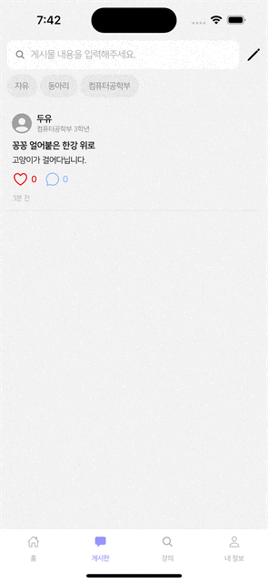
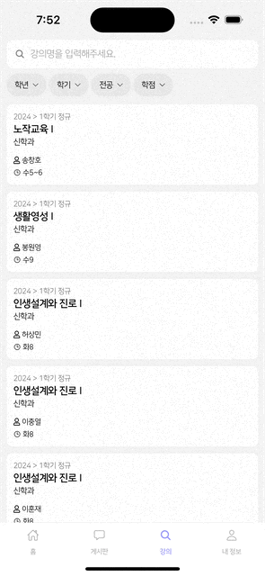
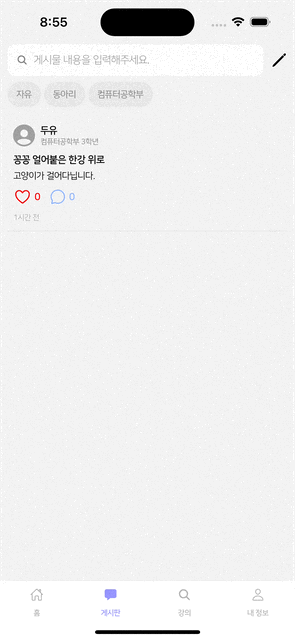

제가 개발하는 서비스에서는 다른 서비스들처럼 게시글에 좋아요를 할 수 있는 기능이 있는데요.



```console
2024-04-23 19:42:47.427 INFO [reactor-http-nio-6] c.d.c.l.LoggingFilter: [9108d19a] HTTP PATCH /post/66409c40323215275afe86d2/like
2024-04-23 19:42:47.438 INFO [nioEventLoopGroup-3-4] c.d.c.l.LoggingFilter: [9108d19a] HTTP 200 OK
2024-04-23 19:42:47.565 INFO [reactor-http-nio-6] c.d.c.l.LoggingFilter: [4b42d217] HTTP PATCH /post/66409c40323215275afe86d2/like
2024-04-23 19:42:47.570 INFO [nioEventLoopGroup-3-4] c.d.c.l.LoggingFilter: [4b42d217] HTTP 200 OK
...
```

문제는 해당 기능에서 API 호출이 비정상적으로 많이 발생할 수 있는 가능성이 있다는 것입니다.
그래서 디바운싱(Debouncing)이라는 최적화 기법을 적용해 보기로 했습니다.

# 디바운싱

디바운싱이란 특정 함수가 연속으로 여러 번 호출되는 경우에 마지막 호출만 수행되도록 하는 최적화 기법 중 하나입니다.
호출이 되고 일정 시간이 지난 후 실제로 함수가 호출되며, 만약 일정 시간 안에 다시 함수가 호출이 되면 이전 호출이 취소되고 다시 일정 시간을 기다리는 방식으로 디바운싱을 구현할 수 있습니다.



위 예시는 검색 기능에 디바운싱을 적용한 예시인데요.
검색창 타이핑(Typing) 중에는 API 호출이 발생하지 않고 타이핑을 끝낸 후에 API 호출이 발생해 UI가 바뀌는 것을 확인할 수 있습니다.

## React

React에서는 `useEffect()`를 통해 디바운싱을 쉽게 구현할 수 있습니다.
`useEffect()`는 의존성 배열 내의 상태 변수가 바뀌었을 때, 콜백(Callback)을 호출하는 React Hook 중 하나입니다.
이때, `useEffect()`의 반환 값으로 설정된 콜백은 `useEffect()`의 다음 호출때 함께 호출됩니다.

```tsx title="App.tsx" showLineNumbers {5, 7}
const App = () => {
  const [number, setNumber] = useState(0)

  const onMounted = () => console.log(`mounted: ${number}`)
  const onUnmounted = () => console.log(`unmounted: ${number}`)

  useEffect(() => {
    onMounted()

    return onUnmounted
  }, [number])

  return <Button onPress={() => setNumber(current => current + 1)} title="+1" />
}
```
```console {3-4}
unmounted: 0
mounted: 1
unmounted: 1
mounted: 2
unmounted: 2
mounted: 3
unmounted: 3
mounted: 4
```

위 코드는 버튼을 클릭할 때마다 `number`가 1씩 증가하는 코드인데요.
`number`를 증가시킬 때마다 이전 `useEffect()`에서의 `onUnmounted()`와 현재 `useEffect()`의 `onMounted()`가 함께 호출되는 것을 볼 수 있습니다.
이러한 점을 활용해 디바운싱을 구현할 수 있습니다.

```ts title="useDebouncing.ts" showLineNumbers {3, 5}
const useDebouncing = (action: () => void, delay: number, deps: DependencyList) => {
  useEffect(() => {
    const timer = setTimeout(action, delay)

    return () => clearTimeout(timer)
  }, deps)
}
```

저는 디바운싱을 재사용할 수 있도록 커스텀 훅(Custom Hook)을 구현했습니다.
`useEffect()`에서는 `setTimeout()`을 통해 `delay` 후에 실제 수행할 작업인 `action()`을 호출하는데, `delay`가 끝나기 전에 한 번 더 `useEffect()`가 호출되면 이전의 `useEffect()`에서의 `setTimeout()`이 `clearTimeout()`에 의해 취소됩니다.
이렇게 되면 `delay` 미만의 간격으로 연속 호출되는 `useEffect()`들에서 `action()`은 수행되지 않으며 마지막의 `useEffect()`에서의 `action()`만 수행되게 됩니다.

## 좋아요 기능 최적화

이제 실제로 좋아요 기능에 디바운싱을 적용해 최적화를 해보겠습니다.

```ts title="postReducer.ts" showLineNumbers {9-17}
const postSlice = createSlice({
  name: 'post',
  initialState: {
    like: {},
    comment: {},
    searchRequest: { content: '' }
  } as PostState,
  reducers: {
    setLikedStudentIds: (state: PostState, action: PayloadAction<{ id: string; likedStudentIds: string[] }>) => ({
      ...state,
      like: {
        ...state.like,
        [action.payload.id]: {
          likedStudentIds: action.payload.likedStudentIds
        }
      }
    }),
    ...
  }
})
```

우선 게시글은 여러 컴포넌트에서 사용되므로 좋아요 개수를 게시글이 있는 모든 컴포넌트에서 동기화할 수 있도록 Redux 스토어를 구현했습니다.
Redux 스토어에는 게시글마다 좋아요한 유저 리스트인 `likedStudentIds`를 저장하도록 했습니다.

```ts title="useLike.ts" showLineNumbers {31-46}
const useLike = (post: PostResponse): LikeStates => {
  const student = useSelector((store: Store) => store.student)
  const likedStudentIds = useSelector((store: Store) => store.post.like[post.id]?.likedStudentIds)
  const [initialIsLiked, setInitialIsLiked] = useState<boolean>()
  const [isLiked, setIsLiked] = useState<boolean>()
  const [count, setCount] = useState<number>()
  const dispatch = useDispatch()

  const likeHandler = useCallback(() => {
    setCount(current => (isLiked ? current! - 1 : current! + 1))
    setIsLiked(current => !current)
  }, [isLiked])

  useEffect(() => {
    if (likedStudentIds) {
      setInitialIsLiked(likedStudentIds.includes(student.id))
      setIsLiked(likedStudentIds.includes(student.id))
      setCount(likedStudentIds.length)
    }
  }, [likedStudentIds])

  useEffect(() => {
    dispatch(
      setLikedStudentIds({
        id: post.id,
        likedStudentIds: post.likedStudentIds
      })
    )
  }, [post])

  useDebouncing(
    async () => {
      if (initialIsLiked !== isLiked) {
        const newPost = await likePostById(post.id)

        dispatch(
          setLikedStudentIds({
            id: post.id,
            likedStudentIds: newPost.likedStudentIds
          })
        )
      }
    },
    500,
    [isLiked]
  )

  return { count, isLiked, likeHandler }
}
```

게시글의 좋아요 개수인 `count` 및 현재 유저의 좋아요 여부인 `isLiked` 등을 포함한 커스텀 훅을 구현했습니다.
`isLiked`가 처음과 달라졌는지 여부를 확인하기 위해 `initialIsLiked`를 최초의 `isLiked`로 초기화 했습니다.
좋아요를 클릭하면 `likeHandler`에 의해 `isLiked`의 상태가 바뀌는데요.
이때, 호출되는 `useDebouncing()`에서 디바운싱을 통해 좋아요를 여러 번 클릭해도 마지막 좋아요만 API에 요청하게 됩니다.

<br /><br />

최종적으로는 `useDebouncing()`에서 `isLiked`가 `initialIsLiked`와 다르다면 바뀐 좋아요 여부를 서버에 반영하고 Redux 스토어 내의 `likedStudentIds`를 갱신하게 됩니다.



```console
2024-04-23 20:55:13.122 INFO [reactor-http-nio-5] c.d.c.l.LoggingFilter: [f8582d5c] HTTP PATCH /post/66409c40323215275afe86d2/like
2024-04-23 20:55:13.135 INFO [nioEventLoopGroup-3-3] c.d.c.l.LoggingFilter: [f8582d5c] HTTP 200 OK
```

이전과 달리 많은 좋아요 요청에도 실제 API 호출은 한 번만 발생한 것을 확인할 수 있습니다.
