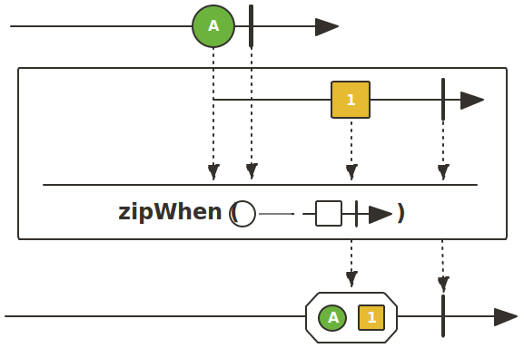

이번에 Spring WebFlux와 MongoDB를 함께 쓰면서 간헐적으로 트랜잭션이 실패하는 문제를 겪었었는데요.

```kotlin showLineNumbers
@Transactional
fun createComment(request: CreateCommentRequest, authentication: DefaultJwtAuthentication): Mono<CommentResponse> =
    with(request) {
        studentRepository.findById(authentication.id)
            .switchIfEmpty(Mono.error(StudentNotFoundException()))
            .zipWith(
                postRepository.findByIdAndDeletedDateIsNull(postId)
                    .switchIfEmpty(Mono.error(PostNotFoundException()))
            )
            .flatMap { (student, post) ->
                commentRepository.save(
                    Comment(
                        postId = postId,
                        writer = Writer(student),
                        content = content
                    )
                ).flatMap {
                    postRepository.save(post.copy(commentIds = post.commentIds.apply { add(it.id!!) }))
                        .thenReturn(it)
                }
            }
            .map { CommentResponse(it) }
    }
```

문제가 발생한 부분은 학생과 게시글을 동시에 조회한 후 댓글을 저장하는 로직이었습니다.

```console
2024-05-20 20:26:39.969 INFO [reactor-http-nio-3] c.d.c.l.LoggingFilter: [e629b518] HTTP POST /comment {"postId":"665afc2ecbdeb92950f8f452", "content":""}
2024-05-20 20:26:39.991 ERROR [nioEventLoopGroup-3-7] c.d.c.e.GlobalExceptionHandler: [e629b518] MongoTransactionException("Command failed with error 251 (NoSuchTransaction): 'Given transaction number 10 does not match any in-progress transactions. The active transaction number is 9' on server mongodb-3:27019. The full response is {"errorLabels": ["TransientTransactionError"], "ok": 0.0, "errmsg": "Given transaction number 10 does not match any in-progress transactions. The active transaction number is 9", "code": 251, "codeName": "NoSuchTransaction", "$clusterTime": {"clusterTime": {"$timestamp": {"t": 1717241199, "i": 2}}, "signature": {"hash": {"$binary": {"base64": "AAAAAAAAAAAAAAAAAAAAAAAAAAA=", "subType": "00"}}, "keyId": 0}}, "operationTime": {"$timestamp": {"t": 1717241199, "i": 1}}}") at org.springframework.data.mongodb.core.MongoExceptionTranslator.translateExceptionIfPossible(MongoExceptionTranslator.java:130)
2024-05-20 20:26:39.993 INFO [nioEventLoopGroup-3-7] c.d.c.l.LoggingFilter: [e629b518] HTTP 500 INTERNAL_SERVER_ERROR
```

해당 부분에서 일부 요청에 대해서만 주어진 트랜잭션의 번호가 처리 중인 트랜잭션과 일치하지 않는다는 로그와 함께 예외가 발생했었습니다.


실제로 1000번의 요청 중 일부 요청에서만 문제가 발생한 것을 확인할 수 있었습니다.

# 트랜잭션에서의 비동기 처리

해당 문제를 해결하고자 검색을 하던 중, 저와 같은 문제를 겪으셨던 분을 Stack Overflow에서 발견하게 되었는데요.


해당 질문의 답변들에서는 모두 처음 요청하는 쿼리에 대한 비동기 처리를 원인으로 제시하고 있었습니다.

## MongoDB의 트랜잭션

MongoDB에서는 `startTransaction`이 `true`인 쿼리가 데이터베이스에 도달하면 트랜잭션이 시작되는데요.

```console
2024-05-20 21:50:18.273 DEBUG [AsyncGetter-6-thread-1] o.m.d.p.command: Command "find" started on database "doyoumate" using a connection with driver-generated ID 7 and server-generated ID 6907 to mongodb-3:27019. The request ID is 106 and the operation ID is 103. Command: {"find": "student", "filter": {"_id": {"$oid": "664c0480a158f8347d17ecd9"}}, "limit": 1, "singleBatch": true, "$db": "doyoumate", "$clusterTime": {"clusterTime": {"$timestamp": {"t": 1717246218, "i": 10}}, "signature": {"hash": {"$binary": {"base64": "AAAAAAAAAAAAAAAAAAAAAAAAAAA=", "subType": "00"}}, "keyId": 0}}, "lsid": {"id": {"$binary": {"base64": "/UtJTyDjSJe+lJy8jwQD1w==", "subType": "04"}}}, "txnNumber": 23, "startTransaction": true, "autocommit": false}
2024-05-20 21:50:18.273 DEBUG [AsyncGetter-6-thread-1] o.m.d.p.command: Command "find" started on database "doyoumate" using a connection with driver-generated ID 8 and server-generated ID 6908 to mongodb-3:27019. The request ID is 107 and the operation ID is 104. Command: {"find": "post", "filter": {"_id": {"$oid": "665afc2ecbdeb92950f8f452"}, "deletedDate": null}, "limit": 2, "batchSize": 256, "$db": "doyoumate", "$clusterTime": {"clusterTime": {"$timestamp": {"t": 1717246218, "i": 10}}, "signature": {"hash": {"$binary": {"base64": "AAAAAAAAAAAAAAAAAAAAAAAAAAA=", "subType": "00"}}, "keyId": 0}}, "lsid": {"id": {"$binary": {"base64": "/UtJTyDjSJe+lJy8jwQD1w==", "subType": "04"}}}, "txnNumber": 23, "autocommit": false}
```

실제로 문제가 발생한 로그를 확인해보면 처음 수행되는 조회에서만 `startTransaction`이 `true`인 것을 확인할 수 있습니다.


앞서 저는 `zipWith()`를 통해 처음 수행되는 조회 쿼리들을 비동기적으로 동시에 수행하도록 했었는데요.
이렇게 되면 `startTransaction`이 `true`인 첫 번째 쿼리가 데이터베이스에 도달하기 전에 다른 쿼리가 데이터베이스에 도달하는 상황이 존재할 수 있습니다.
이 경우, 해당 쿼리는 트랜잭션 시작 전에 수행되며 존재하지 않는 트랜잭션을 참조한 것이므로 `NoSuchTransaction`이 발생하게 됩니다.

## 동기 처리

그렇다면 처음 쿼리에는 반드시 동기 처리를 통해 각 쿼리들의 순서가 보장되어야 하는데요.
동기 처리 방법으로는 `zipWhen()`을 사용하기로 했습니다.



`zipWhen()`은 `zipWith()`와 달리 두 `Mono`를 순차적으로 결합해 동기적으로 처리하는 연산자입니다.

```kotlin showLineNumbers {6-9}
@Transactional
fun createComment(request: CreateCommentRequest, authentication: DefaultJwtAuthentication): Mono<CommentResponse> =
    with(request) {
        studentRepository.findById(authentication.id)
            .switchIfEmpty(Mono.error(StudentNotFoundException()))
            .zipWhen {
                postRepository.findByIdAndDeletedDateIsNull(postId)
                    .switchIfEmpty(Mono.error(PostNotFoundException()))
            }
            .flatMap { (student, post) ->
                commentRepository.save(
                    Comment(
                        postId = postId,
                        writer = Writer(student),
                        content = content
                    )
                ).flatMap {
                    postRepository.save(post.copy(commentIds = post.commentIds.apply { add(it.id!!) }))
                        .thenReturn(it)
                }
            }
            .map { CommentResponse(it) }
    }
```


동기 처리를 한 후, 이번엔 모든 요청이 정상적으로 처리된 것을 확인할 수 있었습니다.
