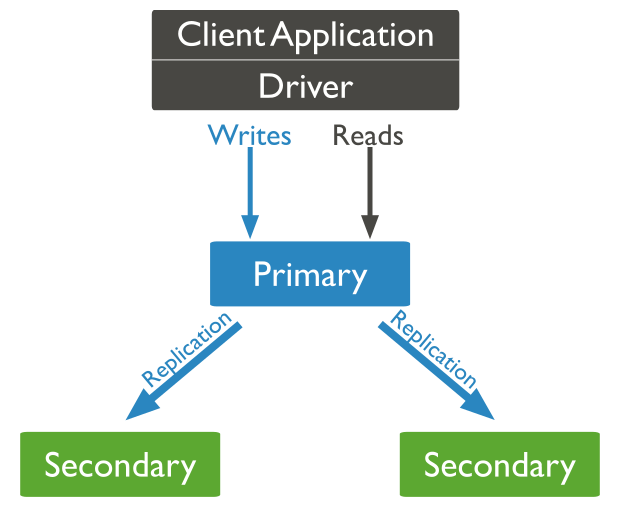

이번에 MongoDB에서 Replica Set을 설정해서 사용하다가 고가용성을 위해 구성한 Replica Set에서 읽기 작업이 하나의 노드에만 몰리는 문제가 발생했었는데요.

```console
2024-06-02 18:15:37.999 DEBUG [AsyncGetter-2-thread-1] o.m.d.p.command: Command "find" started on database "doyoumate" using a connection with driver-generated ID 7 and server-generated ID 6862 to mongodb-1:27017. The request ID is 72 and the operation ID is 69. Command: {"find": "board", "filter": {"deletedDate": null}, "batchSize": 256, "$db": "doyoumate", "$clusterTime": {"clusterTime": {"$timestamp": {"t": 1717319728, "i": 1}}, "signature": {"hash": {"$binary": {"base64": "AAAAAAAAAAAAAAAAAAAAAAAAAAA=", "subType": "00"}}, "keyId": 0}}, "lsid": {"id": {"$binary": {"base64": "6PHPdCEYTE6kT07x1X/ZXQ==", "subType": "04"}}}}
...
2024-06-02 18:15:38.021 DEBUG [AsyncGetter-2-thread-1] o.m.d.p.command: Command "find" started on database "doyoumate" using a connection with driver-generated ID 7 and server-generated ID 6862 to mongodb-1:27017. The request ID is 73 and the operation ID is 70. Command: {"find": "board", "filter": {"deletedDate": null}, "batchSize": 256, "$db": "doyoumate", "$clusterTime": {"clusterTime": {"$timestamp": {"t": 1717319728, "i": 1}}, "signature": {"hash": {"$binary": {"base64": "AAAAAAAAAAAAAAAAAAAAAAAAAAA=", "subType": "00"}}, "keyId": 0}}, "lsid": {"id": {"$binary": {"base64": "6PHPdCEYTE6kT07x1X/ZXQ==", "subType": "04"}}}}
...
2024-06-02 18:15:38.042 DEBUG [AsyncGetter-2-thread-1] o.m.d.p.command: Command "find" started on database "doyoumate" using a connection with driver-generated ID 7 and server-generated ID 6862 to mongodb-1:27017. The request ID is 74 and the operation ID is 71. Command: {"find": "board", "filter": {"deletedDate": null}, "batchSize": 256, "$db": "doyoumate", "$clusterTime": {"clusterTime": {"$timestamp": {"t": 1717319728, "i": 1}}, "signature": {"hash": {"$binary": {"base64": "AAAAAAAAAAAAAAAAAAAAAAAAAAA=", "subType": "00"}}, "keyId": 0}}, "lsid": {"id": {"$binary": {"base64": "6PHPdCEYTE6kT07x1X/ZXQ==", "subType": "04"}}}}
```

실제로 로그를 확인해보면 조회 쿼리를 `mongodb-1:27017`만 처리하는 것을 확인할 수 있었습니다.

# Replica Set



Replica Set은 하나의 Primary 노드와 여러 Secondary 노드로 구성되는데요.
Primary 노드는 oplog(Operation Log)를 작성하고 Secondary 노드가 oplog를 복제하는 방식으로 데이터를 동기화하게 됩니다.
그러나 기본적으로 읽기 및 쓰기 작업은 모두 Primary 노드가 처리하므로 부하 분산의 이점을 가지지는 못합니다.

## Read Preference

Replica Set에는 Read Preference라는 부하 분산과 관련된 옵션이 있습니다.
Replica Set의 기본적인 Read Preference는 `primary`이므로 Primary 노드만 읽기 작업을 처리하는데요.
이를 `secondaryPreferred`로 설정해 기본적으로 Secondary 노드에서 읽기를 수행하도록 할 수 있습니다.

```console
mongodb://mongodb-1:27017,mongodb-2:27018,mongodb-3:27019/doyoumate?readPreference=secondaryPreferred
```

기존의 MongoDB URI(Uniform Resource Identifier)에 `readPreference` 옵션을 추가했습니다.

```console
2024-06-02 18:41:18.939 DEBUG [AsyncGetter-4-thread-1] o.m.d.p.command: Command "find" started on database "doyoumate" using a connection with driver-generated ID 7 and server-generated ID 7038 to mongodb-2:27018. The request ID is 16 and the operation ID is 13. Command: {"find": "board", "filter": {"deletedDate": null}, "batchSize": 256, "$db": "doyoumate", "$clusterTime": {"clusterTime": {"$timestamp": {"t": 1717321278, "i": 1}}, "signature": {"hash": {"$binary": {"base64": "AAAAAAAAAAAAAAAAAAAAAAAAAAA=", "subType": "00"}}, "keyId": 0}}, "lsid": {"id": {"$binary": {"base64": "w6fC8k3aS4OBZNS9V9ufTw==", "subType": "04"}}}, "$readPreference": {"mode": "secondaryPreferred"}}
...
2024-06-02 18:41:18.961 DEBUG [AsyncGetter-6-thread-1] o.m.d.p.command: Command "find" started on database "doyoumate" using a connection with driver-generated ID 8 and server-generated ID 6945 to mongodb-3:27019. The request ID is 17 and the operation ID is 14. Command: {"find": "board", "filter": {"deletedDate": null}, "batchSize": 256, "$db": "doyoumate", "$clusterTime": {"clusterTime": {"$timestamp": {"t": 1717321278, "i": 1}}, "signature": {"hash": {"$binary": {"base64": "AAAAAAAAAAAAAAAAAAAAAAAAAAA=", "subType": "00"}}, "keyId": 0}}, "lsid": {"id": {"$binary": {"base64": "w6fC8k3aS4OBZNS9V9ufTw==", "subType": "04"}}}, "$readPreference": {"mode": "secondaryPreferred"}}
```

이번에는 Primary 노드가 아닌 Secondary 노드인 `mongodb-2:27018` 및 `mongodb-3:27019`에서 조회 쿼리를 처리하는 것을 확인할 수 있습니다.

```console
2024-06-02 19:09:35.889 ERROR [reactor-http-nio-3] c.d.c.e.GlobalExceptionHandler: [527ac37d] UncategorizedMongoDbException("Read preference in a transaction must be primary") at org.springframework.data.mongodb.core.MongoExceptionTranslator.translateExceptionIfPossible(MongoExceptionTranslator.java:135)
```

그러나 트랜잭션의 경우, 반드시 Primary 노드에서만 처리되어야 하므로 Read Preference가 `primary`가 아니면 오류가 발생합니다.

```kotlin showLineNumbers {7}
@Bean
fun mongoTransactionManager(reactiveMongoDatabaseFactory: ReactiveMongoDatabaseFactory): ReactiveMongoTransactionManager =
    ReactiveMongoTransactionManager(reactiveMongoDatabaseFactory)
        .apply {
            setOptions(
                TransactionOptions.builder()
                    .readPreference(ReadPreference.primary())
                    .build()
            )
        }
```

그래서 `ReactiveMongoTransactionManager`를 통해 트랜잭션이 적용된 경우에는 Read Preference가 `primary`로 설정되도록 설정했습니다.

## Write Concern

읽기 작업을 Secondary 노드가 수행하면서 새로 발생하는 문제가 있습니다.
쓰기 작업은 기존과 같이 Primary 노드가 계속해서 수행하게 되는데요.
이때, Primary 노드에 쓰기 작업이 완료되고 복제본이 Secondary 노드에 생성되기 전에 Secondary 노드에 조회 쿼리를 요청하면 이전의 데이터를 조회하게 된다는 문제가 있습니다.
이는 Write Concern을 사용하면 해결할 수 있습니다

<br /><br />

Write Concern은 Replica Set에서 쓰기 작업의 완료 처리 시점을 설정할 수 있는 옵션입니다.

```console {41, 50}
> rs.conf()
{
  _id: 'rs',
  version: 114959,
  term: 286,
  members: [
    ...
  ],
  protocolVersion: Long('1'),
  writeConcernMajorityJournalDefault: true,
  settings: {
    ...
  }
}
```

Replica Set은 `writeConcernMajorityJournalDefault`에 의해 기본적으로 Write Concern 옵션이 `majority`로 설정되어 있는데요.
이는 Replica Set의 과반수 이상의 노드에 저장이 되면 완료 처리를 한다는 의미입니다.
즉, 현재 3개의 노드가 있는 Replica Set에서는 Primary 노드만 쓰기 작업이 완료되면 바로 응답을 보내므로 데이터 정합성에 문제가 발생할 수 있습니다.

<br /><br />

물론 Write Concern을 노드 수만큼 설정하면 정합성을 보장할 수 있겠지만 성능 관점에서는 좋은 방안이 아닙니다.
그래서 저는 Wirte Concern에 `majority` 옵션을 계속해서 사용하기로 했습니다.

```console
mongodb://mongodb-1:27017,mongodb-2:27018,mongodb-3:27019/doyoumate?readPreference=secondaryPreferred&w=3
```

만약 Write Concern의 옵션을 임의로 수정하고 싶다면 기존의 MongoDB URI에 `w` 옵션을 추가해주면 됩니다.
