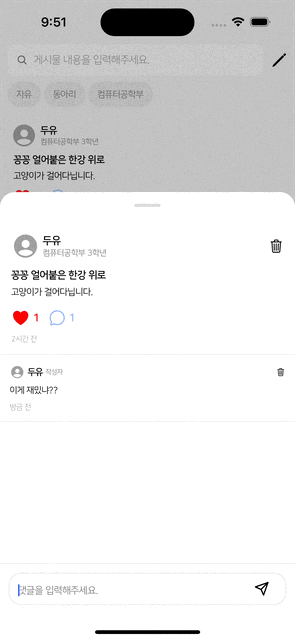
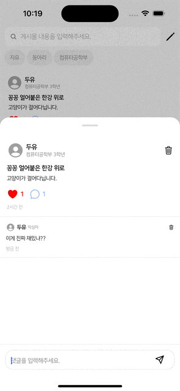

제가 개발하는 서비스에 댓글을 삭제하는 기능이 있는데요.



해당 기능에서 API(Application Programming Interface) 요청 지연으로 인해 UX가 안좋아지는 문제를 겪었습니다.
그래서 해당 기능에 낙관적 업데이트를 적용해 UX 최적화를 수행하기로 했습니다.

# 낙관적 업데이트

낙관적 업데이트란 API 요청 후 응답을 받지 않고 UI(User Interface)를 바로 업데이트 하는 UX 최적화 기법입니다.
요청이 성공할 것이라는 긍정적인 가정을 바탕으로 수행되는 업데이트이기 때문에 낙관적 업데이트입니다.
당연히 UI에 결과가 바로 반영되므로 UX를 개선할 수 있다는 장점이 있지만 API 요청이 실패한 경우에 수행할 롤백(Rollback) 로직이 필요하므로 구현이 복잡하다는 단점도 가지고 있습니다.

## React Query

낙관적 업데이트는 React Query의 `useMutation()`을 통해 쉽게 구현할 수 있습니다.

```tsx showLineNumbers
const { mutate: deleteComment } = useMutation((id: string) => deleteCommentById(id))
```

`useMutation()`은 API에 업데이트 작업을 요청하는데 사용되는 훅(Hook)입니다.

```ts title="types.d.ts" showLineNumbers {5-8}
export interface MutationOptions<TData = unknown, TError = unknown, TVariables = void, TContext = unknown> {
    mutationFn?: MutationFunction<TData, TVariables>;
    mutationKey?: MutationKey;
    variables?: TVariables;
    onMutate?: (variables: TVariables) => Promise<TContext | undefined> | TContext | undefined;
    onSuccess?: (data: TData, variables: TVariables, context: TContext | undefined) => Promise<unknown> | void;
    onError?: (error: TError, variables: TVariables, context: TContext | undefined) => Promise<unknown> | void;
    onSettled?: (data: TData | undefined, error: TError | null, variables: TVariables, context: TContext | undefined) => Promise<unknown> | void;
    retry?: RetryValue<TError>;
    retryDelay?: RetryDelayValue<TError>;
    _defaulted?: boolean;
    meta?: MutationMeta;
}
```

기존의 API 요청 방식과 다른 점은 `onSuccess()`, `onError()` 등의 이벤트 핸들러(Event Handler)들을 통해 후처리에 대한 코드를 선언적으로 작성할 수 있는데요.
이 이벤트 핸들러들을 활용해 낙관접 업데이트를 쉽게 구현할 수 있습니다.
`onMutate()`에서는 UI 업데이트를 수행하도록 하고, API 요청이 실패한 경우에는 `onError()`에서 업데이트된 UI를 롤백하도록 합니다.
마지막으로 이 모든 작업이 끝나고 나서 `onSettled()`에서 API로부터 실제로 수정된 값을 가져오도록 하면 됩니다.

# 댓글 삭제 최적화

이제 낙관적 업데이트를 통해 댓글 삭제 기능을 최적화 해보겠습니다.

```tsx title="PostModal.tsx" showLineNumbers
const { data: comments = [] } = useQuery(['getCommentsByPostId', post.id], () => getCommentsByPostId(post.id))
```

앞서, 댓글들은 `useQuery()`를 통해 API로부터 가져오도록 구현되어 있습니다.

```tsx title="CommentItem.tsx" showLineNumbers
const { mutate: deleteComment } = useMutation((id: string) => deleteCommentById(id), {
  onMutate: async id => {
    const date = new Date()
    console.log(`${date.getHours()}:${date.getMinutes()}:${date.getSeconds()}.${date.getMilliseconds()} API 요청`)
  },
  onSettled: () => {
    const date = new Date()
    console.log(`${date.getHours()}:${date.getMinutes()}:${date.getSeconds()}.${date.getMilliseconds()} API 응답`)

    queryClient.invalidateQueries({ queryKey: ['getCommentsByPostId', comment.postId] })
  }
})

useEffect(
  () => () => {
    const date = new Date()
    console.log(`${date.getHours()}:${date.getMinutes()}:${date.getSeconds()}.${date.getMilliseconds()} 언마운트`)
  },
  []
)
```

기존의 댓글 삭제 기능은 API 응답을 받은 후 `invalidateQueries()`에 의해 모든 댓글들을 API로부터 새로 가져와 업데이트합니다.

```console
21:49:31.853 API 요청
21:49:31.887 API 응답
21:49:31.936 언마운트
```

실제로 삭제된 댓글이 언마운트(Unmount)되는 시점이 API 응답 후라는 것을 확인할 수 있습니다.

<br /><br />

이제 낙관적 업데이트를 적용해 UX를 개선해보도록 하겠습니다.

```ts showLineNumbers {5-10}
onMutate: async id => {
  const date = new Date()
  console.log(`${date.getHours()}:${date.getMinutes()}:${date.getSeconds()}.${date.getMilliseconds()} API 요청`)

  await queryClient.cancelQueries({ queryKey: ['getCommentsByPostId', comment.postId] })
  const previousComments = queryClient.getQueryData<CommentResponse[]>(['getCommentsByPostId', comment.postId])
  queryClient.setQueryData(
    ['getCommentsByPostId', comment.postId],
    previousComments?.filter(comment => comment.id !== id)
  )

  return { previousComments }
}
```

우선 `onMutate()`에서 `cancelQueries()`를 통해 현재 진행 중인 요청들을 취소해 낙관적 업데이트를 덮어쓰지 않도록 합니다.
그 다음, `setQueryData()`를 통해 API 요청 없이 기존의 댓글 리스트에서 수동으로 해당 댓글을 삭제합니다.
이후 롤백을 위해서 `onMutate()`에서 `previousComments`를 `onError`의 `context`로 전달했는데요.

```ts showLineNumbers {2}
onError: (error, id, context) => {
  queryClient.setQueryData(['getCommentsByPostId', comment.postId], context?.previousComments)
},
```

그러므로 `onError()`에서는 단순히 댓글 리스트를 다시 `previousComments`로 바꿔주면 롤백을 수행할 수 있습니다.

```ts showLineNumbers {5}
onSettled: () => {
  const date = new Date()
  console.log(`${date.getHours()}:${date.getMinutes()}:${date.getSeconds()}.${date.getMilliseconds()} API 응답`)

  queryClient.invalidateQueries({ queryKey: ['getCommentsByPostId', comment.postId] })
}
```

마지막으로 `onSettled()`에서는 `invalidateQueries()`로 캐시를 삭제해 댓글 리스트를 API로부터 가져와 업데이트를 하게 됩니다.

```tsx title="CommentItem.tsx" showLineNumbers
const { mutate: deleteComment } = useMutation((id: string) => deleteCommentById(id), {
  onMutate: async id => {
    const date = new Date()
    console.log(`${date.getHours()}:${date.getMinutes()}:${date.getSeconds()}.${date.getMilliseconds()} API 요청`)

    await queryClient.cancelQueries({ queryKey: ['getCommentsByPostId', comment.postId] })
    const previousComments = queryClient.getQueryData<CommentResponse[]>(['getCommentsByPostId', comment.postId])
    queryClient.setQueryData(
      ['getCommentsByPostId', comment.postId],
      previousComments?.filter(comment => comment.id !== id)
    )

    return { previousComments }
  },
  onError: (error, id, context) => {
    queryClient.setQueryData(['getCommentsByPostId', comment.postId], context?.previousComments)
  },
  onSettled: () => {
    const date = new Date()
    console.log(`${date.getHours()}:${date.getMinutes()}:${date.getSeconds()}.${date.getMilliseconds()} API 응답`)

    queryClient.invalidateQueries({ queryKey: ['getCommentsByPostId', comment.postId] })
  }
})

useEffect(
  () => () => {
    const date = new Date()
    console.log(`${date.getHours()}:${date.getMinutes()}:${date.getSeconds()}.${date.getMilliseconds()} 언마운트`)
  },
  []
)
```

최종적인 코드는 위와 같습니다.



```console
22:14:46.34 API 요청
22:14:46.53 언마운트
22:14:46.124 API 응답
```

이전과 달리 API 요청 후 댓글이 바로 언마운트 되었습니다.
실제로 UI를 보면 댓글이 바로 삭제되는 것을 확인할 수 있습니다.
