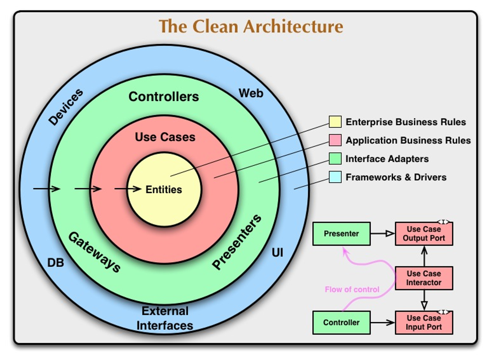
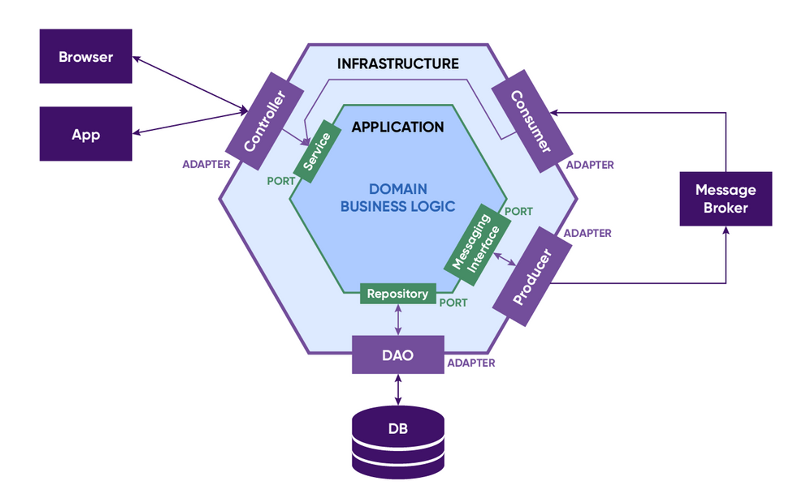
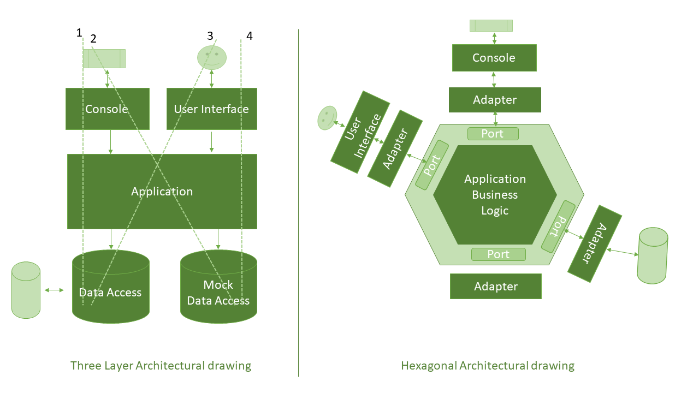
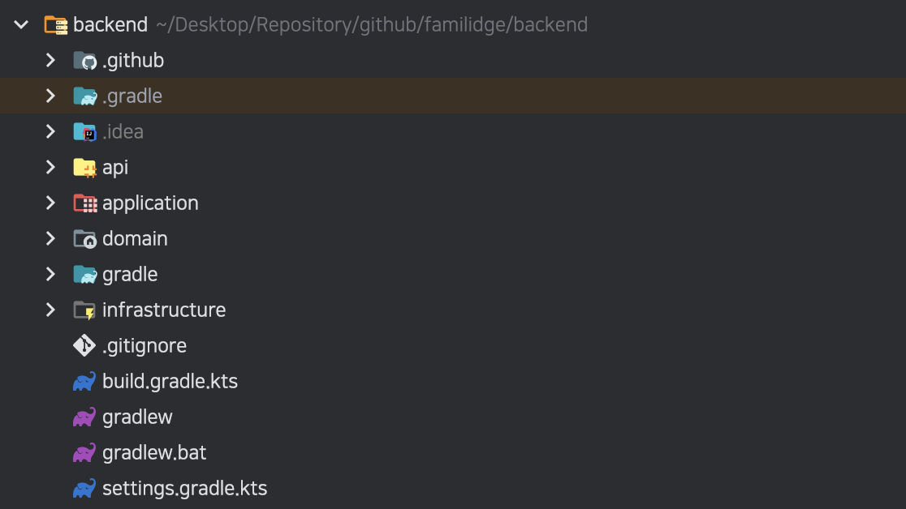
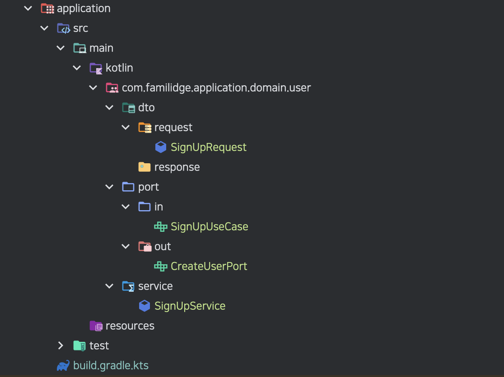
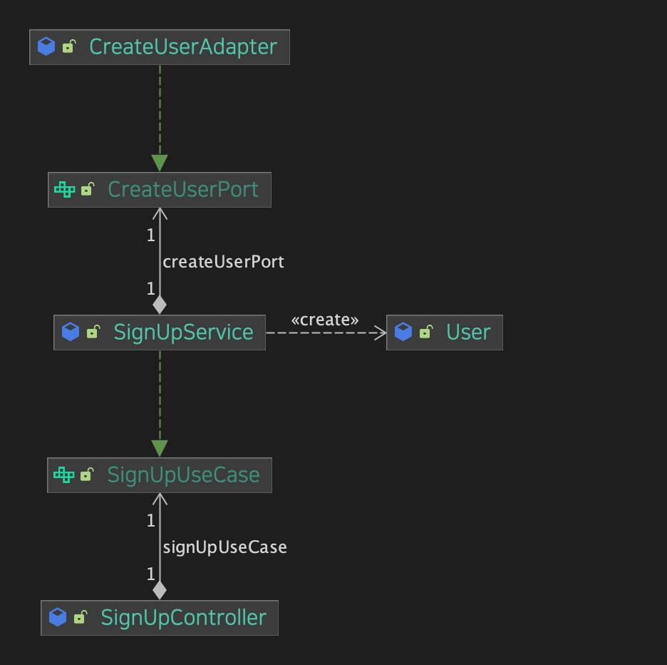

이번 글은 멀티 모듈을 기반으로 헥사고날 아키텍처를 구성한 경험에 대한 글입니다.

<br />

이번에 백엔드 개발을 시작하기 전에 데이터베이스로 SQL(Structured Query Language)과 NoSQL 중 어느 것을 사용할지 고민을 했었습니다.
일반적으로 데이터베이스는 서비스에 따라서 결정되는데요.
하지만 서비스에서 비즈니스 요구사항이 얼마나 빈번하게 변경될지, 연관 관계가 얼마나 많이 생길지 쉽게 예상이 되지 않았습니다.
그렇다고 개발 중에 다른 데이터베이스로 바꿔버리는 상황이 발생하면 모든 코드를 변경해야 한다는 부담스러운 문제도 있어서 쉽게 기술을 선택하지 못했습니다.

# 아키텍처

사실 은탄환은 없으므로 언제나 중간에 기술을 바꿀 가능성을 배제할 수 없습니다.
그래서 저는 지금은 오히려 특정 기술을 도입한 상황보다는 중간에 다른 기술로 바꾼 상황을 좀 더 고려해보기로 했습니다.

<br />

이러한 기술 변화에 대한 수용성은 기본적으로 소프트웨어 설계도인 아키텍처에 따라 달라집니다.
그래서 저는 아키텍처를 한번 고민해보기로 했습니다.

## 계층형 아키텍처

일반적으로 사용되는 계층형 아키텍처(Layered Architecture)는 시스템을 프레젠테이션(Presentation), 도메인(Domain), 데이터 액세스(Data Access) 계층으로 나누는 아키텍처입니다.
각각의 계층은 관심사에 따라 분류되며, 직접적인 하위 계층만을 의존하게 됩니다.
이러한 계층 분리는 응집성을 높이고 의존성을 낮춤으로써 유지보수를 용이하게 해줍니다.

<br />

하지만 계층형 아키텍처에서는 도메인 계층이 영속성 계층을 의존하고 있다는 문제를 가지는데요.
이는 일반적인 데이터 중심 설계로, 비즈니스 로직이 데이터베이스 등의 외부 기술에 크게 영향을 받는다는 단점을 가집니다.

## 클린 아키텍처



클린 아키텍처(Clean Architecture)는 도메인 계층이 외부에 가지는 의존성이 전혀 없도록 설계해야 한다는 이론입니다.
계층형 아키텍처와 달리 클린 아키텍처에서는 도메인 계층이 가지는 의존성이 전혀 없어 비즈니스 규칙을 담는 도메인 엔티티는 어떤 외부 기술에도 종속적이지 않습니다.
이에 따라 도메인 엔티티를 중심으로 구성되는 비즈니스 로직도 외부 기술에 영향 받지 않습니다.

<br />

또한 클린 아키텍처는 의존성 역전 법칙(Dependency Inversion Principle, DIP)과 단일 책임 원칙(Single Responsibility Principle, SRP)을 준수하는데요.
외부에서는 도메인 계층에서 구현한 인터페이스를 의존하므로 의존성 역전 법칙을, 하나의 서비스를 각각의 유즈케이스(Use-case)로 나누어 세분화하므로 단일 책임 원칙을 준수하게 됩니다.

## 헥사고날 아키텍처



헥사고날 아키텍처(Hexagonal Architecture)는 클린 아키텍처를 구현한 모델 중 하나로, 육각형 형태로 디자인되어 헥사고날 아키텍처라 불립니다.
순수 도메인 엔티티를 가지는 도메인 계층, 여러 포트와 비즈니스 로직을 가진 애플리케이션 계층, 외부 영역인 인프라 계층으로 육각형을 이루고 있습니다.

<br />

해당 육각형에서 외부와 내부를 연결해주는 구성 요소로 포트(Port)와 어댑터(Adapter)가 있는데요.
포트는 외부 영역에서 비즈니스 로직을 호출하기 위해 사용하는 인바운드 포트와 비즈니스 로직에서 외부 영역을 호출하기 위해 사용하는 아웃바운드 포트로 나뉩니다.
이러한 포트들을 사용하는 어댑터는 외부 영역에서 인바운드 포트를 통해 비즈니스 로직을 호출하는 인바운드 어댑터, 비즈니스 로직에서 아웃바운드 포트를 통해 외부 영역을 호출하는 아웃바운드 어댑터로 나뉩니다.
이러한 특징 때문에 헥사고날 아키텍처는 포트와 어댑터 아키텍처(Ports and Adapters Architecture)라고도 불립니다

# 계층형 아키텍처 vs 헥사고날 아키텍처



변화에 용이한 아키텍처를 구성했으면 당연히 기술 변화도 쉽게 받아들일 수 있는데요.
기존에 사용해왔던 계층형 아키텍처보다는 헥사고날 아키텍처가 기술 변화에 좀 더 용이하다고 판단해 해당 아키텍처를 도입해보기로 했습니다.

# 멀티 모듈

저는 일반적인 헥사고날 아키텍처를 기반으로 멀티 모듈 모놀리식 아키텍처를 설계할 생각인데요.
멀티 모듈을 사용하면 각 계층마다 라이브러리와 의존성들을 완전히 분리시킬 수 있다는 장점을 가지고 있습니다.
예를 들어 도메인 계층에서 특정 기술에 종속된 코드를 작성하는 등의 실수를 예방할 수 있습니다.



저는 도메인 계층인 `domain`, 애플리케이션 계층인 `application`, 인프라 계층인 `api`와 `infrastructure`로 모듈을 구성하였습니다.
인프라 계층에서 `api`에서는 인바운드 어댑터, `infrastructure`에서는 아웃바운드 어댑터를 구현하게 됩니다.

# Coroutine

```kotlin title="build.gradle.kts" showLineNumbers {3}
dependencies {
    implementation("org.jetbrains.kotlin:kotlin-reflect")
    implementation("org.jetbrains.kotlinx:kotlinx-coroutines-reactor")
    ...
}
```

앞서, 서버는 Spring WebFlux를 기반으로 개발할 생각인데요.
저는 로직을 작성하는데 있어서 Reactor가 아닌 코루틴(Coroutine)을 사용하기로 결정했습니다.

```kotlin title="PostService.kt" showLineNumbers
@Transactional
fun deletePostById(id: String, authentication: DefaultJwtAuthentication): Mono<Void> =
    postRepository.findByIdAndDeletedDateIsNull(id) // 게시글 조회
        .switchIfEmpty(Mono.error(PostNotFoundException()))
        .filter { it.writer.id == authentication.id } // 권한 확인
        .switchIfEmpty(Mono.error(PermissionDeniedException()))
        .flatMap {
            LocalDateTime.now()
                .let { now ->
                    postRepository.save(it.copy(deletedDate = now)) // 게시글 삭제 처리
                        .zipWith( // 동시성 처리
                            commentRepository.findAllByPostIdAndDeletedDateIsNull(id) // 게시글에 달린 댓글 전체 조회
                                .map { it.copy(deletedDate = now) }
                                .flatMap { commentRepository.save(it) } // 댓글 삭제 처리
                                .then(Mono.just(true))
                        )
                }
        }
        .then()
```

기존의 Reactor를 사용한 경우, 여러 리액티브 연산자들로 인해 비즈니스 로직의 가독성이 안좋아지는 것을 경험해왔습니다.
앞서 설명드렸듯이, 도메인 주도 설계(Domain Driven Design, DDD)를 따르는 헥사고날 아키텍처에서는 비즈니스 로직이 외부 기술에 영향받지 않아야 하는데요.
하지만 Spring WebFlux를 기반으로 서버를 개발한다면 비즈니스 로직에 Reactor 등의 비동기 프로그래밍이 필수적으로 존재할 수 밖에 없습니다.

```kotlin title="PostService.kt" showLineNumbers
@Transactional
suspend fun deletePostById(id: String, authentication: DefaultJwtAuthentication): Unit = coroutineScope {
    val now = LocalDateTime.now()
    val post = postRepository.findByIdAndDeletedDateIsNull(id) // 게시글 조회
        .awaitSingleOrNull() ?: throw PostNotFoundException()

    if (post.writer.id != authentication.id) throw PermissionDeniedException() // 권한 확인

    val postJob = launch { // 동시성 처리
        postRepository.save(post.copy(deletedDate = now)) // 게시글 삭제 처리
            .awaitSingle()
    }
    val commentDeferred = async { // 동시성 처리
        commentRepository.findAllByPostIdAndDeletedDateIsNull(id) // 게시글에 달린 댓글 전체 조회
            .asFlow()
            .map { it.copy(deletedDate = now) }
            .map {
                commentRepository.save(it) // 댓글 삭제 처리
                    .awaitSingle()
            }
            .collect()
    }

    listOf(postJob, commentDeferred).joinAll()
}
```

그래서 Reactor보다는 명령형 프로그래밍 방식으로 비동기 처리가 가능한 코루틴이 비즈니스 로직에 덜 영향을 주지 않을까 생각해서 코루틴을 도입하기로 했습니다.
또한 코루틴은 명령형 프로그래밍을 사용하므로 Spring WebFlux에서 Spring Web MVC로 변경해도 비즈니스 로직에 큰 변화를 주지 않습니다.

# 도메인 계층

이제 어떠한 의존성도 가지지 않는 도메인 계층부터 구성해보겠습니다.

```kotlin title="User.kt" showLineNumbers {1, 3}
@Table
data class User(
    @Id
    val id: String? = null,
    val email: String
)
```

헥사고날 아키텍처에서는 도메인 계층이 어떤 기술에도 종속적이지 않아야 합니다.
문제는 JPA(Java Persistence API) 등의 기술을 사용하는 경우, 엔티티가 `@Entity` 등의 해당 기술에 종속적인 내용을 포함하게 되는데요.
이는 헥사고날 아키텍처에 맞지 않는 설계라고 생각했습니다.

```kotlin title="User.kt" showLineNumbers
data class User(
    val id: String? = null,
    val email: String
)
```
```kotlin title="UserEntity.kt" showLineNumbers
@Table
data class UserEntity(
    @Id
    val id: String? = null,
    val email: String
)
```

그래서 저는 인프라 계층에서 사용하는 엔티티와 도메인 계층의 엔티티를 따로 분리시켰습니다.
이로써 도메인 계층에서는 어떠한 라이브러리 없이 POJO(Plain Old Java Object)로 도메인 규칙을 작성하게 됩니다.

# 애플리케이션 계층

그 다음 도메인 계층을 의존하는 애플리케이션 계층을 구성해보겠습니다.

```kotlin title="build.gradle.kts" showLineNumbers {3}
dependencies {
    implementation(project(":domain"))
    implementation("org.springframework.boot:spring-boot")
}
```

애플리케이션 계층도 도메인 계층처럼 어떤 기술에도 종속적이면 안되지만, 예외적으로 `@Service`를 사용하기 위해 Spring Boot 관련 의존성을 추가했는데요.
커스텀 어노테이션을 만들고 인프라 계층에서 해당 어노테이션을 Bean으로 등록하는 방법이 제일 좋겠지만, 해당 방법을 구현하는 비용보다는 Spring Boot 관련 의존성을 추가하는 것이 비용이 좀 더 싸다고 생각했습니다.
또한 프레임워크에 있어서는 Spring framework가 아닌 다른 프레임워크를 사용할 가능성이 굉장히 희박하다고 생각했기 때문에 해당 부분은 예외적으로 허용했습니다.



애플리케이션 계층은 인바운드 및 아웃바운드 포트와 비즈니스 로직을 가지게 됩니다.

```kotlin title="SignUpUseCase.kt" showLineNumbers
interface SignUpUseCase {
    suspend fun signUp(request: SignUpRequest)
}
```
```kotlin title="CreateUserPort.kt" showLineNumber
interface CreateUserPort {
    suspend fun createUser(user: User): User
}
```

특정 비즈니스 로직에 대한 인바운드 포트인 유즈케이스와 해당 유즈케이스에서 사용할 아웃바운드 포트를 구현합니다.
저는 비즈니스 로직에 대해 입력과 출력을 명확히 정의하는 인바운드 포트를 비즈니스 요구 사항에 따른 기능 단위인 유즈케이스라고 명명했습니다.

```kotlin title="SignUpService.kt" showLineNumbers
@Service
class SignUpService(
    private val createUserPort: CreateUserPort
) : SignUpUseCase {
    override suspend fun signUp(request: SignUpRequest) {
        createUserPort.createUser(
            User(
                email = request.email
            )
        )
    }
}
```

이후, 해당 유즈케이스에 대한 비즈니스 로직을 구현해줍니다.
비즈니스 로직에서 외부와 관련된 코드들은 전부 아웃바운드 포트를 사용합니다.
실제 아웃바운드 포트의 구현에 대한 책임은 인프라 계층에서 가집니다.
이로써 `SignUpService`는 오직 도메인 계층에만 의존하며 POJO로 비즈니스 로직을 구현하게 됩니다.

<br />

## 연산자 오버로딩

비즈니스 로직을 작성하는 도중, 저는 `CreateUserPort`에서 `createUser()`를 호출하는 부분이 불필요하다고 생각헀습니다.
포트는 단일 책임 원칙에 의해 하나의 책임만 가지며, 해당 책임에 대한 정보는 이미 포트 이름에 명시되어 있는데요.
그럼 굳이 메서드를 호출해서 중복되는 의미를 만들 필요가 없다고 생각했습니다.
그래서 이 부분은 연산자 오버로딩을 통해 해결했습니다.

```kotlin title="CreateUserPort.kt" showLineNumber
fun interface CreateUserPort {
    suspend operator fun invoke(user: User): User
}
```

기존의 메서드를 호출 연산자 오버로딩으로 바꿨습니다.
또한 포트가 하나의 책임만을 가진다는 것을 명시하기 위해 포트를 함수형 인터페이스로 만들었습니다.

```kotlin title="SignUpService.kt" showLineNumbers {6~10}
@Service
class SignUpService(
    private val createUser: CreateUserPort
) : SignUpUseCase {
    override suspend fun signUp(request: SignUpRequest) {
        createUser(
            User(
                email = request.email
            )
        )
    }
}
```

비즈니스 로직에서는 단순히 메서드를 호출하듯이 `CreateUserPort`를 사용하면 됩니다.
확실히 이전 코드와 달리 불필요하게 중복되는 의미도 없어지고 코드도 간결해진 것을 확인할 수 있습니다.

# 인프라 계층

인프라 계층에서는 인바운드 어댑터와 아웃바운드 어댑터를 구현하게 됩니다.

## 아웃바운드 어댑터

아웃바운드 어댑터는 `infrastructure` 모듈에 속하게 되는데요.
일반적으로 데이터베이스 통신 등을 아웃바운드 어댑터가 처리하게 됩니다.

```kotlin title="build.gradle.kts" showLineNumbers
dependencies {
    implementation(project(":application"))
    implementation(project(":domain"))
    implementation("org.springframework.boot:spring-boot-starter-data-r2dbc")
    implementation(libs.r2dbc.mysql)
}
```

앞서 어댑터는 포트를 사용하기 때문에 `application` 모듈을 의존하게 됩니다.
또한 `application` 모듈이 의존하는 `domain` 모듈 또한 의존하게 됩니다.
그 외에 R2DBC(Reactive Relational Database Connectivity) 등의 데이터베이스 관련 의존성도 추가했습니다.

```kotlin title="UserEntity.kt" showLineNumbers
@Table
data class UserEntity(
    @Id
    val id: String? = null,
    val email: String
) {
    companion object {
        operator fun invoke(user: User): UserEntity =
            with(user) {
                UserEntity(
                    id = id,
                    email = email
                )
            }
    }

    fun toUser(): User =
        User(
            id = id,
            email = email
        )
}
```

앞서 도메인 계층에서 설계했듯이, `User`와 별개로 데이터베이스에 저장될 `UserEntity`를 구현합니다.
`User`에서는 외부 구현을 알면 안되기 때문에 `UserEntity`에서만 `User`와의 양방향 매핑을 위한 메서드들을 모두 가지도록 했습니다.

```kotlin title="UserRepository.kt" showLineNumbers
@Repository
interface UserRepository : CoroutineCrudRepository<UserEntity, Long>
```
```kotlin title="CreateUserAdapter.kt" showLineNumbers
@Component
class CreateUserAdapter(
    private val userRepository: UserRepository
) : CreateUserPort {
    override suspend fun createUser(user: User): User =
        userRepository.save(UserEntity(user))
            .toUser()
}
```

그 다음, 아웃바운드 어댑터에서 사용할 `UserRepository`와 아웃바운드 어댑터인 `CreateUserAdapter`를 구현했습니다.
포트를 하나의 어댑터에 모두 구현하는 방법도 있지만, 저는 단일 책임 원칙을 위해 각각의 포트 별로 어댑터를 구현할 생각입니다.

## 인바운드 어댑터

인바운드 어댑터는 `api` 모듈에 속하게 되는데요.
일반적으로 HTTP 요청 등을 인바운드 어댑터가 처리하게 됩니다.

```kotlin title="build.gradle.kts" showLineNumbers
dependencies {
    implementation(project(":application"))
    implementation(project(":domain"))
    implementation("org.springframework.boot:spring-boot-starter-webflux")
    implementation("org.springframework.boot:spring-boot-starter-security")
}
```

인바운드 어댑터는 기존의 아웃바운드 어댑터와 동일하게 `application`과 `domain` 모듈을 의존하며, HTTP 요청을 처리해야 하므로 Spring WebFlux 등의 의존성을 추가했습니다.

```kotlin title="SignUpController.kt" showLineNumbers
@RequestMapping("/user")
@RestController
class SignUpController(
    private val signUpUseCase: SignUpUseCase
) {
    @PostMapping("/sign-up")
    suspend fun signUp(
        @RequestBody
        request: SignUpRequest
    ) {
        signUpUseCase.signUp(request)
    }
}
```

그 다음, 인바운드 어댑터인 `SignUpController`를 구현했습니다.

# 의존성 확인

마지막으로 지금까지의 설계를 확인하기 위해 의존성 다이어그램을 보겠습니다.



위 다이어그램을 보면 비즈니스 로직을 가진 `SignUpService`가 `CreateUserPort`나 `SignUpUseCase` 등의 인터페이스를 통해서만 `CreateUserAdapter`나 `SignUpController` 등의 외부 영역과 연결되는 것을 확인할 수 있습니다.
이렇게 되면 데이터베이스 등의 외부 기술이 변경되어도 비즈니스 로직을 건드리지 않고 `CreateUserPort`의 구현체를 새로 추가하는 것만으로 기술을 도입할 수 있습니다.
또한 도메인 주도 설계를 통해 실제 비즈니스 요구 사항을 정확히 반영할 수 있게 됩니다.
