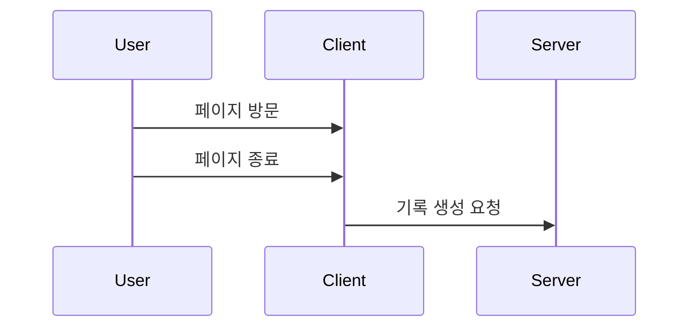
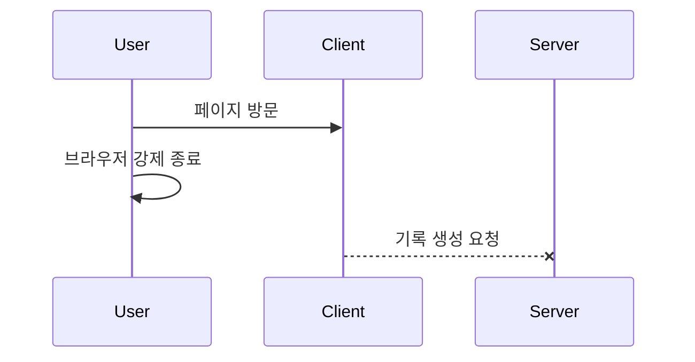
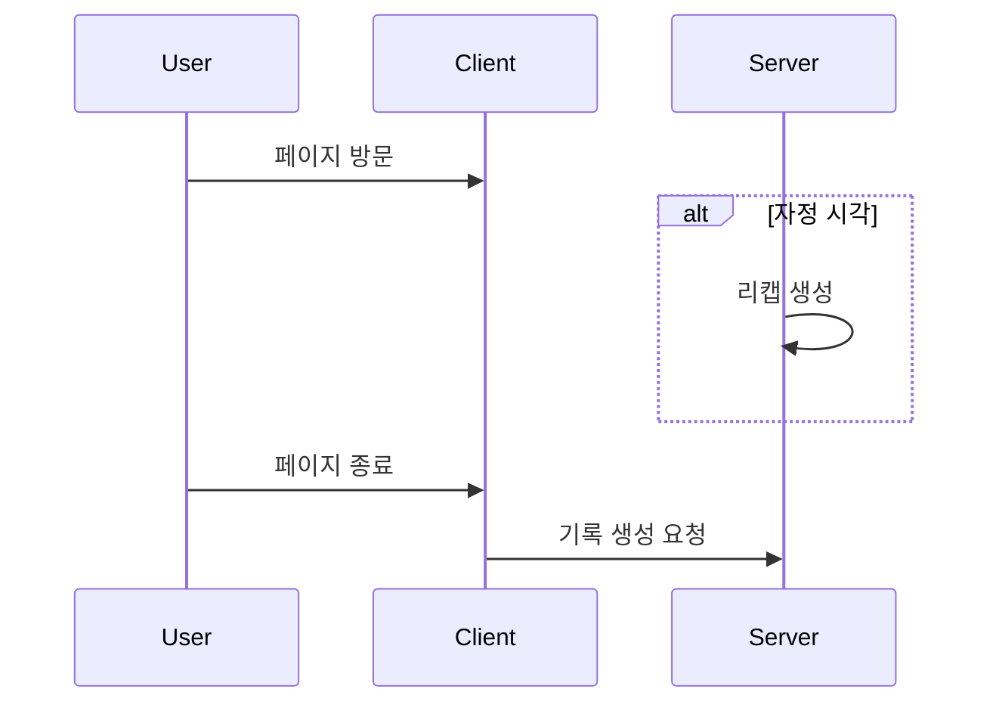
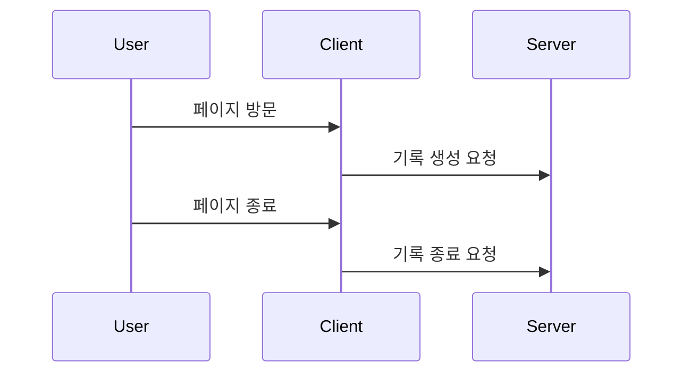
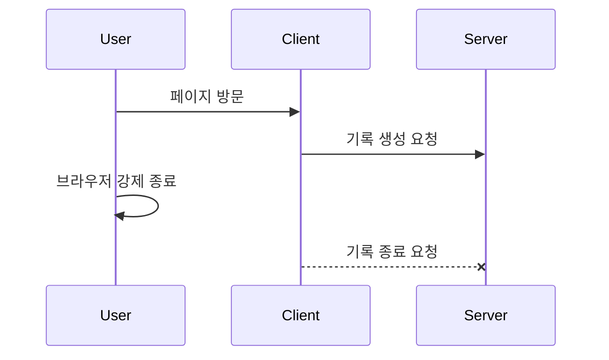
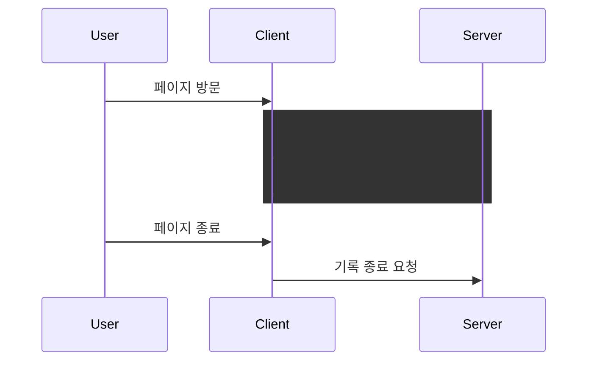
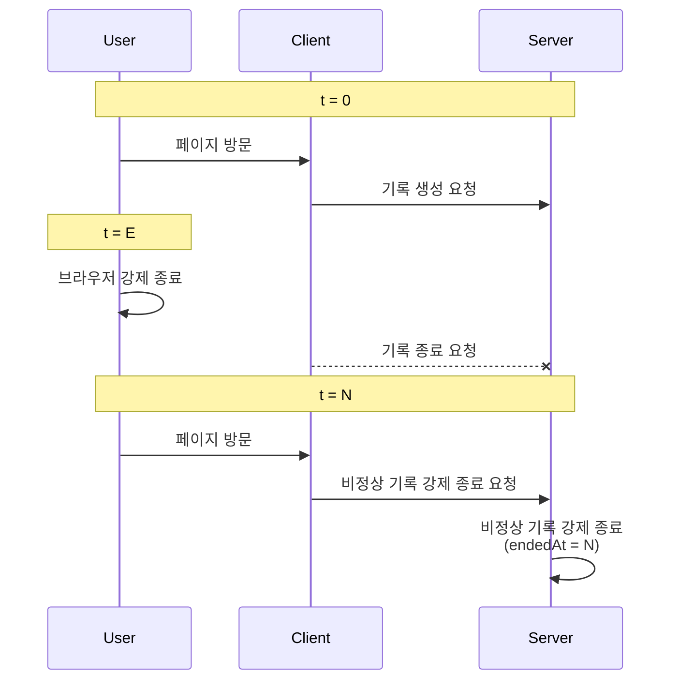
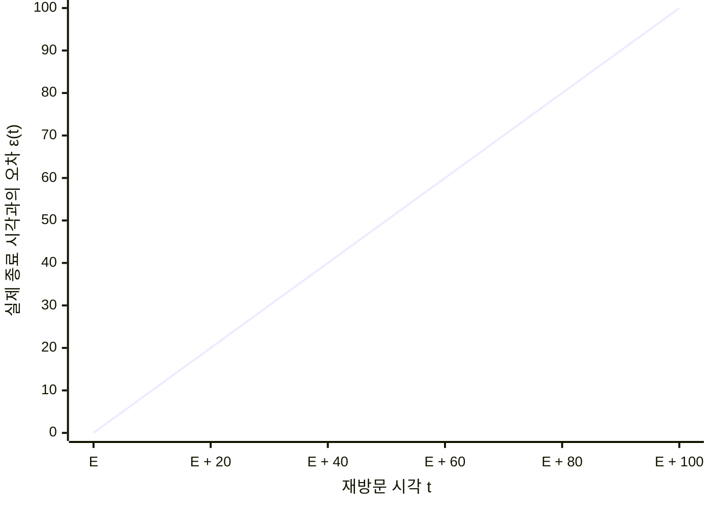
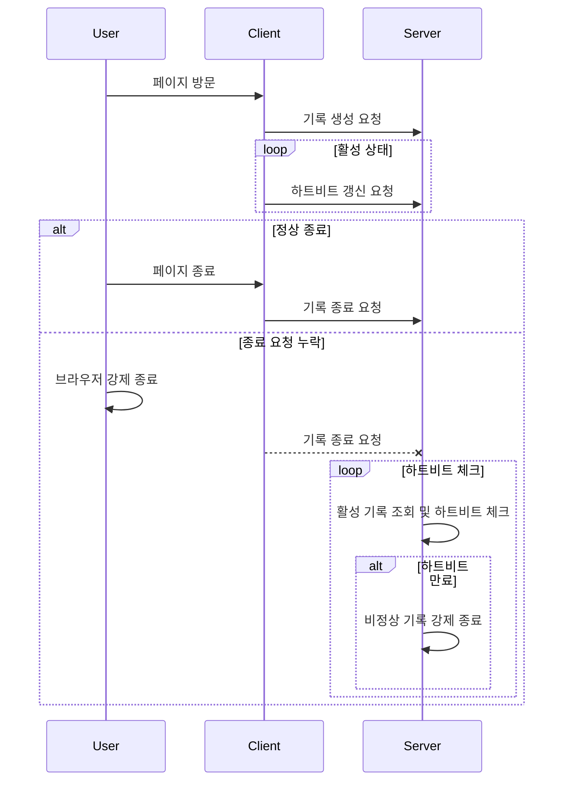
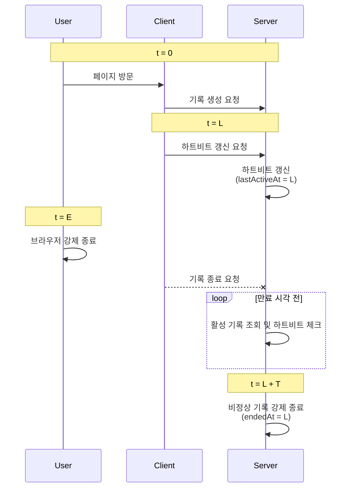

Retoday에는 사용자의 브라우저 활동을 기록하는 기능이 있습니다.
브라우저 확장 프로그램이 사용자의 활동을 수집하고, 서버에 기록 생성 요청을 보내는 구조인데요.
대시보드와 리캡에서 일부 기록이 누락되는 현상을 발견하면서 기록 생성 기능을 다시 살펴보게 되었습니다.

# 문제 현상

발견한 문제 현상은 두 가지였습니다.

1. 대시보드에서 브라우저를 끄기 직전 활동한 기록이 누락되던 문제
2. 리캡에서 다음 날 새벽까지 활동했던 기록이 누락되던 문제

두 기능 모두 테스트 데이터로는 집계 로직에 문제가 없는 것을 확인했는데요.
이 결과만으로 집계 로직에 문제가 없다고 단정할 수는 없지만, 집계할 기록 자체가 누락되었을 가능성을 먼저 의심했습니다.

# 문제 원인

현재 기록 생성 과정은 다음과 같습니다.



확장 프로그램은 페이지 방문 시각을 내부적으로 저장해 두었다가, 사용자가 페이지를 종료하면 해당 시각을 포함해 기록 생성 요청을 보냅니다.
방문 시에는 별도 요청을 보내지 않고 종료 시점에만 요청을 한 번 보내므로 서버 부하를 줄일 수 있었습니다.
다만 페이지가 종료되어야 기록을 저장할 수 있다 보니, 다음과 같은 문제들이 발생할 수 있습니다.

## 첫 번째 문제: 기록 유실



확장 프로그램은 브라우저 내부에서 실행되므로 브라우저에 종속적입니다.
즉, 브라우저가 강제 종료되는 등의 상황에서는 확장 프로그램이 기록 생성 요청을 보내지 못할 수 있는데요.
이러한 경우, 해당 페이지의 기록 자체가 유실되는 문제가 발생합니다.

## 두 번째 문제: 집계 누락



페이지 종료 전까지는 해당 기록이 서버에 존재하지 않습니다.
그렇기에 현재 계속 보고 있는 페이지가 있어도, 해당 기록이 집계에서 누락될 수 있었습니다.
예를 들어 사용자가 자정 전부터 보던 페이지를 다음 날 새벽에 종료하면, 자정에 리캡을 생성할 때는 해당 기록을 집계에 반영하지 못합니다.
페이지 종료 후 매번 새로 집계하는 대시보드에는 해당 기록이 반영될 수 있지만, 이미 생성된 리캡은 재생성하지 않는 이상 누락이 그대로 남습니다.

결국 이 문제들의 원인은 페이지 종료 시점까지 기록 생성 요청을 미루는 구조라고 생각했습니다.

# 구조 개선

이 문제를 해결하기 위해 기록 생성 요청을 페이지 종료 시점이 아닌 방문 시점에 보내기로 했습니다.
다만 방문 시점에는 활동이 언제 끝날지 알 수 없으므로, 페이지 종료 시에 종료 시각을 갱신하도록 했습니다.



기존에는 한 번의 요청으로 기록이 완성됐지만, 변경한 구조에서는 두 번의 요청에 걸쳐 기록을 완성합니다.
생성 요청에서는 기록 시작 시각(`startedAt`)을 저장하고, 종료 요청에서는 기록 종료 시각(`endedAt`)을 갱신합니다.
생성 요청이 성공한 뒤라면 브라우저 강제 종료 등의 상황에서도 서버에 기록이 남아 있으므로 기존의 기록 유실 문제를 해결할 수 있습니다.

또한 리캡 생성 배치나 대시보드 집계에서는 아직 종료되지 않은 기록(이하 활성 기록)을 조회할 수 있게 되었는데요.
이때, 활성 기록들은 `endedAt`이 `null`이기 때문에 집계 시 전처리가 필요합니다.
그래서 `endedAt`을 현재 시각으로 보정해 활성 기록을 현재 시각까지 활동한 것으로 집계할 수 있도록 했습니다.

# 한계점 보완

집계에서 현재 시각까지 활동한 것으로 계산해도 되는 것은 사용자가 실제로 페이지를 보고 있는 활성 기록인 경우인데요.
문제는 브라우저가 강제 종료되어 종료 요청을 보내지 못한 경우에도 종료 시각이 없는 기록이 남기 때문에, 해당 기록을 정상적인 활성 기록과 구분할 수 없었습니다.



종료 요청이 누락되면 `endedAt`은 계속 `null`로 남습니다.
이 기록을 매번 현재 시각까지 활동한 것으로 계산하면, 실제로는 브라우저를 사용하지 않은 시간까지 집계됩니다.
따라서 종료 시각이 없는 기록 중에서 실제 활동이 끝난 기록을 종료 처리할 방법이 필요했습니다.

## 첫 번째 대안: 기록 생성 전처리



처음에는 기록 생성 요청 전에 기존의 활성 기록들을 비정상 기록으로 간주하고 강제 종료 처리하는 방법을 생각했습니다.
현재 서비스에서는 사용자가 임의의 시점에 반드시 한 페이지만 볼 수 있다는 전제가 있기 때문에 적용할 수 있는 방법입니다.

강제 종료 시 `endedAt`을 임의의 종료 시각으로 보정해야 하는데요.
실제 종료 시각을 예상할 수 없기 때문에 재방문 시점을 최종 종료 시각으로 사용하기로 했습니다.
그러나 이 경우, 실제 종료 시각과 최종 종료 시각 간의 오차 범위를 예상할 수 없다는 단점이 생깁니다.



실제 종료 시각을 $E$라고 하면, 종료는 $t = E$에 발생하지만 재방문 시각이 $t = N$($N > E$)이므로 최종 종료 시각은 $t = N$으로 보정됩니다.
이때, 오차 수식은 다음과 같습니다.

$$
\begin{aligned}
\varepsilon(t) 
&= |t - E| \\
&= t - E \qquad (t > E)
\end{aligned}
$$



결과적으로 재방문 시점이 늦어질수록 실제 종료 시각과의 오차가 계속 증가하는 구조인데요.
재방문 시점에 상한이 없으므로 종료 시각의 오차 범위 역시 이론적으로 제한 없이 커질 수 있습니다.
결국 이러한 오차 범위를 줄이려면 실제 종료 시각과 관련된 정보가 필요했습니다.

## 두 번째 대안: 하트비트

그래서 활동을 하는 동안 확장 프로그램이 서버에 주기적으로 신호를 보내도록 하는 하트비트 방법을 생각했습니다. 
마지막 하트비트 갱신 시각을 활용하면 오차를 예측 가능한 범위로 크게 줄일 수 있습니다.



클라이언트는 주기적으로 하트비트 요청을 보내고 서버에서는 주기적으로 하트비트를 체크합니다.
이때, 하트비트가 만료된 기록은 비정상 기록으로 간주하고 종료 시각을 마지막 하트비트 갱신 시각으로 보정합니다.

해당 방법에서 실제 종료 시각과의 오차 범위를 이해하려면 하트비트 주기와 만료 시간을 구분해서 볼 필요가 있습니다.
예를 들어, 마지막 하트비트 갱신 시각을 $L$, 하트비트 주기를 $H$, 실제 종료 시각을 $E$($L \le E \le L + H$), 하트비트 만료 시간을 $T$($T > H$)라고 하겠습니다.



실제 종료는 $t = E$에 발생하지만, 마지막 하트비트 갱신 시각은 $t = L$이므로 최종 종료 시각은 $L$로 보정됩니다.
이때, 마지막 하트비트 갱신 이후 만료 시간이 지나기 전까지는 해당 기록을 활성 상태로 판단하는데요.
따라서 실제 종료 시각 $E$ 이후에도 만료 시각인 $L + T$까지는 활성 기록으로 집계될 수 있습니다.
그러므로 보정 전 오차 수식은 다음과 같습니다.

$$
\begin{aligned}
\varepsilon(t)
&= |t - E| \\
&= t - E
\qquad (E \le t < L + T)
\end{aligned}
$$

결국 보정 직전까지 최대 오차는 $L + T - E$까지 수렴하게 됩니다.

보정 후에는 강제 종료 시각이 $L$이 되는데요.
따라서 보정 후 오차 수식은 다음과 같습니다.

$$
\begin{aligned}
\varepsilon(t) 
&= |L - E| \\
&= E - L \qquad (t \ge L + T)
\end{aligned}
$$

$E \le L + H$이므로 결국 보정 후 최대 오차는 $H$에 수렴하게 됩니다.

최종적인 오차 수식은 다음과 같습니다.

$$
\varepsilon(t) =
\begin{cases}
t - E & (E \le t < L + T) \\
E - L & (t \ge L + T)
\end{cases}
$$

```mermaid
xychart
    x-axis "현재 시각 t" ["E", "L + T", "∞"]
    y-axis "실제 종료 시각과의 오차 ε(t)" 0 --> 100
    line [0, 100, 50]
```

즉, 최종 오차 범위는 하트비트 주기에, 일시적인 오차 범위는 만료 시간에 영향을 받습니다.
여기서 중요한 점은 이전 방법과 달리 오차 범위가 예상 가능하고 조절 가능해졌다는 점입니다.

## 예외 케이스

앞의 설명에서는 네트워크 지연이 없다고 가정했었는데요.
그렇다면 이번엔 네트워크 지연이 있는 경우를 한번 살펴보겠습니다.

예를 들어, 클라이언트의 $n$번째 하트비트 갱신 요청 시각을 $L_n$($L_n \le E$), $n$번째 요청의 네트워크 지연을 $D_n$이라고 하겠습니다.
클라이언트는 응답 여부에 상관 없이 주기적으로 하트비트 요청을 보냅니다.
그러므로 하트비트 갱신 요청 시각 수식은 다음과 같습니다.

$$
L_n = L_{n-1} + H
$$

$n$번째 요청이 서버에 도착하는 시각은 $L_n + D_n$인데요.
직전 요청까지 반영된 상태에서 $D_n > T - H$이면, 종료 시각을 $L_{n-1}$로 조기 확정하게 됩니다.
이 경우 오차 수식은 다음과 같습니다.

$$
\varepsilon(t) = |E - L_{n-1}| = E - L_n + H  \qquad (t \ge L_{n-1} + T)
$$

클라이언트가 정상 주기로 하트비트 갱신 요청을 보냈더라도, 네트워크 지연이 있다면 최대 오차가 $H$를 넘어설 수 있습니다.
따라서 이미 종료 처리된 기록이라도 늦게 도착한 하트비트를 반영할 수 있어야 합니다.

그래서 이렇게 하트비트 요청 시각이 기존 종료 시각보다 늦으면, 최종 종료 시각을 해당 값으로 보정하는 방법을 생각했습니다.
정상 종료 케이스에서는 하트비트 갱신 요청 시각이 종료 시각보다 늦는 경우가 없기 떄문에 가능한 방법입니다.

이를 적용한 코드는 다음과 같습니다.

```kotlin title="하트비트 시각 반영 예시"
val lastActiveAt = command.lastActiveAt

if (lastActiveAt > history.lastActiveAt) {
    history.lastActiveAt = lastActiveAt
}

history.endedAt?.let { endedAt ->
    if (lastActiveAt > endedAt) {
        history.endedAt = lastActiveAt
    }
}
```

해당 방법은 기존 종료 시각보다 늦은 하트비트 갱신 요청 시각만 반영하므로 네트워크 지연 뿐만 아니라 요청 순서가 뒤바뀌거나 중복으로 도착하는 경우에도 정상적으로 종료 시각을 보정할 수 있습니다.
즉, 일시적으로 오차가 $H$를 넘더라도 마지막 하트비트가 도착해 반영되면 다시 오차 범위가 $H$ 이내로 제한됩니다.
다만 이는 요청이 결국 도착한다는 전제입니다. 요청이 아예 누락되는 경우에는 상한을 보장할 수 없습니다.
이미 집계에 반영된 기록이라면, 종료 시각을 보정한 차이도 집계에 반영해야 실제 조회 결과까지 일치합니다.
