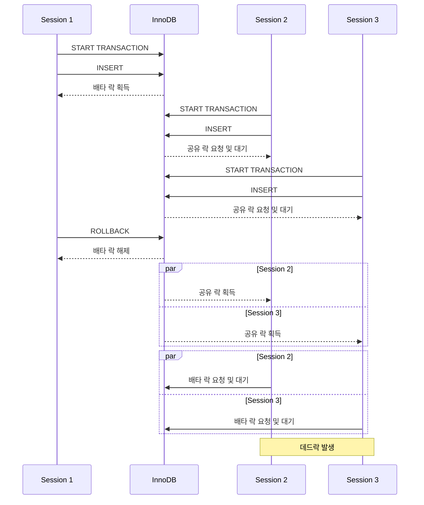

Quizit에는 사용자가 퀴즈를 북마크하는 기능이 있습니다.
해당 기능은 이미 북마크한 퀴즈를 다시 북마크하면 자동으로 북마크를 해제하는 토글 방식인데요.
같은 북마크에 요청이 겹칠 때 간헐적으로 500 응답이 발생했습니다.

# 문제 현상

같은 사용자와 같은 퀴즈에 북마크 요청 100개를 동시에 보내 문제를 재현했습니다.

| 항목       | 값  |
| ---------- | --- |
| 총 요청 수 | 100 |
| 성공 응답  | 87  |
| 실패 응답  | 13  |

실패한 일부 요청에는 다음과 같이 데드락 로그가 남아 있었습니다.

```text
org.springframework.dao.DeadlockLoserDataAccessException:
jOOQ; SQL [insert ignore into `quiz_bookmark` (`id`, `quiz_id`, `user_id`) values (?, ?, ?)];
Deadlock found when trying to get lock; try restarting transaction
```

# 문제 원인

기존 북마크 처리 흐름은 다음과 같습니다.

```kotlin title="QuizService.kt" showLineNumbers
fun markQuiz(
    userId: UUID,
    command: MarkQuizCommand
) {
    transaction {
        if (!quizRepository.existsById(command.quizId)) {
            throw QuizNotFoundException()
        }

        if (quizBookmarkRepository.existsByQuizIdAndUserId(command.quizId, userId)) {
            quizBookmarkRepository.deleteByQuizIdAndUserId(command.quizId, userId)
        } else {
            quizBookmarkRepository.saveIgnore(
                QuizBookmark(
                    quizId = command.quizId,
                    userId = userId
                )
            )
        }
    }
}
```

먼저 북마크 존재 여부를 조회하고, 조회 결과에 따라 삭제하거나 추가합니다.
여러 요청이 같은 상태를 조회하면 동시에 같은 분기로 진입할 수 있습니다.

```sql showLineNumbers {5}
CREATE TABLE quiz_bookmark (
    id BINARY(16) PRIMARY KEY,
    quiz_id BINARY(16) NOT NULL,
    user_id BINARY(16) NOT NULL,
    UNIQUE INDEX uk_quiz_bookmark_quiz_user (quiz_id, user_id)
);
```

또한 북마크 테이블에는 중복 북마크 문제를 해결하기 위해 `(quiz_id, user_id)`에 대한 유니크 인덱스가 존재합니다.

이제 문제의 데드락 원인을 분석하기 위해 InnoDB의 데드락 로그를 조회했습니다.

```sql
SHOW ENGINE INNODB STATUS
```

```text {9,17,24,32}
LATEST DETECTED DEADLOCK
------------------------
2026-08-14 20:20:48 281473010351872
*** (1) TRANSACTION:
TRANSACTION 124053, ACTIVE 0 sec inserting

*** (1) HOLDS THE LOCK(S):
RECORD LOCKS space id 81 page no 5 n bits 80 index uk_quiz_bookmark_quiz_user of table `quizit`.`quiz_bookmark` trx id 124053 lock mode S
Record lock, heap no 1 PHYSICAL RECORD: n_fields 1; compact format; info bits 0
Record lock, heap no 2 PHYSICAL RECORD: n_fields 3; compact format; info bits 32
Record lock, heap no 3 PHYSICAL RECORD: n_fields 3; compact format; info bits 32
Record lock, heap no 4 PHYSICAL RECORD: n_fields 3; compact format; info bits 32
Record lock, heap no 5 PHYSICAL RECORD: n_fields 3; compact format; info bits 32

*** (1) WAITING FOR THIS LOCK TO BE GRANTED:
RECORD LOCKS space id 81 page no 5 n bits 80 index uk_quiz_bookmark_quiz_user of table `quizit`.`quiz_bookmark` trx id 124053 lock_mode X insert intention waiting
Record lock, heap no 1

*** (2) TRANSACTION:
TRANSACTION 124054, ACTIVE 0 sec inserting

*** (2) HOLDS THE LOCK(S):
RECORD LOCKS space id 81 page no 5 n bits 80 index uk_quiz_bookmark_quiz_user of table `quizit`.`quiz_bookmark` trx id 124054 lock mode S
Record lock, heap no 1 PHYSICAL RECORD: n_fields 1; compact format; info bits 0
Record lock, heap no 2 PHYSICAL RECORD: n_fields 3; compact format; info bits 32
Record lock, heap no 3 PHYSICAL RECORD: n_fields 3; compact format; info bits 32
Record lock, heap no 4 PHYSICAL RECORD: n_fields 3; compact format; info bits 32
Record lock, heap no 5 PHYSICAL RECORD: n_fields 3; compact format; info bits 32

*** (2) WAITING FOR THIS LOCK TO BE GRANTED:
RECORD LOCKS space id 81 page no 5 n bits 80 index uk_quiz_bookmark_quiz_user of table `quizit`.`quiz_bookmark` trx id 124054 lock_mode X insert intention waiting
Record lock, heap no 1
*** WE ROLL BACK TRANSACTION (2)
```

두 트랜잭션 모두 `uk_quiz_bookmark_quiz_user` 인덱스에 공유 락을 보유하면서, 동시에 배타 락(Insert Intention Lock)을 기다려서 데드락이 발생한 것을 확인했습니다.
`INSERT`의 동작 과정을 따라가면서 이러한 상황이 발생한 이유를 천천히 살펴보겠습니다.

## 중복 검사에서의 락

`INSERT`에서는 보조 인덱스 엔트리를 삽입하기 전에 유니크 제약조건이 있는 경우, 중복 후보를 스캔하는 과정을 거치는데요.

```cpp title="row0ins.cc" {21,24} showLineNumbers
static dberr_t row_ins_scan_sec_index_for_duplicate(...) {
  allow_duplicates = row_allow_duplicates(thr);

  do {
    if (allow_duplicates) {
      err = row_ins_set_rec_lock(LOCK_X, lock_type, block, rec, index, offsets, thr);
    } else {
      if (skip_gap_locks) {
        if (is_supremum) {
          continue;
        }
        if (is_next) {
          goto end_scan;
        }
        lock_type = LOCK_REC_NOT_GAP;
      } else if (is_supremum) {
        lock_type = LOCK_ORDINARY;
      } else if (is_next) {
        lock_type = LOCK_GAP;
      } else {
        lock_type = LOCK_ORDINARY;
      }

      err = row_ins_set_rec_lock(LOCK_S, lock_type, block, rec, index, offsets, thr);
    }

    if (!is_next && !index->allow_duplicates) {
      if (row_ins_dupl_error_with_rec(rec, entry, index, offsets)) {
        err = DB_DUPLICATE_KEY;

        goto end_scan;
      }
    }
  } while (pcur.move_to_next(mtr));
}
```

중복 스캔은 중복 후보 레코드들에 하나씩 락을 걸고 실제 중복 여부를 확인하는 과정으로 수행됩니다.
이때 사용하는 락은 공유 락 + 넥스트 키 락(Next-key Lock)인데요.
결국 로그에서 봤던 레코드들은 전부 중복 후보였기에 해당 락이 걸렸다는 것을 알 수 있었습니다.

### Delete-marked Record

중복 후보에 락을 거는 이유는 이해했으나, 유니크 인덱스에서 이러한 중복 후보가 여러 개 존재하는 것은 이해하기 어려웠는데요.
이에 대한 정답은 `info bits`에서 찾을 수 있었습니다.

`info bits`는 헤더의 상태 비트 영역을 읽어 십진수로 출력한 값입니다.

```text {4-7}
*** (1) HOLDS THE LOCK(S):
RECORD LOCKS space id 81 page no 5 n bits 80 index uk_quiz_bookmark_quiz_user of table `quizit`.`quiz_bookmark` trx id 124053 lock mode S
Record lock, heap no 1 PHYSICAL RECORD: n_fields 1; compact format; info bits 0
Record lock, heap no 2 PHYSICAL RECORD: n_fields 3; compact format; info bits 32
Record lock, heap no 3 PHYSICAL RECORD: n_fields 3; compact format; info bits 32
Record lock, heap no 4 PHYSICAL RECORD: n_fields 3; compact format; info bits 32
Record lock, heap no 5 PHYSICAL RECORD: n_fields 3; compact format; info bits 32
```

락이 잡힌 레코드들은 대부분 `info bits`가 `32`였는데요.

```cpp title="rec.h" showLineNumbers {2}
constexpr uint32_t REC_INFO_MIN_REC_FLAG = 0x10UL;
constexpr uint32_t REC_INFO_DELETED_FLAG = 0x20UL;
constexpr uint32_t REC_INFO_VERSION_FLAG = 0x40UL;
constexpr uint32_t REC_INFO_INSTANT_FLAG = 0x80UL;
```

이때 `info bits 32`는 `REC_INFO_DELETED_FLAG`를 의미합니다.
즉, 삭제 표시된 레코드(Delete-marked Record)입니다.
이러한 레코드들이 존재하는 이유는 `DELETE`의 내부 동작 때문인데요.

> InnoDB does not physically remove a row from the database immediately when you delete it with an SQL statement. A row and its index records are only physically removed when InnoDB discards the undo log record written for the deletion.<br/> - [MySQL 공식 문서](https://dev.mysql.com/doc/refman/8.4/en/innodb-purge-configuration.html)

InnoDB의 `DELETE`는 레코드를 즉시 물리적으로 삭제하지 않습니다.

```cpp title="ha_innodb.cc" showLineNumbers {2,5}
int ha_innobase::delete_row(...) {
  m_prebuilt->upd_node->is_delete = true;

  if (error == DB_SUCCESS) {
    error = row_update_for_mysql((byte *)record, m_prebuilt);
  }
}
```

대신 내부적으로 `UPDATE`를 통해 레코드에 삭제 표시를 해두는데요.

> Purge runs on a periodic schedule. It parses and processes undo log pages from the history list, which is a list of undo log pages for committed transactions that is maintained by the InnoDB transaction system. Purge frees the undo log pages from the history list after processing them.<br/> - [MySQL 공식 문서](https://dev.mysql.com/doc/refman/8.4/en/innodb-purge-configuration.html)

이러한 Delete-marked 레코드들은 주기적으로 돌아가는 퍼지 스레드(Purge Thread)에 의해 물리적으로 삭제됩니다.
결국 락이 걸린 중복 후보들은 아직 퍼지 스레드에 의해 처리되지 못한 Delete-marked 레코드들이었던 것이었습니다.

### Supremum Record

```text {3}
*** (1) HOLDS THE LOCK(S):
RECORD LOCKS space id 81 page no 5 n bits 80 index uk_quiz_bookmark_quiz_user of table `quizit`.`quiz_bookmark` trx id 124053 lock mode S
Record lock, heap no 1 PHYSICAL RECORD: n_fields 1; compact format; info bits 0
Record lock, heap no 2 PHYSICAL RECORD: n_fields 3; compact format; info bits 32
Record lock, heap no 3 PHYSICAL RECORD: n_fields 3; compact format; info bits 32
Record lock, heap no 4 PHYSICAL RECORD: n_fields 3; compact format; info bits 32
Record lock, heap no 5 PHYSICAL RECORD: n_fields 3; compact format; info bits 32
```

그렇다면 `info bits 0`인 첫 번째 레코드는 무엇일까요?
해당 레코드는 `info bits`보다 `heap no`으로부터 정답을 찾을 수 있었습니다.

InnoDB에서는 페이지마다 시작과 끝을 의미하는 가상 레코드(Pseudo Record)가 존재하는데요.
이때 시작은 Infimum, 끝은 Supremum이라고 합니다.

```cpp title="page0page.cc" {3} showLineNumbers
page_t *page_create_low(...) {
  if (comp) {
    memcpy(page + PAGE_DATA, infimum_supremum_compact, sizeof infimum_supremum_compact);
    memset(page + PAGE_NEW_SUPREMUM_END, 0, UNIV_PAGE_SIZE - PAGE_DIR - PAGE_NEW_SUPREMUM_END);
  }

  return (page);
}
```

실제로 페이지 생성 시에 가상 레코드 템플릿(`infimum_supremum_compact`)을 미리 삽입해두는 것을 확인할 수 있습니다.

```cpp title="page0page.cc" {4-5} showLineNumbers
static const byte infimum_supremum_compact[] = {
    /* the infimum record */
    0x01, 0x00, 0x02 /* heap_no = 0, REC_STATUS_INFIMUM */, 0x00, 0x0d /* pointer to supremum */, 'i', 'n', 'f', 'i', 'm', 'u', 'm', 0,
    /* the supremum record */
    0x01, 0x00, 0x0b /* heap_no = 1, REC_STATUS_SUPREMUM */, 0x00, 0x00 /* end of record list */, 's', 'u', 'p', 'r', 'e', 'm', 'u', 'm'
};
```

해당 템플릿은 Infimum 및 Supremum 레코드를 바이트 배열로 가지고 있는데요.
주석에서도 알 수 있듯이 Supremum 레코드는 `heap_no`를 고정적으로 `1`로 가지고 있습니다.
즉, 앞서 봤었던 레코드는 Supremum 레코드였던 것이었습니다.

이제 해당 레코드에 락이 걸린 이유는 `INSERT`의 중복 후보 스캔과 연관지어 설명할 수 있는데요.

```cpp title="row0ins.cc" {3,15-16} showLineNumbers
static dberr_t row_ins_scan_sec_index_for_duplicate(...) {
  do {
    const bool is_next = !is_supremum && (cmp_dtuple_rec(entry, rec, index, offsets) < 0);

    if (allow_duplicates) {...}
    else {
      if (skip_gap_locks) {
        if (is_supremum) {
          continue;
        }
        if (is_next) {
          goto end_scan;
        }
        lock_type = LOCK_REC_NOT_GAP;
      } else if (is_supremum) {
        lock_type = LOCK_ORDINARY;
      } else if (is_next) {
        lock_type = LOCK_GAP;
      } else {
        lock_type = LOCK_ORDINARY;
      }
    }
}
```

앞서 설명한 중복 후보를 스캔하며 락을 거는 과정에는 마지막 Supremum 레코드도 포함됩니다.
실제로 중복 후보를 끝내기 위한 플래그인 `is_next`는 Supremum 레코드인 경우 활성화되지 않도록 되어 있는데요.
그렇기에 Supremum 레코드까지 공유 락 + 넥스트 키 락이 걸리게 된 것입니다.

## 삽입 시도에서의 락

지금까지 공유 락이 어디에, 어떻게 걸리게 된 것인지 알아봤는데요.
이제 데드락의 직접적인 원인인 배타 락에 대해 살펴보겠습니다.

```text {2-3,6-7}
*** (1) WAITING FOR THIS LOCK TO BE GRANTED:
RECORD LOCKS space id 81 page no 5 n bits 80 index uk_quiz_bookmark_quiz_user of table `quizit`.`quiz_bookmark` trx id 124053 lock_mode X insert intention waiting
Record lock, heap no 1

*** (2) WAITING FOR THIS LOCK TO BE GRANTED:
RECORD LOCKS space id 81 page no 5 n bits 80 index uk_quiz_bookmark_quiz_user of table `quizit`.`quiz_bookmark` trx id 124054 lock_mode X insert intention waiting
Record lock, heap no 1
*** WE ROLL BACK TRANSACTION (2)
```

앞서 배타 락은 Supremum 레코드에 걸린 것을 확인했었습니다.
해당 배타 락은 Insert Intention Lock입니다.

> An insert intention lock is a type of gap lock set by`INSERT operations prior to row insertion. This lock signals the intent to insert in such a way that multiple transactions inserting into the same index gap need not wait for each other if they are not inserting at the same position within the gap.<br/> - [MySQL 공식 문서](https://dev.mysql.com/doc/refman/9.7/en/innodb-locking.html#innodb-insert-intention-locks)

Insert Intention Lock은 `INSERT`에서 실제 삽입 전에 걸리는 갭 락(Gap Lock)의 일종인데요.

```cpp title="lock0lock.cc" showLineNumbers {2,6}
static inline Conflict rec_lock_check_conflict(...) {
  if ((lock_is_on_supremum || (type_mode & LOCK_GAP)) && !(type_mode & LOCK_INSERT_INTENTION)) {
    return Conflict::NO_CONFLICT;
  }

  if (lock_rec_get_insert_intention(lock2)) {
    return Conflict::NO_CONFLICT;
  }

  return Conflict::HAS_TO_WAIT;
}
```

같은 갭 락(Insert Intention Lock)끼리는 호환이 되지만 다른 갭 락과는 충돌이 된다는 특징을 가지고 있습니다.

결국 해당 락이 걸렸다는 것은 `INSERT`의 중복 검사를 통과해 실제 삽입 단계까지 진행되었다는 것을 의미하는데요.
즉, 중복 후보로서 락이 걸린 Delete-marked 레코드들이 전부 중복 검사를 통과했다는 것으로 이해할 수 있습니다.

```c++ title="row0ins.cc" showLineNumbers {11}
static bool row_ins_dupl_error_with_rec(...) {
  n_unique = dict_index_get_n_unique(index);
  matched_fields = 0;

  entry->compare(rec, index, offsets, &matched_fields);

  if (matched_fields < n_unique) {
    return false;
  }

  return rec_get_deleted_flag(rec, rec_offs_comp(offsets)) == 0;
}
```
```c++ title="rem0rec.ic" showLineNumbers {3}
static inline bool rec_get_deleted_flag(const rec_t *rec, bool comp) {
  if (comp) {
    return (rec_get_bit_field_1(rec, REC_NEW_INFO_BITS, REC_INFO_DELETED_FLAG, REC_INFO_BITS_SHIFT));
  }
}
```

실제로 중복 검사를 하는 부분에서 Delete-mark 레코드를 예외적으로 허용하는 것을 확인할 수 있었습니다.

결국 여러 요청이 동시에 Delete-mark 레코드를 중복 후보로 스캔해 락을 잡았는데, 바로 삽입 단계로 넘어가 배타 락을 요청하는 것이 데드락의 원인이었습니다.

## 공식 문서에서의 예시

사실 이러한 데드락은 공식 문서에서도 잘 알려진 시나리오였는데요.
공식 문서에서는 다음과 같은 `INSERT` 데드락 예시를 설명합니다.



저희가 겪은 데드락과의 공통점은 공유 락을 서로 동시에 획득한 상태에서 실제 삽입 단계까지 진행되어 배타 락을 요청한다는 점입니다.
위 예시에서는 `INSERT`를 수행한 트랜잭션이 롤백(Rollback)됨에 따라 원래 존재하던 중복 후보가 사라져 최종적으로 중복 검사를 통과한 경우이고, 저희가 겪은 데드락은 Delete-marked 레코드가 중복 후보로 인식되지만 예외적으로 중복 검사를 통과한 경우입니다.

# 문제 해결

해당 문제를 해결하기 위해 같은 요청을 락으로 직렬화하는 방법과, 데드락이 발생한 트랜잭션을 재시도하는 방법을 생각했는데요.
락을 사용하는 방법은 락 획득과 해제, 타임아웃과 장애 복구까지 관리해야 한다는 단점이 있습니다.
이에 비해 북마크 처리 자체는 조회와 추가 또는 삭제로 끝나는 짧은 트랜잭션이라, 실패한 작업을 다시 실행하는 비용이 적어 재시도 방법이 좀 더 효율적이라 판단했습니다.

## 트랜잭션 전체 재시도

재시도할 때는 북마크 존재 여부 조회부터 다시 실행해야 합니다.
데드락으로 기존 트랜잭션이 롤백되었고 그동안 다른 요청이 북마크를 추가하거나 삭제했을 수 있기 때문입니다.
처음 조회 결과를 그대로 사용해 `INSERT`만 반복하면 현재 상태와 맞지 않는 분기를 실행할 수 있습니다.

기존에 사용하던 `transaction()` 확장 함수에 재시도 옵션을 추가했습니다.

```kotlin title="TransactionExtensions.kt" {24-35} showLineNumbers
fun <T> transaction(
    readOnly: Boolean = false,
    propagation: Propagation = Propagation.REQUIRED,
    retry: TransactionRetry? = null,
    func: () -> T
): T {
    if (retry == null) {
        return TransactionWrapper(
            readOnly = readOnly,
            propagation = propagation,
            func = func
        )
    }

    var count = 0

    while (true) {
        try {
            return TransactionWrapper(
                readOnly = readOnly,
                propagation = propagation,
                func = func
            )
        } catch (exception: Throwable) {
            if (!retry.retryOn(exception)) {
                throw exception
            }

            count += 1

            if (count >= retry.count) {
                throw exception
            }

            Thread.sleep(retry.backoff.inWholeMilliseconds)
        }
    }
}
```

`count`는 첫 번째 실행을 포함한 최대 시도 횟수입니다.
예외가 재시도 대상이 아니거나 시도 횟수를 모두 사용했으면 호출자에게 다시 전달합니다.

# 검증

같은 북마크에 100개 요청을 동시에 보내고, 재시도 유무만 바꿔 각각 300회 반복했습니다.

| 지표 | 재시도 미적용 | 재시도 적용 |
| --- | --- | --- |
| 동시 요청 수 | 100개 | 100개 |
| 누적 요청 수 | 30,000건 | 30,000건 |
| 실패 요청 | 139건 | 0건 |
| 평균 응답 시간 | 26.32ms | 28.25ms |
| P95 응답 시간 | 49.38ms | 49.70ms |
| P99 응답 시간 | 75.07ms | 147.13ms |
| 요청당 평균 재시도 횟수 | 0회 | 0.0281회 |

전체 요청 기준으로 평균 및 P95 응답 시간은 크게 변하지 않았으며 P99 응답 시간은 약 2배 늘었습니다.
데드락 자체를 없애지는 못했지만, 일부 요청의 지연을 감수하고 실패 응답을 복구할 수 있도록 한 결과입니다.
